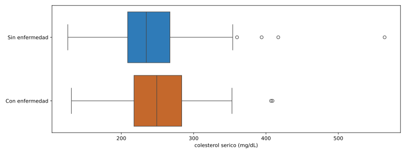
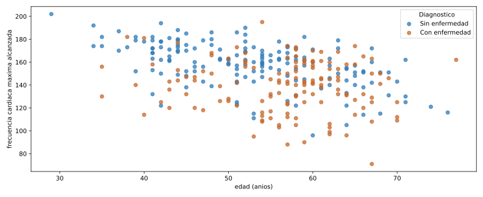

::: {.ficha}
|            |                                                                    |
|------------|--------------------------------------------------------------------|
| Módulo     | Estadística para Analítica                                        |
| Programa   | Especialización en Big Data                                       |
| Unidad     | Laboratorio complementario. Aplica las herramientas de las semanas 3 a 5 de la Unidad 1 |
:::

## Para qué sirve este laboratorio

Las Semanas 3 y 4 construyeron cada herramienta por separado, sobre datasets distintos del libro de
referencia: `state.csv` para percentiles y boxplot, `dfw_airline.csv` para el gráfico de barras,
`lc_loans.csv` para la tabla de contingencia. Aquí encadenas las mismas herramientas sobre **un solo
dataset real**, de principio a fin, como harías con tu propio conjunto de datos.

El dataset es clínico: mediciones de pacientes evaluados por enfermedad cardiovascular. No vas a
construir un modelo que prediga el diagnóstico; vas a describir qué diferencias, si las hay,
aparecen entre pacientes con y sin enfermedad, usando únicamente las herramientas de la Unidad 1.

## Objetivo

Al terminar deberías poder:

1. Cargar un dataset externo desde una URL pública, verificar su forma y sus tipos antes de usarlo.
2. Calcular cuantiles y el rango intercuartílico de una variable numérica, y usarlos para detectar
   valores atípicos.
3. Comparar la distribución de una variable numérica entre dos grupos con un boxplot.
4. Resumir una variable categórica con frecuencias y construir una tabla de contingencia con
   porcentajes por fila.
5. Construir un gráfico de dispersión condicionado por una tercera variable e interpretar el patrón.
6. Redactar una conclusión exploratoria que distinga asociación de causalidad.

## El dataset: diagnóstico de enfermedad cardiovascular

Es la base **Cleveland** del *Heart Disease Dataset*, recolectada por Robert Detrano en la Cleveland
Clinic Foundation y publicada en el UCI Machine Learning Repository: 303 pacientes, 13 variables
clínicas y un diagnóstico.

**Página oficial:** [archive.ics.uci.edu/dataset/45/heart+disease](https://archive.ics.uci.edu/dataset/45/heart+disease).
**En Kaggle:** [Heart Disease Cleveland UCI](https://www.kaggle.com/datasets/cherngs/heart-disease-cleveland-uci)
(requiere cuenta).

### Cómo cargarlo

Este laboratorio usa la URL directa de UCI: no exige cuenta ni token, así el código corre igual para
todos sin depender de credenciales personales.

```python
import pandas as pd

url = "https://archive.ics.uci.edu/static/public/45/data.csv"
df = pd.read_csv(url)
```

Si prefieres trabajar desde el archivo descargado de Kaggle, el procedimiento es el mismo a partir de
`pd.read_csv("heart.csv")`. Los mirrors de Kaggle no siempre coinciden con la codificación original
de UCI: algunos recodifican `cp` de `1-4` a `0-3`, y algunos marcan los datos faltantes con el texto
`"?"` en vez de dejarlos vacíos (en ese caso, carga con `pd.read_csv("heart.csv", na_values="?")`).
**Antes de reusar el código de este laboratorio con un archivo de Kaggle, revisa
`df["cp"].unique()`** para confirmar qué codificación trae tu copia.

### Diccionario de variables

| Variable | Tipo | Qué mide |
|---|---|---|
| `age` | Numérica continua | Edad en años |
| `sex` | Categórica binaria | Sexo (1 = hombre, 0 = mujer) |
| `cp` | Categórica, 4 niveles | Dolor de pecho: 1 angina típica, 2 angina atípica, 3 dolor no anginoso, 4 asintomático |
| `trestbps` | Numérica continua | Presión arterial en reposo (mm Hg) |
| `chol` | Numérica continua | Colesterol sérico (mg/dL) |
| `fbs` | Categórica binaria | Glucosa en ayunas mayor a 120 mg/dL |
| `restecg` | Categórica, 3 niveles | Resultado electrocardiográfico en reposo |
| `thalach` | Numérica continua | Frecuencia cardíaca máxima alcanzada |
| `exang` | Categórica binaria | Angina inducida por ejercicio |
| `oldpeak` | Numérica continua | Depresión del segmento ST inducida por ejercicio |
| `slope` | Categórica ordinal, 3 niveles | Pendiente del segmento ST en el pico del ejercicio |
| `ca` | Numérica discreta, 0 a 3 | Vasos principales coloreados por fluoroscopia |
| `thal` | Categórica, 3 niveles | Resultado de la prueba de talasemia |
| `num` | Diagnóstico original | 0 sin enfermedad; 1 a 4, distintos grados de enfermedad |

## Primer vistazo

```python
print(df.shape)
print(df.head())
print(df.dtypes)
print(df.isnull().sum())
```

```text
(303, 14)
   age  sex  cp  trestbps  chol  fbs  ...  exang  oldpeak  slope   ca  thal  num
0   63    1   1       145   233    1  ...      0      2.3      3  0.0   6.0    0
1   67    1   4       160   286    0  ...      1      1.5      2  3.0   3.0    2
2   67    1   4       120   229    0  ...      1      2.6      2  2.0   7.0    1
3   37    1   3       130   250    0  ...      0      3.5      3  0.0   3.0    0
4   41    0   2       130   204    0  ...      0      1.4      1  0.0   3.0    0

[5 rows x 14 columns]
age           int64
sex           int64
cp            int64
trestbps      int64
chol          int64
fbs           int64
restecg       int64
thalach       int64
exang         int64
oldpeak     float64
slope         int64
ca          float64
thal        float64
num           int64
dtype: object
age         0
sex         0
cp          0
trestbps    0
chol        0
fbs         0
restecg     0
thalach     0
exang       0
oldpeak     0
slope       0
ca          4
thal        2
num         0
dtype: int64
```

303 pacientes, 14 columnas, sin sorpresas de forma. `ca` tiene 4 valores faltantes y `thal` tiene 2:
seis pacientes en total con algún dato incompleto. No se eliminan del dataset completo; simplemente
quedan fuera de cualquier cálculo puntual que use esa columna.

El diagnóstico original (`num`) trae cinco niveles de severidad. Para este laboratorio, igual que en
la mayoría de los análisis publicados con este dataset, importa distinguir presencia o ausencia de
enfermedad, no el grado:

```python
df["diagnostico"] = (df["num"] > 0).astype(int)
df["diagnostico_txt"] = df["diagnostico"].map({0: "Sin enfermedad", 1: "Con enfermedad"})
df["sexo"] = df["sex"].map({0: "Mujer", 1: "Hombre"})

print(df["diagnostico_txt"].value_counts())
print(df["diagnostico_txt"].value_counts(normalize=True).mul(100).round(1))
```

```text
diagnostico_txt
Sin enfermedad    164
Con enfermedad    139
Name: count, dtype: int64
diagnostico_txt
Sin enfermedad    54.1
Con enfermedad    45.9
Name: proportion, dtype: float64
```

La muestra queda razonablemente balanceada entre los dos grupos: 54.1% sin enfermedad, 45.9% con
enfermedad.

## Variable numérica: colesterol

```python
print(df["chol"].describe())
```

```text
count    303.000000
mean     246.693069
std       51.776918
min      126.000000
25%      211.000000
50%      241.000000
75%      275.000000
max      564.000000
Name: chol, dtype: float64
```

```python
q1 = df["chol"].quantile(0.25)
q3 = df["chol"].quantile(0.75)
iqr = q3 - q1
limite_inferior = q1 - 1.5 * iqr
limite_superior = q3 + 1.5 * iqr

print("Q1:", q1, "Q3:", q3, "IQR:", iqr)
print("limite inferior:", limite_inferior, "limite superior:", limite_superior)

atipicos = df[(df["chol"] < limite_inferior) | (df["chol"] > limite_superior)]
print(atipicos[["age", "sexo", "chol", "diagnostico_txt"]].sort_values("chol", ascending=False))
```

```text
Q1: 211.0 Q3: 275.0 IQR: 64.0
limite inferior: 115.0 limite superior: 371.0
     age   sexo  chol diagnostico_txt
152   67  Mujer   564  Sin enfermedad
48    65  Mujer   417  Sin enfermedad
181   56  Mujer   409  Con enfermedad
121   63  Mujer   407  Con enfermedad
173   62  Mujer   394  Sin enfermedad
```

::: {.callout-note}
## Interpretación en contexto

Cinco pacientes quedan por encima del límite superior de 371 mg/dL, y los cinco son mujeres, todas
mayores de 55 años. No hay ningún hombre atípico en colesterol en esta muestra. Es un patrón que
vale la pena anotar y seguir explorando (por ejemplo, cruzando colesterol con sexo y edad juntos),
pero con cinco casos no alcanza para una conclusión general sobre mujeres mayores.
:::

```python
import matplotlib.pyplot as plt
import seaborn as sns

colores = {"Sin enfermedad": "#2f7bb8", "Con enfermedad": "#c4682c"}

fig, ax = plt.subplots(figsize=(11, 4.2))
sns.boxplot(
    data=df, x="chol", y="diagnostico_txt", hue="diagnostico_txt",
    palette=colores, saturation=1, legend=False, ax=ax,
)
ax.set_xlabel("colesterol sérico (mg/dL)")
ax.set_ylabel("")
plt.show()
```

Un solo llamado a `sns.boxplot`, con `x` la variable numérica y `y` la variable categórica que separa los
grupos: seaborn dibuja una caja por cada valor de `diagnostico_txt`. `palette` fija el color de cada
grupo (los mismos dos colores que vas a ver otra vez en el gráfico de dispersión); `saturation=1` evita
que seaborn los aclare por defecto.

::: {.diagrama}
{fig-alt="Boxplot horizontal del colesterol serico comparando pacientes sin enfermedad y con enfermedad, con las dos cajas muy superpuestas y una mediana apenas mas alta en el grupo con enfermedad."}
:::

```python
print(df.groupby("diagnostico_txt")["chol"].median())
```

```text
diagnostico_txt
Con enfermedad    249.0
Sin enfermedad    234.5
Name: chol, dtype: float64
```

::: {.callout-note}
## Interpretación en contexto

La mediana difiere apenas 14.5 mg/dL entre los dos grupos, y las cajas se superponen casi por
completo. A diferencia del caso de las aerolíneas de la semana pasada, donde las cajas de Alaska y
American no se tocaban, aquí el colesterol por sí solo no separa visualmente a los pacientes con y
sin enfermedad. Es un resultado exploratorio legítimo: no toda variable clínicamente relevante
produce una diferencia visible en un boxplot.
:::

## Variable categórica: sexo

```python
print(df["sexo"].value_counts())
print(df["sexo"].value_counts(normalize=True).mul(100).round(1))
```

```text
sexo
Hombre    206
Mujer      97
Name: count, dtype: int64
sexo
Hombre    68.0
Mujer     32.0
Name: proportion, dtype: float64
```

La muestra no está balanceada por sexo: 68% hombres contra 32% mujeres. Conviene tenerlo presente
antes de comparar los dos grupos, porque cualquier diferencia en conteos absolutos puede deberse
simplemente a que hay más del doble de hombres que de mujeres, no a un efecto real.

## Tabla de contingencia: sexo y diagnóstico

```python
tabla = pd.crosstab(df["sexo"], df["diagnostico_txt"])
print(tabla)

tabla_pct = (pd.crosstab(df["sexo"], df["diagnostico_txt"], normalize="index") * 100).round(1)
print(tabla_pct)
```

```text
diagnostico_txt  Con enfermedad  Sin enfermedad
sexo
Hombre                      114              92
Mujer                        25              72
diagnostico_txt  Con enfermedad  Sin enfermedad
sexo
Hombre                     55.3            44.7
Mujer                      25.8            74.2
```

::: {.callout-note}
## Interpretación en contexto

En conteos absolutos hay casi cinco veces más hombres con enfermedad (114) que mujeres con
enfermedad (25), pero eso es en parte porque hay más hombres en toda la muestra. El porcentaje por
fila corrige eso: 55.3% de los hombres tiene diagnóstico positivo, contra 25.8% de las mujeres. La
diferencia se mantiene y es grande incluso después de corregir por el desbalance de la muestra.
:::

## Dispersión condicional: edad y frecuencia cardíaca máxima

```python
sin_enfermedad = df[df["diagnostico_txt"] == "Sin enfermedad"]
con_enfermedad = df[df["diagnostico_txt"] == "Con enfermedad"]

fig, ax = plt.subplots(figsize=(11, 4.5))
ax.scatter(sin_enfermedad["age"], sin_enfermedad["thalach"], color="#2f7bb8", alpha=0.75, label="Sin enfermedad")
ax.scatter(con_enfermedad["age"], con_enfermedad["thalach"], color="#c4682c", alpha=0.75, label="Con enfermedad")
ax.set_xlabel("edad (años)")
ax.set_ylabel("frecuencia cardíaca máxima alcanzada")
ax.legend(title="Diagnóstico")
plt.show()
```

Separas el DataFrame en dos partes con una condición (`sin_enfermedad`, `con_enfermedad`) y dibujas cada
una con su propio color, en dos líneas de `ax.scatter`. Es más código que un solo `for`, pero se lee de
arriba hacia abajo sin tener que seguir un diccionario ni una iteración.

::: {.diagrama}
{fig-alt="Grafico de dispersion de edad contra frecuencia cardiaca maxima, coloreado por diagnostico, con los puntos de pacientes con enfermedad concentrados hacia frecuencias mas bajas y los de pacientes sin enfermedad mas dispersos hacia frecuencias altas."}
:::

```python
print(df[["age", "thalach"]].corr())
```

```text
              age   thalach
age      1.000000 -0.393806
thalach -0.393806  1.000000
```

::: {.callout-note}
## Interpretación en contexto

La correlación es -0.39: una relación negativa moderada, coherente con lo esperado
fisiológicamente, a mayor edad, menor frecuencia cardíaca máxima. Al colorear por diagnóstico se ve
además que, para una misma edad, los pacientes con enfermedad (naranja) tienden a ubicarse más abajo
que los pacientes sin enfermedad (azul). La frecuencia cardíaca máxima separa los dos grupos con más
claridad que el colesterol de la sección anterior.
:::

## Del gráfico al informe

Un informe exploratorio sobre este dataset, para cualquier variable que elijas, necesita cuatro
piezas: cuántos pacientes y qué variables hay, un análisis de una variable numérica con su
conclusión, un análisis de una variable categórica o una tabla de contingencia con su conclusión, y
una relación entre dos variables (dispersión o boxplot agrupado) con su conclusión. Cada conclusión
describe una asociación observada en estos 303 pacientes, nunca una causa: "el colesterol no separa
los grupos" es una conclusión válida; "el colesterol no causa enfermedad cardiovascular" no se
sostiene con un gráfico exploratorio.

::: {.callout-tip}
## Ejercicio propuesto

Elige `trestbps` (presión arterial en reposo) y repite el mismo recorrido: cuantiles e IQR,
boxplot comparado entre `diagnostico_txt`, y una frase de conclusión. Después construye la tabla de
contingencia entre `cp` (tipo de dolor de pecho) y `diagnostico_txt`, con porcentajes por fila, y
responde: ¿el tipo de dolor de pecho parece asociado al diagnóstico, o las cuatro categorías se
comportan de forma parecida?
:::

## Errores frecuentes

::: {.error-caso}
[Error 1]{.etiqueta}

### Reusar código de otro dataset sin revisar la codificación

**Causa.** Los mirrors de Kaggle de este mismo dataset no siempre codifican `cp`, `ca` o los valores
faltantes igual que la fuente original de UCI.

**Solución.** Antes de mapear etiquetas o filtrar por un valor concreto, revisa
`df["columna"].unique()`. Si los números no coinciden con el diccionario de variables de esta guía,
la fuente usa otra codificación.
:::

::: {.error-caso}
[Error 2]{.etiqueta}

### Leer una diferencia entre grupos como causa del diagnóstico

**Causa.** Encontrar una diferencia real en los datos (la frecuencia cardíaca máxima, el sexo) se
confunde fácilmente con haber encontrado la causa de la enfermedad.

**Solución.** Un análisis exploratorio muestra asociaciones dentro de esta muestra concreta. Probar
causalidad exige diseño experimental o inferencia formal, que es tema de la Unidad 3.
:::

## Recursos

- Detrano, R. et al. *Heart Disease*, UCI Machine Learning Repository, 1988. Página del dataset:
  [archive.ics.uci.edu/dataset/45/heart+disease](https://archive.ics.uci.edu/dataset/45/heart+disease).
- Mirror en Kaggle: [Heart Disease Cleveland UCI](https://www.kaggle.com/datasets/cherngs/heart-disease-cleveland-uci).
- Documentación de `pandas.DataFrame.quantile`: [pandas.pydata.org/docs/reference/api/pandas.DataFrame.quantile.html](https://pandas.pydata.org/docs/reference/api/pandas.DataFrame.quantile.html)
- Documentación de `pandas.crosstab`: [pandas.pydata.org/docs/reference/api/pandas.crosstab.html](https://pandas.pydata.org/docs/reference/api/pandas.crosstab.html)

::: {.pie-doc}
Estadística para Analítica. Institución Universitaria Pascual Bravo. Facultad de Ingeniería.
Semestre 2026-02.

**Transparencia.** La redacción de esta guía contó con el apoyo de inteligencia artificial, usando
el modelo Claude Sonnet 5 de Anthropic. Todo el contenido fue revisado y validado. Las salidas de
terminal y los gráficos son reales, producidos al ejecutar estos mismos programas contra el dataset
público de UCI durante la preparación del material.
:::
