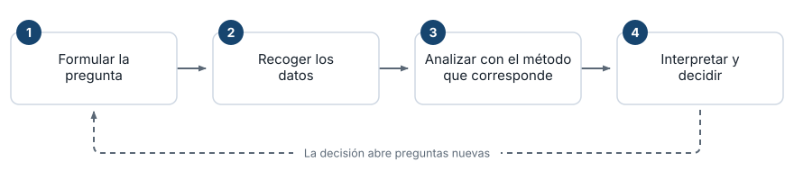
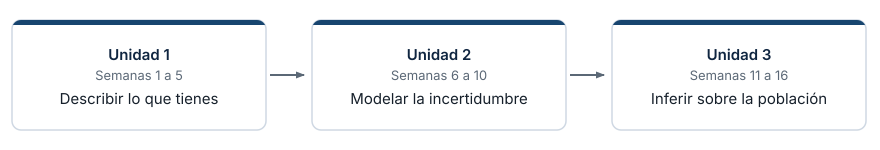
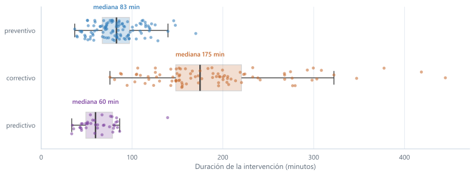
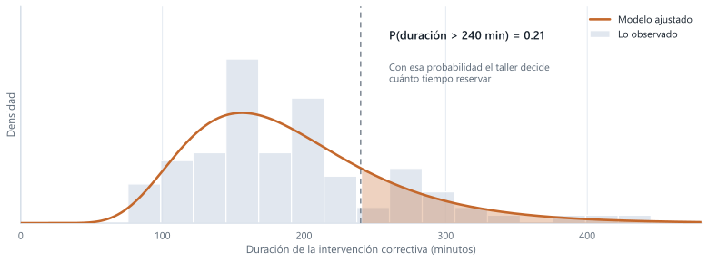
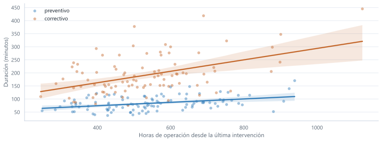
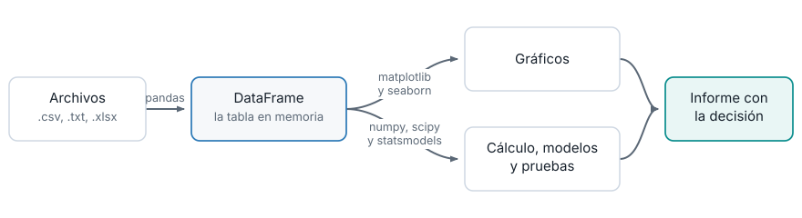
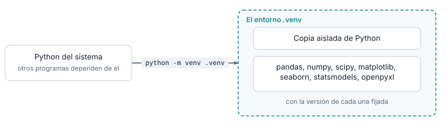
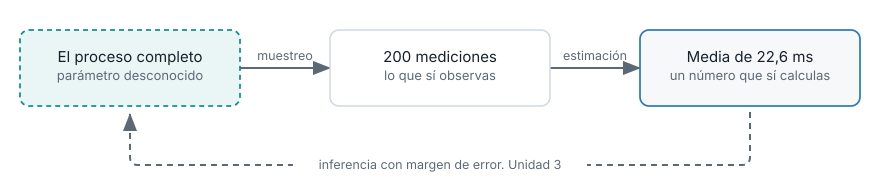
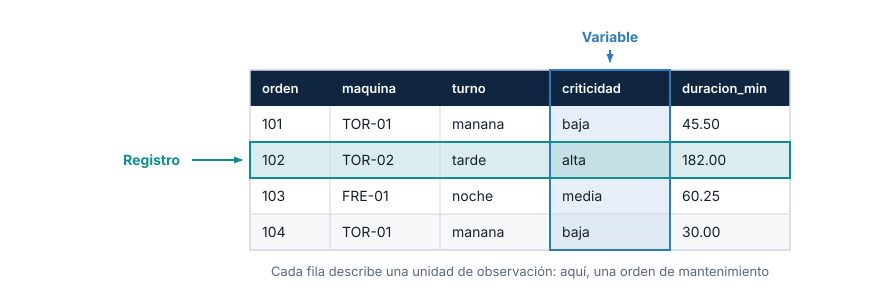

## Ruta de la sesión

::: {.columns}
::: {.column width="50%"}
**Primera parte**

1. La estadística como proceso
2. Un caso de ejemplo
3. El mapa de las 16 semanas
4. Qué produce cada unidad
:::

::: {.column width="50%"}
**Segunda parte**

1. El entorno de trabajo
2. Instalación y verificación
3. Demostración: la variabilidad
4. Muestra, parámetro y estimación
:::
:::

## Cuatro pasos, no uno {.solo-diagrama}

{fig-alt="Formular la pregunta, recoger los datos, analizar e interpretar, con un retorno de la decisión a la pregunta"}

## Qué se decide en cada paso

- **Formular la pregunta.** Qué decisión depende de la respuesta y con qué precisión hay que darla.
- **Recoger los datos.** Qué se mide, cada cuánto, con qué instrumento y quién responde por el registro.
- **Analizar.** Con el método que admite la naturaleza de esas variables.
- **Interpretar y decidir.** Qué se hace con el resultado y con cuánta confianza.

. . .

Los cuatro pesan igual sobre el resultado.

## Dónde se pierde el rigor

Un análisis impecable montado sobre datos mal recogidos produce una decisión equivocada con
apariencia de rigor.

. . .

[Y esa decisión hay que defenderla después ante quien la firma.]{.grande}

## Un caso de ejemplo: el taller de mantenimiento

Un taller registra cada intervención sobre sus tornos y fresadoras: qué máquina, en qué turno, de
qué tipo y cuántos minutos tomó. La pregunta del área es cuánto tiempo reservar para una
intervención y de qué depende.

Tres decisiones tomadas antes de medir deciden si el análisis sirve:

- Qué cuenta como el comienzo y el final de una intervención.
- Cada cuánto se registra y con qué instrumento se mide el tiempo.
- Quién responde por el registro cuando cambia el turno.

. . .

[Cambia una de esas decisiones y cambia la conclusión.]{.pregunta}

## El mapa del módulo {.solo-diagrama}

{fig-alt="Unidad 1 entre las semanas 1 y 5, unidad 2 entre la 6 y la 10, unidad 3 entre la 11 y la 16"}

## Qué responde cada unidad

::: {.columns}
::: {.column width="32%"}
::: {.unidad}
[Unidad 1]{.titulo-unidad}

[Qué hay en estos datos]{.pregunta-unidad}

Informe exploratorio con gráficos y resúmenes numéricos.

[Cierre 30%]{.peso}
:::
:::

::: {.column width="32%"}
::: {.unidad}
[Unidad 2]{.titulo-unidad}

[Qué tan probable es lo que observo]{.pregunta-unidad}

Un modelo de probabilidad ajustado al fenómeno.

[Cierre 30%]{.peso}
:::
:::

::: {.column width="32%"}
::: {.unidad}
[Unidad 3]{.titulo-unidad}

[Qué puedo afirmar sobre lo que no medí]{.pregunta-unidad}

Conclusiones sobre la población, con su margen de error declarado.

[Cierre 40%]{.peso}
:::
:::
:::

## Unidad 1. Describir lo que hay {.grafico}

{fig-alt="Diagrama de cajas con los puntos superpuestos de la duración de las intervenciones, separadas por tipo. La correctiva tiene mediana 175 minutos, la preventiva 83 y la predictiva 60."}

[Tablas de frecuencia, histogramas, medidas de localización y dispersión, boxplot. El producto es un
informe exploratorio del caso. Datos simulados de 240 intervenciones.]{.pie-grafico}

## Unidad 2. Modelar la incertidumbre {.grafico}

{fig-alt="Histograma de la duración de las intervenciones correctivas con una densidad lognormal ajustada encima y la cola sombreada a partir de los 240 minutos, con la probabilidad anotada."}

[Se ajusta una distribución a lo observado y con ella se calculan probabilidades de eventos que
todavía no ocurrieron. El producto es un modelo que responde preguntas.]{.pie-grafico}

## Unidad 3. Inferir sobre el proceso {.grafico}

{fig-alt="Dispersión de la duración contra las horas de operación, con una recta de regresión y su banda de confianza del 95 por ciento para las intervenciones preventivas y para las correctivas."}

[Intervalos de confianza, pruebas de hipótesis, comparación de tratamientos y regresión. El producto
son conclusiones sobre el proceso, con su margen de error declarado.]{.pie-grafico}

## El método del módulo

Cada tema entra por el concepto y sale por el computador:

1. **Concepto.** Qué afirma el resultado y bajo qué supuestos se sostiene.
2. **Implementación.** El mismo resultado escrito en Python, sobre datos reales.
3. **Simulación.** Repetimos el procedimiento muchas veces y observamos cómo se comporta.

. . .

Así la distribución de una media deja de ser una fórmula y pasa a ser algo que mediste.

## El recorrido de los datos {.solo-diagrama}

{fig-alt="De los archivos al DataFrame con pandas, de ahí a gráficos y a cálculo y modelos, y de los dos al informe"}

## Las siete librerías

::: {.columns}
::: {.column width="50%"}
::: {.libreria}
**pandas**
Carga los datos y los deja como tabla con columnas con nombre
:::

::: {.libreria}
**numpy**
Cálculo numérico y números aleatorios para simular
:::

::: {.libreria}
**openpyxl**
Deja que pandas lea y escriba archivos de Excel
:::

::: {.libreria}
**matplotlib**
Motor de los gráficos
:::
:::

::: {.column width="50%"}
::: {.libreria}
**seaborn**
Gráficos estadísticos con menos código
:::

::: {.libreria}
**scipy**
Distribuciones de probabilidad y pruebas de hipótesis
:::

::: {.libreria}
**statsmodels**
Regresión y ANOVA con la salida que se reporta
:::
:::
:::

## Cómo vamos a trabajar {.con-definiciones}

{fig-alt="El Python del sistema y, aparte, el entorno .venv con una copia aislada de Python y las librerías con su versión fijada"}

::: {.definiciones}
Cada quien trabaja en un entorno aislado con **las mismas versiones**. Así el mismo script produce
el mismo resultado en tu máquina, en la mía y en la de quien revise tu informe dentro de un año.
:::

## Laboratorio: crea el entorno

```bash
mkdir estadistica-analitica
cd estadistica-analitica
python -m venv .venv
```

Actívalo según tu sistema:

```bash
# Windows, PowerShell
.venv\Scripts\Activate.ps1

# macOS y Linux
source .venv/bin/activate
```

Si la terminal no muestra `(.venv)`, el entorno no está activo.

## Laboratorio: instala las librerías

Crea `requirements.txt`:

```text
pandas==2.3.1
numpy==2.3.2
scipy==1.17.0
matplotlib==3.10.8
seaborn==0.13.2
statsmodels==0.14.6
openpyxl==3.1.5
```

```bash
pip install -r requirements.txt
```

Fijar las versiones con `==` es lo que hace reproducible el análisis.

## Laboratorio: verifica

```bash
python -c "import pandas, numpy, scipy, matplotlib, seaborn, statsmodels; print('todo listo')"
```

```bash
python -c "import pandas, numpy, scipy; print(pandas.__version__, numpy.__version__, scipy.__version__)"
```

```text
2.3.1 2.3.2 1.17.0
```

::: {.aviso}
Cerrar la terminal desactiva el entorno. Hay que activarlo otra vez en cada sesión de trabajo.
:::

## La misma operación, 200 veces {.codigo-largo}

```python
import time
import random
import pandas as pd

random.seed(2026)

filas = []
for i in range(1, 201):
    datos = [random.random() for _ in range(100_000)]
    inicio = time.perf_counter()
    datos.sort()
    fin = time.perf_counter()
    filas.append({
        "medicion": i,
        "tiempo_ms": round((fin - inicio) * 1000, 3),
        "tamano": 100_000,
    })

mediciones = pd.DataFrame(filas)
mediciones.to_csv("tiempos_ordenamiento.csv", index=False)

print(mediciones.head())
print()
print(mediciones["tiempo_ms"].describe())
```

## Doscientos números distintos {.codigo-largo}

```text
   medicion  tiempo_ms  tamano
0         1     23.650  100000
1         2     22.488  100000
2         3     25.532  100000
3         4     25.649  100000
4         5     25.361  100000

count    200.000000
mean      22.645985
std        4.305880
min       15.767000
25%       18.478000
50%       23.849500
75%       25.551000
max       38.598000
Name: tiempo_ms, dtype: float64
```

## Qué acaba de pasar

- La medición más rápida tardó 15.8 ms. La más lenta, 38.6.
- `random.seed(2026)` fija la secuencia: la lista que se ordena es siempre la misma.

. . .

[La variabilidad no viene de los datos. Viene de la medición.]{.grande}

## Entonces, ¿cuál es el valor verdadero? {.solo-diagrama}

{fig-alt="Del proceso completo sale por muestreo un conjunto de 200 mediciones, de ahí una estimación, y la inferencia devuelve una conclusión sobre el proceso"}

## La consecuencia práctica

::: {.aviso}
Un solo dato no es evidencia.
:::

Si alguien reporta que una máquina se demoró 38 minutos en una intervención, no sabes todavía si es
la máquina o es el ruido de una sola medición.

## Tres formatos de almacenamiento

| Formato | Qué es | Cuándo lo vas a usar |
|---|---|---|
| `.csv` | Texto plano, valores separados por comas | El formato por omisión |
| `.txt` | Texto plano con tabulación | Lo que exportan muchos equipos de medición |
| `.xlsx` | Libro de Excel | Cuando el dato llega o se entrega en Excel |

Pandas lee y escribe los tres. Para `.xlsx` necesita `openpyxl`.

## Anatomía de una tabla de datos {.con-definiciones}

{fig-alt="Una tabla de órdenes de mantenimiento con la columna criticidad resaltada como variable y una fila resaltada como registro"}

::: {.definiciones}
**Variable.** Una columna. Algo que se midió u observó de cada unidad.

**Registro.** Una fila completa: todos los valores medidos de una misma unidad.

**Unidad de observación.** Lo que representa cada fila. Aquí, una orden de mantenimiento.
:::

## Lo que viene

La semana 2 clasifica las variables por su naturaleza y ahí queda acordado el caso sobre el que
trabajan las tres unidades.

[Toda la guía de la semana está publicada en el sitio del módulo.]{.grande}
