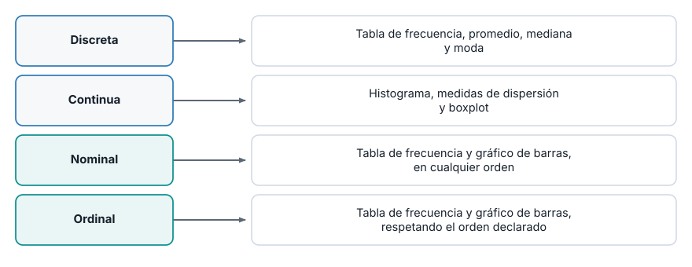
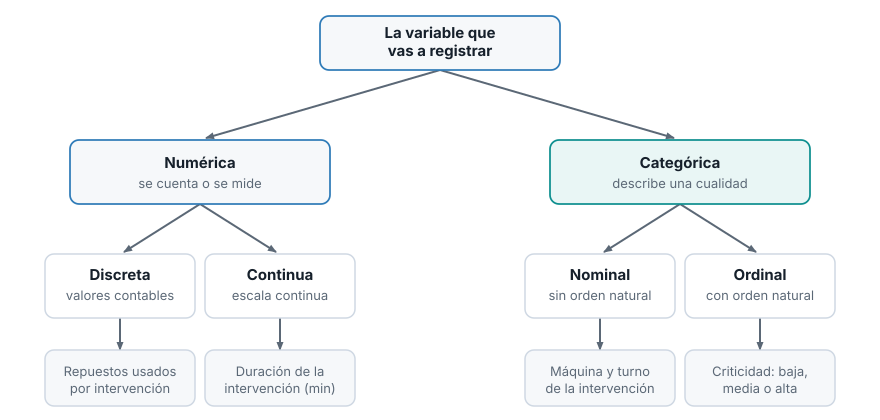
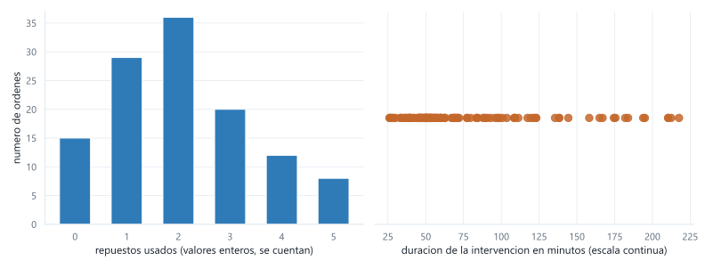
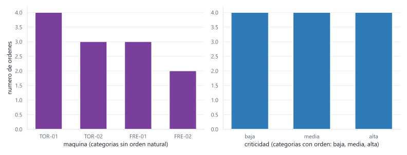

::: {.ficha}
|            |                                                          |
|------------|----------------------------------------------------------|
| Módulo     | Estadística para Analítica                               |
| Programa   | Especialización en Big Data                              |
| Unidad     | Unidad 1. Análisis descriptivo y exploratorio de datos   |
:::

[Abrir la presentación de la sesión](presentacion-tipos-de-variables.html){.btn .btn-primary
role="button"}

## De qué va esta semana

Vas a cargar un dataset con pandas y a observar algo que pasa siempre: la herramienta adivina el
tipo de cada columna, y a veces adivina mal. Acierta con las columnas numéricas, pero le pone
`object` a una columna que sí tiene un orden real (`criticidad`: baja, media, alta), porque
`object` es como decir "texto y no sé nada más". Esa etiqueta genérica esconde el orden, y el orden
se pierde si no lo declaras tú.

Esta semana resuelve esa pregunta con método. Vas a aprender a clasificar cualquier variable en
cuatro categorías y a declarar esa clasificación en pandas para que el software la respete.

Al terminar deberías poder:

1. Cargar un dataset con pandas y leer los tipos que asigna automáticamente a cada columna.
2. Clasificar una variable como numérica discreta, numérica continua, categórica nominal o
   categórica ordinal, con dos preguntas.
3. Explicar por qué esa clasificación decide qué análisis puedes aplicarle más adelante.
4. Declarar en pandas una columna categórica ordinal, con su orden explícito, y usar ese orden para
   ordenar y filtrar.

## Cargar el dataset y ver qué tipos asignó pandas

Vas a trabajar con un registro de 120 órdenes de mantenimiento y siete columnas: el número de
orden, la máquina, el turno, el tipo de intervención, la criticidad, la duración en minutos y los
repuestos usados. Descarga [`ordenes.csv`](recursos/ordenes.csv) y ábrelo con pandas:

```python
import pandas as pd

ordenes = pd.read_csv("ordenes.csv")
print(ordenes.head())
```

```text
   orden maquina   turno        tipo criticidad  duracion_min  repuestos
0    101  TOR-01  manana  preventivo       baja         45.50          1
1    102  TOR-02   tarde  correctivo       alta        182.00          4
2    103  FRE-01   noche  preventivo      media         60.25          2
3    104  TOR-01  manana  predictivo       baja         30.00          0
4    105  FRE-02   tarde  correctivo       alta        210.50          5
```

`pd.read_csv` adivina el tipo de cada columna a partir de lo que encuentra en el archivo. Pídele la
lista completa con `.dtypes`:

```python
print(ordenes.dtypes)
```

```text
orden             int64
maquina          object
turno            object
tipo             object
criticidad       object
duracion_min    float64
repuestos         int64
dtype: object
```

Acertó con `orden` y `repuestos` (`int64`) y con `duracion_min` (`float64`). Pero `criticidad`
quedó en `object`, la etiqueta genérica que pandas usa para "texto y no sé nada más". Ese detalle
no es un error de pandas: es la pregunta que resuelve el resto de esta guía.

## Por qué clasificar una variable no es un trámite

Antes de calcular cualquier cosa, alguien decide qué tipo de dato representa una columna. Esa
decisión no es un formalismo de la carta descriptiva: determina qué operaciones tienen sentido y
cuáles son un error disfrazado de número.

Sumar `repuestos` (1, 4, 2, 0...) tiene sentido: el total de repuestos usados en el mes es una
cantidad real. Sumar un código de máquina no lo tiene, aunque `pandas` lo deje intentar si lo
codificas como número. Promediar la criticidad tampoco tiene sentido con los números 1, 2 y 3 si
antes no declaraste que ese orden existe: el promedio de "baja" y "alta" no es "media" por
casualidad aritmética, es media porque tú fijaste ese orden.

La consecuencia concreta: cada uno de los cuatro tipos habilita un conjunto distinto de análisis, y
las tres semanas que siguen (03, 04 y 05) están organizadas alrededor de esa clasificación.

::: {.diagrama}
{fig-alt="Discreta y continua llevan a tablas de frecuencia, medidas de localizacion y dispersion y boxplot. Nominal y ordinal llevan a tablas de frecuencia y graficos de barras, con la ordinal respetando su orden."}
:::

## Dos preguntas clasifican cualquier variable

No hace falta memorizar una lista de ejemplos. Dos preguntas, en orden, ubican cualquier variable
en una de las cuatro categorías.

**Primera pregunta: ¿el valor se cuenta o se mide?**

Si la respuesta es un número entero que sale de contar unidades completas, la variable es
**numérica discreta**. Si sale de medir en una escala donde caben decimales, sin importar cuántos
apliques, la variable es **numérica continua**.

**Segunda pregunta, solo si la variable no es un número: ¿las categorías tienen un orden natural?**

Si puedes ordenar las categorías de menor a mayor sin inventar el criterio, la variable es
**categórica ordinal**. Si no existe ese orden, o existen varios criterios igual de válidos para
ordenarla, la variable es **categórica nominal**.

::: {.diagrama}
{fig-alt="Arbol de clasificacion: la variable se cuenta o se mide, si se cuenta es discreta y si se mide es continua; si no es numerica, se pregunta si tiene un orden natural, si lo tiene es ordinal y si no es nominal. Cada hoja lleva un ejemplo de mantenimiento."}
:::

## Numéricas: discretas y continuas

Una variable numérica discreta se **cuenta**. Sus valores posibles son un conjunto que puedes
enumerar, casi siempre números enteros, y no existe un valor intermedio entre dos consecutivos: no
hay 2.5 repuestos usados. En el contexto de mantenimiento: repuestos usados en una intervención,
número de paradas no programadas en un mes, número de operarios asignados a una orden.

Una variable numérica continua se **mide**. Entre dos valores cualesquiera siempre cabe otro, y el
número de decimales que reportes depende de la precisión del instrumento, no de la naturaleza de la
variable. En el mismo contexto: duración de la intervención en minutos, temperatura del rodamiento
en grados, vibración medida en milímetros por segundo.

Verifícalo con el mismo `ordenes` que ya cargaste:

```python
print(sorted(ordenes["repuestos"].unique().tolist()))
print(ordenes["duracion_min"].nunique(), "valores distintos, entre",
      ordenes["duracion_min"].min(), "y", ordenes["duracion_min"].max())
```

```text
[0, 1, 2, 3, 4, 5]
120 valores distintos, entre 26.03 y 217.56
```

`repuestos` solo toma seis valores posibles, todos enteros: los puedes contar con los dedos. En
120 órdenes, `duracion_min` no repite ni un solo valor: trae decimales y no hay un conjunto finito
de valores esperables, cualquier número positivo es una duración posible. Esa diferencia es la que
separa discreta de continua, no la cantidad de valores distintos que aparezcan en tu muestra.

::: {.callout-note}
## Un caso que confunde: cuando lo continuo se registra redondeado

Si un instrumento solo reporta minutos enteros, `duracion_min` seguiría siendo continua: la
variable en sí admite cualquier valor real, aunque el instrumento con el que la mides tenga una
resolución limitada. La naturaleza de la variable no cambia porque el aparato que la registra sea
más o menos preciso.
:::

::: {.diagrama}
{fig-alt="A la izquierda, un grafico de barras de repuestos usados con seis valores enteros posibles, de 0 a 5. A la derecha, un grafico de puntos de la duracion en minutos, repartidos en una escala continua."}
:::

El gráfico de la izquierda tiene barras separadas en valores exactos: no existe una barra entre 1 y
2 repuestos porque ese valor no puede ocurrir. El de la derecha es una nube de puntos sobre una
recta: cualquier posición entre el mínimo y el máximo es una duración que pudo haberse dado.

## Categóricas: nominales y ordinales

Una variable categórica nominal describe una cualidad **sin orden natural**. Puedes reordenar sus
categorías de cualquier forma (alfabética, por frecuencia, al azar) sin perder información, porque
ninguna ordenación es más correcta que otra. En el dataset: `maquina` (los códigos de torno y
fresadora no tienen un "antes" y un "después") y `tipo` de intervención (preventivo, correctivo y
predictivo no forman una escala).

Una variable categórica ordinal describe una cualidad **con un orden natural**, aunque no puedas
medir la distancia entre categorías consecutivas. `criticidad` es el ejemplo del dataset: baja,
media y alta tienen un orden que cualquiera reconoce, pero no hay forma de decir cuánto más grave
es "alta" que "media" en un número, como sí puedes hacerlo con dos duraciones.

```python
print(ordenes["maquina"].dtype)
print(sorted(ordenes["maquina"].unique().tolist()))
```

```text
object
['FRE-01', 'FRE-02', 'TOR-01', 'TOR-02']
```

Ordenar `maquina` alfabéticamente no le agrega ni le quita información: es una lista, no una escala.
Con `criticidad` pasa lo contrario, y ahí está el problema que viste al cargar el dataset.

El dataset completo tiene 120 filas: para que la tabla quepa completa en la página, trabaja con una
muestra de las primeras 12 órdenes.

```python
muestra = ordenes.head(12)
print(muestra.sort_values("criticidad")[["orden", "criticidad"]].to_string(index=False))
```

```text
 orden criticidad
   102       alta
   105       alta
   107       alta
   110       alta
   101       baja
   104       baja
   108       baja
   111       baja
   103      media
   106      media
   109      media
   112      media
```

Pandas ordenó por texto, alfabéticamente: alta, baja, media. Es un orden válido para una cadena de
texto y un orden equivocado para la criticidad de una intervención. El software no cometió un
error: hizo exactamente lo que el tipo `object` le permite hacer. El error es no haberle dicho que
`criticidad` es ordinal.

::: {.diagrama}
{fig-alt="A la izquierda, un grafico de barras de la maquina con cuatro categorias sin orden particular. A la derecha, un grafico de barras de la criticidad en su orden correcto: baja, media, alta."}
:::

### Declarar el orden en pandas

Pandas tiene un tipo de dato para esto: `category`, con el argumento `ordered=True`. Declaras la
lista de categorías en el orden que corresponde, y a partir de ahí pandas ordena, compara y filtra
respetando ese orden.

```python
from pandas.api.types import CategoricalDtype

orden_criticidad = CategoricalDtype(categories=["baja", "media", "alta"], ordered=True)
ordenes["criticidad"] = ordenes["criticidad"].astype(orden_criticidad)
muestra = ordenes.head(12)

print(ordenes["criticidad"].dtype)
print(muestra.sort_values("criticidad")[["orden", "criticidad"]].to_string(index=False))
```

```text
category
 orden criticidad
   101       baja
   104       baja
   108       baja
   111       baja
   103      media
   106      media
   109      media
   112      media
   102       alta
   105       alta
   107       alta
   110       alta
```

El mismo `sort_values`, sin ningún argumento adicional, ahora ordena correctamente. La diferencia no
está en el método que llamaste: está en lo que le dijiste al dato sobre sí mismo.

Con el orden declarado, filtrar por criticidad también gana sentido: puedes pedir "todo lo que sea
más grave que media" con el operador de comparación normal, algo que no puedes hacer con un texto
suelto. Sigue el filtro sobre la misma muestra de 12, y el máximo y el mínimo sobre el dataset
completo:

```python
urgentes = muestra[muestra["criticidad"] > "media"]
print(urgentes[["orden", "maquina", "criticidad"]].to_string(index=False))

print("maximo:", ordenes["criticidad"].max())
print("minimo:", ordenes["criticidad"].min())
```

```text
 orden maquina criticidad
   102  TOR-02       alta
   105  FRE-02       alta
   107  FRE-01       alta
   110  TOR-02       alta
maximo: alta
minimo: baja
```

::: {.callout-warning}
## La trampa: un valor suelto pierde el orden

El orden vive en el tipo de la **columna completa**, no en cada valor por separado. Si sacas un
solo dato con `.iloc` y lo guardas en una variable, pandas te lo entrega convertido a texto normal,
y una comparación entre esos dos valores vuelve a ser alfabética.

```python
valor_suelto = ordenes["criticidad"].iloc[0]
print(type(valor_suelto), valor_suelto)
print("baja < alta como texto suelto:", ordenes["criticidad"].iloc[0] < ordenes["criticidad"].iloc[1])
print("baja < alta con los codigos internos:",
      ordenes["criticidad"].cat.codes.iloc[0] < ordenes["criticidad"].cat.codes.iloc[1])
```

```text
<class 'str'> baja
baja < alta como texto suelto: False
baja < alta con los codigos internos: True
```

`baja < alta` da `False` porque, como texto suelto, compara alfabéticamente ("b" va después de
"a"). Compara filas dentro de una operación de pandas (`sort_values`, un filtro con `[]`, `.max()`,
`.min()`) y el orden se respeta. Si necesitas comparar dos valores sueltos, usa `.cat.codes`, que
son los números internos que pandas asigna según el orden que declaraste.
:::

## Caso de uso: diseñar las columnas de una orden de trabajo

Así se aplica el criterio completo, columna por columna, sobre una tabla nueva antes de escribir
una sola línea de análisis.

Un área de mantenimiento quiere registrar, además de lo que ya trae `ordenes.csv`, cuatro datos
nuevos por intervención: la temperatura del rodamiento al momento de la revisión, el nombre del
técnico responsable, si la intervención quedó aprobada por el supervisor o no, y el nivel de
desgaste de la pieza principal, en una escala de tres niveles que ya usa la planta: leve, moderado,
severo.

| Variable nueva | Pregunta 1: ¿se cuenta o se mide? | Pregunta 2: ¿tiene orden? | Clasificación |
|---|---|---|---|
| Temperatura en grados | Se mide, con decimales | No aplica | Numérica continua |
| Nombre del técnico | No es un número | Sin orden natural | Categórica nominal |
| Aprobada por el supervisor | No es un número | Solo dos valores, sin orden entre sí | Categórica nominal |
| Nivel de desgaste | No es un número | Leve, moderado y severo sí ordenan | Categórica ordinal |

"Aprobada por el supervisor" tiene solo dos categorías (sí o no), y eso confunde: parece que un
sí/no pudiera codificarse como 1/0 y tratarse como número. No lo es. Sumar o promediar esos ceros y
unos no produce una cantidad con sentido propio; lo que sí tiene sentido es contar cuántas órdenes
caen en cada categoría, que es exactamente el tratamiento de una variable nominal.

Verifica la tabla con código, construyendo esas cuatro columnas nuevas para las 120 órdenes
existentes:

```python
import numpy as np

rng = np.random.default_rng(2026)

ordenes["temperatura_c"] = rng.uniform(38, 92, size=len(ordenes)).round(1)
ordenes["tecnico"] = rng.choice(["Diaz", "Moreno", "Restrepo"], size=len(ordenes))
ordenes["aprobada"] = rng.choice(["si", "no"], size=len(ordenes))

orden_desgaste = CategoricalDtype(categories=["leve", "moderado", "severo"], ordered=True)
ordenes["desgaste"] = rng.choice(["leve", "moderado", "severo"], size=len(ordenes))
ordenes["desgaste"] = ordenes["desgaste"].astype(orden_desgaste)

print(ordenes[["orden", "temperatura_c", "tecnico", "aprobada", "desgaste"]].dtypes)
```

```text
orden               int64
temperatura_c     float64
tecnico            object
aprobada           object
desgaste         category
dtype: object
```

`temperatura_c` quedó `float64` sin que lo pidieras: `np.random.default_rng().uniform` siempre
produce decimales, coherente con que es una variable continua. `tecnico` y `aprobada` quedan
`object`, coherente con que son nominales. `desgaste` es la única que declaraste como `category`
ordenada, porque es la única con un orden real.

## Errores frecuentes

::: {.error-caso}
[Error 1]{.etiqueta}

### Tratar un código numérico como si fuera una cantidad

**Causa.** Un número de máquina, de orden o de empleado se ve como número, y pandas lo lee como
`int64` si el código solo tiene dígitos. Pero sumar dos números de orden no produce nada
interpretable: es una etiqueta, no una cantidad.

**Solución.** Pregúntate si tiene sentido sumar, promediar o restar esa columna. Si no lo tiene, es
categórica nominal, aunque esté escrita con dígitos. Conviértela explícitamente con
`ordenes["codigo"] = ordenes["codigo"].astype(str)` para que quede claro que no se opera
aritméticamente sobre ella.
:::

::: {.error-caso}
[Error 2]{.etiqueta}

### Declarar una ordinal sin `ordered=True`

**Causa.** `ordenes["criticidad"].astype("category")`, sin pasar por `CategoricalDtype`, sí crea
una columna categórica, pero sin orden. `sort_values` la sigue ordenando de forma arbitraria (por el
orden en que pandas encontró las categorías por primera vez), no por baja, media, alta.

**Solución.** Para cualquier variable ordinal, usa siempre
`CategoricalDtype(categories=[...], ordered=True)` y pasa la lista de categorías en el orden que
corresponde. `astype("category")` a secas sirve para nominales.
:::

::: {.error-caso}
[Error 3]{.etiqueta}

### Comparar dos valores sueltos y confiar en el resultado

**Causa.** Como viste en el callout de esta guía, extraer un valor individual de una columna
categórica con `.iloc` lo convierte en texto normal, y una comparación entre dos de esos valores
vuelve a ser alfabética sin avisar.

**Solución.** Compara dentro de operaciones de pandas (`sort_values`, un filtro con corchetes,
`.max()`, `.min()`), o usa `.cat.codes` si de verdad necesitas dos valores sueltos.
:::

## Lista de chequeo de la semana

::: {.checklist}
**Antes de la próxima sesión**

- [ ] Sabes clasificar cualquier variable con las dos preguntas de esta guía, sin consultar una
      lista de ejemplos
- [ ] Ejecutaste el bloque de `CategoricalDtype` y el `sort_values` quedó en baja, media, alta
- [ ] Entiendes por qué un valor suelto extraído con `.iloc` pierde el orden
:::

## Lo que viene

- **Semana 3.** Con las variables ya clasificadas, construirás tablas de frecuencia e histogramas
  para las numéricas, y calcularás medidas de localización y dispersión.
- **Semana 4.** Interpretarás boxplots y cuantiles para las numéricas, y tablas de contingencia y
  gráficos de barras para las categóricas, ya en su orden correcto cuando aplique.
- **Semana 5.** Examinarás relaciones con gráficos de dispersión y condicionales, y presentarás el
  informe exploratorio para cerrar la Unidad 1.

## Recursos

- Clasificación de datos en escalas de medición: Stevens, S. S. (1946). *On the theory of scales of
  measurement.*
- Variables numéricas discretas y continuas, con ejemplos aplicados a ingeniería: Montgomery, D. C.
  y Runger, G. C. *Applied Statistics and Probability for Engineers.* 7.ª edición, capítulo 1.
- Datos categóricos en pandas, con `CategoricalDtype` y orden explícito:
  [pandas.pydata.org/docs/user_guide/categorical.html](https://pandas.pydata.org/docs/user_guide/categorical.html)
- Dataset de esta guía: [`ordenes.csv`](recursos/ordenes.csv)

::: {.pie-doc}
Estadística para Analítica. Institución Universitaria Pascual Bravo. Facultad de Ingeniería.
Semestre 2026-02.

**Transparencia.** La redacción de esta guía contó con el apoyo de inteligencia artificial,
usando el modelo Claude Opus 5 de Anthropic. Todo el contenido fue revisado y validado. Las salidas
de terminal son reales, producidas al ejecutar estos mismos programas durante la preparación del
material.
:::
