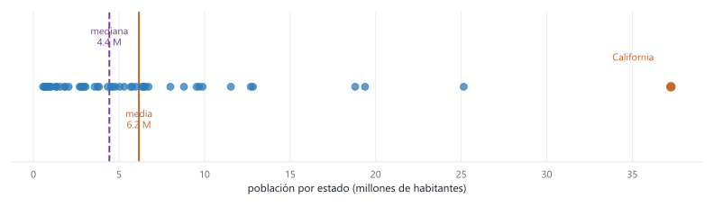
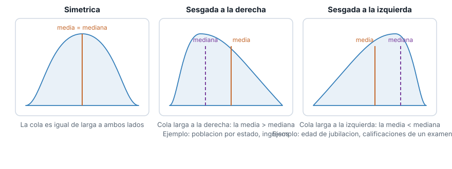
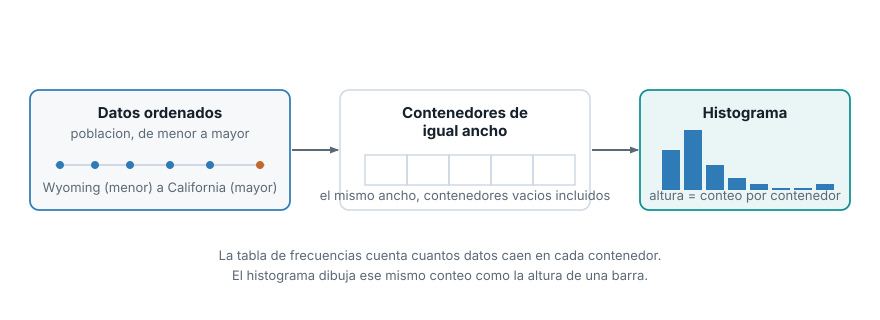
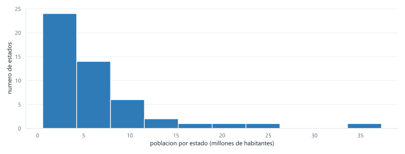
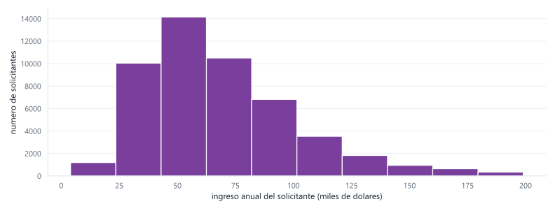

::: {.ficha}
|            |                                                          |
|------------|----------------------------------------------------------|
| Módulo     | Estadística para Analítica                               |
| Programa   | Especialización en Big Data                              |
| Unidad     | Unidad 1. Análisis descriptivo y exploratorio de datos   |
:::

## De qué va esta semana

Esta guía sigue el capítulo 1 de *Estadística práctica para ciencia de datos con R y Python* (Bruce,
Bruce y Gedeck, 2.ª edición), que es la fuente que seguimos esta semana. Vamos a repetir, con
Python, los mismos cálculos que hace el libro, con la misma formalidad: cada medida trae su
fórmula, un ejemplo resuelto, y un recuadro de **interpretación en contexto** que explica, en
lenguaje llano y con el ejemplo concreto del dataset, qué significa ese número más allá de la
definición matemática.

El dataset guía es `state.csv`, del propio repositorio del libro: población y tasa de homicidios de
los 50 estados de EE. UU. según el censo de 2010. Es pequeño, real y ya publicado, lo que te deja
verificar cada resultado contra un libro de referencia mientras aprendes el método. No vas a
quedarte solo mirando cómo lo resuelvo yo: cada bloque conceptual trae un ejercicio para que lo
resuelvas tú sobre una segunda columna del mismo dataset (`Murder.Rate`), con una solución que
puedes revisar después de intentarlo. Después, aplicas todo el método completo, de principio a fin,
sobre un dataset distinto y mucho más grande: 50 000 ingresos de solicitantes de crédito
(`loans_income.csv`, también del libro). Y para cerrar, un ejercicio sin solución ni dataset dado:
tú buscas los datos, formulas las preguntas y justificas cada respuesta.

La pregunta que resuelve esta semana es la que aparece cada vez que alguien te entrega una columna
de números: ¿cuál es el valor típico de esta variable, y qué tan dispersos están los datos
alrededor de ese valor? La media sola no basta. Vas a calcular varias formas de resumir la
localización y la dispersión, ver cuándo cada una conviene y por qué, y terminar resumiendo una
variable completa en una tabla de frecuencias y un histograma.

Al terminar deberías poder:

1. Calcular e interpretar media, mediana y media truncada a partir de su fórmula, y explicar por
   qué pueden diferir en un mismo conjunto de datos.
2. Calcular media y mediana ponderadas cuando cada observación no debería pesar lo mismo.
3. Calcular e interpretar varianza, desviación estándar, rango intercuartílico (IQR), desviación
   absoluta mediana (MAD) y coeficiente de variación, y decidir cuál reportar según si la variable
   tiene valores atípicos.
4. Construir una tabla de frecuencias con contenedores de igual ancho y su histograma
   correspondiente, e interpretar la forma de la distribución que resulta (simétrica o sesgada).
5. Aplicar el método completo a un conjunto de datos nuevo, formular tus propias preguntas sobre
   él, y justificar por escrito por qué cada medida que elegiste es la que corresponde.

## Cargar el dataset del libro

`state.csv` está publicado en el repositorio de datos del libro. No hace falta descargarlo: pandas
puede leerlo directo desde la URL cruda de GitHub.

```python
import pandas as pd

url = "https://raw.githubusercontent.com/gedeck/practical-statistics-for-data-scientists/master/data/state.csv"
state = pd.read_csv(url)
print(state.head(8))

print(state.dtypes)
```

```text
         State  Population  Murder.Rate Abbreviation
0      Alabama     4779736          5.7           AL
1       Alaska      710231          5.6           AK
2      Arizona     6392017          4.7           AZ
3     Arkansas     2915918          5.6           AR
4   California    37253956          4.4           CA
5     Colorado     5029196          2.8           CO
6  Connecticut     3574097          2.4           CT
7     Delaware      897934          5.8           DE

State            object
Population        int64
Murder.Rate     float64
Abbreviation     object
dtype: object
```

Cuatro columnas: el nombre del estado y su abreviatura son categóricas nominales, sin orden natural
(la clasificación de la semana 02). `Population` y `Murder.Rate` son numéricas: `Population` se
cuenta (número de habitantes), y `Murder.Rate` se mide, en homicidios por cada 100 000 habitantes
por año. El dataset completo tiene 50 filas, una por estado. Vas a trabajar `Population` conmigo,
paso a paso, y vas a resolver los mismos pasos con `Murder.Rate` por tu cuenta.

## Estimación de la localización

La localización responde una pregunta simple: si tuvieras que resumir toda la columna en un solo
número, ¿cuál dirías? Hay más de una respuesta razonable, y esta sección construye tres, con su
fórmula, antes de comparar cuál conviene según el caso.

### La media

La media (o promedio) suma todos los valores y divide entre cuántos son:

$$
\bar{x} = \frac{\sum_{i=1}^{n} x_i}{n}
$$

donde $x_1, x_2, \ldots, x_n$ son los $n$ valores de la variable. Es la estimación de localización
más simple y la más usada, y por eso vale la pena entender exactamente cuándo falla.

### La mediana

La mediana ordena los $n$ valores de menor a mayor y toma el valor central. Si $n$ es impar, es el
valor en la posición $\frac{n+1}{2}$. Si $n$ es par (como en `state.csv`, con 50 filas), es el
promedio de los dos valores centrales, en las posiciones $\frac{n}{2}$ y $\frac{n}{2}+1$. A
diferencia de la media, la mediana no usa el valor de cada dato, solo su posición en el orden.

### La media truncada

La media truncada ordena los valores, descarta un número fijo $p$ de observaciones en cada extremo,
y promedia lo que queda:

$$
\bar{x}_{\text{tr}} = \frac{\sum_{i=p+1}^{n-p} x_{(i)}}{n - 2p}
$$

donde $x_{(1)}, x_{(2)}, \ldots, x_{(n)}$ son los valores ordenados de menor a mayor. Con `trim=0.1`
(10%) sobre 50 estados, $p = 5$: se descartan los 5 estados más pequeños y los 5 más grandes, y se
promedian los 40 restantes.

### Las tres, calculadas sobre `Population`

```python
from scipy.stats import trim_mean

media = state["Population"].mean()
media_truncada = trim_mean(state["Population"], 0.1)
mediana = state["Population"].median()

print("media:", media)
print("media truncada (10%):", media_truncada)
print("mediana:", mediana)
```

```text
media: 6162876.3
media truncada (10%): 4783697.125
mediana: 4436369.5
```

Las tres estimaciones dan resultados distintos, y la diferencia no es ruido: tiene una causa
concreta. La mediana ordena las 50 poblaciones y toma el valor central. No le importa si el estado
más grande tiene 6 millones de habitantes o 40 millones: solo le importa su posición en el orden. La
media, en cambio, suma los 50 valores, y California pesa en esa suma con sus 37 253 956 habitantes
tanto como pesan juntos varios de los estados más pequeños. Ese único estado empuja la media muy por
encima de la mediana: la diferencia entre las dos, 6 162 876 contra 4 436 370, es casi 1.73 millones
de habitantes, más grande que la población de 12 de los 50 estados.

La media truncada, al descartar los 5 estados más grandes (entre ellos California) y los 5 más
pequeños, queda mucho más cerca de la mediana (4.78 millones) que de la media (6.16 millones): es un
punto intermedio, que elimina la influencia de los extremos sin llegar a ignorar por completo cuánto
pesa cada estado, como sí hace la mediana.

::: {.callout-note}
## Interpretación en contexto

- **Media (6.16 millones).** Es la cifra que resultaría si repartieras la población total del país
  en partes exactamente iguales entre los 50 estados. Nadie tiene esa población: es un promedio
  matemático, no el tamaño de ningún estado real. Sirve para cálculos que necesitan el total (la
  población total del país es la media por 50), pero engaña si la usas para describir "cómo es un
  estado típico".
- **Mediana (4.44 millones).** Es la población del estado que queda justo en el medio si alinearas
  los 50 estados de menor a mayor. La mitad de los estados tiene menos población que eso, y la otra
  mitad tiene más. Es la mejor respuesta a "¿cómo es un estado típico?", porque no le importa si
  California tiene 6 millones o 60 millones más que el resto: sigue estando igual de lejos, en la
  misma posición del orden.
- **Media truncada (4.78 millones).** Es como el promedio de una competencia de clavados, donde se
  descartan la nota más alta y la más baja de los jueces antes de promediar, para que un juez
  sesgado no manipule el resultado: aquí se descartan los 5 estados más chicos y los 5 más grandes
  antes de promediar los 40 restantes.
:::

::: {.diagrama}
{fig-alt="Linea de poblacion por estado en millones de habitantes, con California marcada aparte como un punto alejado del resto. La mediana cae dentro del grupo denso de estados; la media queda desplazada hacia la derecha, mas cerca de California."}
:::

Cuando una variable no tiene valores extremos, media y mediana casi coinciden. Cuando sí los tiene
(y `Population` es un buen ejemplo: hay un salto grande entre la mayoría de los estados y los pocos
muy poblados), la mediana y la media truncada quedan más cerca del valor que describiría mejor a un
estado "típico", y la media queda **jalada** hacia el valor atípico. Esa propiedad, no dejarse mover
por unos pocos valores extremos, se llama **robustez**. La mediana y la media truncada son robustas;
la media, no.

::: {.diagrama}
{fig-alt="Tres curvas de distribucion: simetrica con media igual a mediana, sesgada a la derecha con la media mayor que la mediana por la cola larga hacia valores altos, y sesgada a la izquierda con la media menor que la mediana."}
:::

Esta relación entre media y mediana no es exclusiva de `Population`: es una regla general que vas a
usar en cada dataset nuevo que abras. Cuando la cola de la distribución se estira hacia valores
altos (sesgo a la derecha, como la población o casi cualquier variable de dinero: ingresos, precios,
ventas), la media queda por encima de la mediana. Cuando se estira hacia valores bajos (sesgo a la
izquierda, menos común: edad de jubilación, calificaciones de un examen fácil donde casi todos sacan
buena nota y pocos sacan mala), la media queda por debajo. Cuando no hay cola dominante, coinciden.
Antes de reportar un solo número, mirar si media y mediana coinciden te dice, sin necesidad de
graficar nada todavía, si la variable tiene sesgo.

::: {.callout-tip collapse="true"}
## Ejercicio: localización de `Murder.Rate`

Calcula la media, la mediana y la media truncada al 10% de `Murder.Rate`, la tasa de homicidios por
cada 100 000 habitantes. Antes de correr el código, escribe una hipótesis: ¿esperas que la media
quede muy por encima de la mediana, como pasó con `Population`, o más cerca? Justifica tu respuesta
pensando en si `Murder.Rate` tiene un valor tan extremo como California.

Después de calcular las tres, responde: ¿qué estado tiene la tasa más alta? ¿Cambia tu conclusión
sobre el sesgo de la distribución?

::: {.callout-tip collapse="true"}
## Solución

```python
media_mr = state["Murder.Rate"].mean()
mediana_mr = state["Murder.Rate"].median()
truncada_mr = trim_mean(state["Murder.Rate"], 0.1)

print("media:", media_mr)
print("mediana:", mediana_mr)
print("media truncada (10%):", truncada_mr)
```

```text
media: 4.066
mediana: 4.0
media truncada (10%): 3.9450000000000003
```

Las tres estimaciones quedan mucho más cerca entre sí que en `Population` (4.07, 4.0 y 3.95, contra
6.16, 4.44 y 4.78 millones). `Murder.Rate` sí tiene sesgo a la derecha (la media queda un poco por
encima de la mediana), pero mucho más leve: no hay un estado tan extremo, en proporción al resto,
como California lo es para la población. El máximo de `Murder.Rate` es 10.3 (Louisiana), apenas
2.5 veces la media, mientras que la población de California es más de 6 veces la media de
`Population`. Conclusión: una diferencia pequeña entre media y mediana es la señal de que ningún
valor extremo domina el resultado, y en ese caso cualquiera de las tres estimaciones sirve para
reportar el valor típico.
:::
:::

### Media y mediana ponderadas

`Murder.Rate` trae otra pregunta. Si promedias esa columna sin más, tratas la tasa de Wyoming (con
menos de 600 000 habitantes) exactamente igual que la de California (con más de 37 millones), y sin
embargo un homicidio en California pesa sobre una población muchísimo mayor. Cuando cada observación
representa una masa distinta, conviene ponderar: multiplicar cada valor por su peso antes de
promediar.

$$
\bar{x}_w = \frac{\sum_{i=1}^{n} w_i x_i}{\sum_{i=1}^{n} w_i}
$$

donde $w_i$ es el peso de la observación $i$ (aquí, la población del estado $i$). La mediana
ponderada sigue la misma idea pero sobre las posiciones: es el valor tal que la mitad de la suma de
los pesos queda por encima y la otra mitad por debajo, en la lista ordenada.

```python
import numpy as np
import wquantiles

print("media simple de Murder.Rate:", state["Murder.Rate"].mean())
print("mediana simple de Murder.Rate:", state["Murder.Rate"].median())

media_ponderada = np.average(state["Murder.Rate"], weights=state["Population"])
mediana_ponderada = wquantiles.median(state["Murder.Rate"], weights=state["Population"])

print("media ponderada por poblacion:", media_ponderada)
print("mediana ponderada por poblacion:", mediana_ponderada)
```

```text
media simple de Murder.Rate: 4.066
mediana simple de Murder.Rate: 4.0
media ponderada por poblacion: 4.445833981123393
mediana ponderada por poblacion: 4.4
```

`np.average` con el argumento `weights` calcula la media ponderada directamente. Para la mediana
ponderada no hay una función en la librería estándar de NumPy o pandas; el paquete `wquantiles`
(se instala con `pip install wquantiles`) la resuelve. La tasa ponderada sube de 4.07 a 4.45: los
estados más poblados de esta muestra tienden a tener una tasa de homicidios un poco más alta que el
promedio simple, y ponderar por población lo refleja.

**Caso de uso.** Si un analista de política pública preguntara "¿cuál es la tasa de homicidios
promedio en el país?", la respuesta correcta no es el promedio simple de las 50 tasas estatales: es
la tasa ponderada, porque refleja cuántas personas viven realmente bajo cada tasa. El promedio
simple le da a Wyoming (menos de 600 000 habitantes) el mismo peso que a California (más de 37
millones), y eso distorsiona cualquier conclusión sobre el país como conjunto.

::: {.callout-note}
## Interpretación en contexto

Piensa en la diferencia entre estas dos preguntas: "¿cuál es la tasa de homicidios promedio *entre*
los 50 estados?" (la respuesta es 4.07, el promedio simple, donde cada estado cuenta como una
unidad) y "¿cuál es la tasa de homicidios que en promedio vive *una persona* del país?" (la respuesta
es 4.45, el promedio ponderado, donde cada persona cuenta como una unidad). La primera pregunta trata
a Wyoming como si tuviera el mismo peso que California; la segunda no. Cuál de las dos preguntar
depende de si tu unidad de interés son los estados o las personas.
:::

::: {.callout-note}
## ¿Y la moda?

La carta descriptiva menciona la moda entre las medidas de localización, pero la moda casi no se
usa con variables numéricas. Es el valor que más se repite, y eso solo es informativo cuando hay
repeticiones reales.

```python
print(state["Murder.Rate"].value_counts().sort_values(ascending=False).head(5))

print("valores unicos de Population:", state["Population"].nunique(), "de", len(state))
```

```text
Murder.Rate
5.7    3
2.0    3
1.6    3
5.6    2
5.8    2
Name: count, dtype: int64

valores unicos de Population: 50 de 50
```

`Murder.Rate` sí tiene repeticiones (varios estados comparten la misma tasa), y hay un empate a tres
vías en el valor más frecuente: 5.7, 2.0 y 1.6 homicidios por 100 000 habitantes aparecen cada uno
en tres estados. Eso ya es una moda multimodal, sin un único valor dominante. `Population`, en
cambio, tiene 50 valores distintos en 50 filas: ningún valor se repite, así que la moda no dice
nada. Donde la moda sí es la medida correcta es en variables categóricas: la máquina que más se usó
en el taller de mantenimiento de la semana 02, o el turno con más órdenes registradas. Ahí no hay
alternativa: no puedes promediar `maquina`, pero sí puedes preguntar cuál es la más frecuente.
:::

## Estimación de la variabilidad

Saber el valor típico no basta: dos variables pueden tener la misma media y comportarse de forma
completamente distinta si una está muy concentrada alrededor de ese valor y la otra muy dispersa. La
variabilidad mide qué tan lejos, en promedio, están los datos de su valor central.

### Varianza y desviación estándar

La varianza promedia el cuadrado de las distancias de cada valor a la media:

$$
s^2 = \frac{\sum_{i=1}^{n} (x_i - \bar{x})^2}{n - 1}
$$

Se divide entre $n - 1$ y no entre $n$ porque, al usar la media muestral $\bar{x}$ en vez de la
media real de la población, se pierde un grado de libertad: si conoces $\bar{x}$ y $n - 1$ de los
valores, el último queda determinado. Dividir entre $n - 1$ corrige ese sesgo. En la práctica, con
muestras de tamaño moderado o grande, la diferencia entre dividir por $n$ o por $n - 1$ es mínima.

La varianza queda en unidades al cuadrado (habitantes al cuadrado, si hablamos de `Population`), lo
que la hace casi imposible de interpretar directamente. La desviación estándar es su raíz cuadrada,
y por eso es la que casi siempre se reporta: queda en la misma unidad que los datos originales.

$$
s = \sqrt{s^2}
$$

```python
varianza = state["Population"].var()
desviacion = state["Population"].std()

print("varianza:", varianza)
print("desviacion estandar:", desviacion)
```

```text
varianza: 46898327373394.445
desviacion estandar: 6848235.347401142
```

Verifica la relación con la fórmula: $\sqrt{46\,898\,327\,373\,394.445} \approx 6\,848\,235.35$,
que coincide con lo que calculó `.std()`.

::: {.callout-note}
## Interpretación en contexto

La varianza, por sí sola, casi no se interpreta: "46.9 billones de habitantes al cuadrado" no
significa nada intuitivo para nadie. Existe como paso matemático hacia la desviación estándar, no
como un número para reportar. La desviación estándar sí se lee directamente: en promedio, la
población de un estado se aleja unos 6.85 millones de habitantes de la media del país. Es la regla
de bolsillo que usarías para decir "esta población es normal" o "esta población es rarísima": si un
estado se aleja mucho más que una desviación estándar de la media, llama la atención.
:::

### Rango intercuartílico (IQR) y MAD

El IQR y la MAD son las versiones robustas de la desviación estándar, del mismo modo que la mediana
es la versión robusta de la media.

El IQR es la diferencia entre el percentil 75 ($Q_3$) y el percentil 25 ($Q_1$): el ancho del 50%
central de los datos, ignorando el 25% más bajo y el 25% más alto.

$$
\text{IQR} = Q_3 - Q_1
$$

La MAD (desviación absoluta mediana) es la mediana de las distancias absolutas de cada valor a la
mediana:

$$
\text{MAD} = \text{mediana} \left( |x_1 - m|, |x_2 - m|, \ldots, |x_n - m| \right)
$$

donde $m$ es la mediana de la variable. En Python, `statsmodels` multiplica la MAD por la constante
1.4826 antes de devolverla, para que quede en la misma escala que la desviación estándar cuando los
datos siguen una distribución normal.

```python
from statsmodels import robust

iqr = state["Population"].quantile(0.75) - state["Population"].quantile(0.25)
mad = robust.scale.mad(state["Population"])

print("rango intercuartilico (IQR):", iqr)
print("MAD:", mad)
```

```text
rango intercuartilico (IQR): 4847308.0
MAD: 3849876.1459979336
```

| Medida | Valor sobre `Population` | ¿Robusta a atípicos? |
|---|---:|:---:|
| Desviación estándar | 6 848 235 | No |
| IQR | 4 847 308 | Sí |
| MAD | 3 849 876 | Sí |

La varianza y la desviación estándar elevan las distancias al cuadrado, así que un solo valor muy
alejado (otra vez, California) pesa desproporcionadamente en el resultado: la desviación estándar es
casi el doble de la MAD (6 848 235 contra 3 849 876) precisamente porque no es robusta a ese valor
extremo. El IQR y la MAD, como la mediana, no se mueven si cambias el valor de California por
cualquier otro número igual de grande: solo les importa la posición de los datos, no su magnitud
exacta.

::: {.callout-note}
## Interpretación en contexto

El IQR (4.85 millones) responde: si te quedas solo con la mitad de los estados que están justo en
el centro de la distribución (descartando el 25% más chico y el 25% más grande), esos estados
varían en un rango de 4.85 millones de habitantes entre el más chico y el más grande de ese grupo
central. La MAD (3.85 millones) responde algo parecido, pero calculado distinto: en promedio, usando
la mediana como referencia en vez de la media, un estado se aleja unos 3.85 millones de habitantes
del estado típico. Las dos existen porque, a diferencia de la desviación estándar, no se dejan
impresionar por California.
:::

::: {.callout-tip collapse="true"}
## Ejercicio: variabilidad de `Murder.Rate`

Calcula la varianza, la desviación estándar, el IQR y la MAD de `Murder.Rate`. Antes de calcular,
piensa: como ya viste en el ejercicio anterior que `Murder.Rate` no tiene un atípico tan marcado
como California, ¿esperas que la desviación estándar y la MAD queden mucho más cerca entre sí que
en `Population`, o igual de lejos?

::: {.callout-tip collapse="true"}
## Solución

```python
varianza_mr = state["Murder.Rate"].var()
desviacion_mr = state["Murder.Rate"].std()
iqr_mr = state["Murder.Rate"].quantile(0.75) - state["Murder.Rate"].quantile(0.25)
mad_mr = robust.scale.mad(state["Murder.Rate"])

print("varianza:", varianza_mr)
print("desviacion estandar:", desviacion_mr)
print("IQR:", iqr_mr)
print("MAD:", mad_mr)
```

```text
varianza: 3.6700448979591838
desviacion estandar: 1.9157361243029227
IQR: 3.125
MAD: 2.3721635496089624
```

Al contrario de lo que podría esperarse, la desviación estándar (1.92) queda **por debajo** de la
MAD (2.37), no por encima. Esto no contradice lo que aprendiste con `Population`: significa que
`Murder.Rate`, con solo 50 observaciones y sin un atípico dominante, no se comporta exactamente como
una distribución normal perfecta, que es el supuesto bajo el que la MAD se escala con el factor
1.4826 para igualar a la desviación estándar. La lección no cambia: sin un valor extremo que domine,
las dos medidas quedan en el mismo orden de magnitud (1.92 y 2.37, una diferencia de 0.45), muy
distinto de la brecha de casi 3 millones que separaba a la desviación estándar de la MAD en
`Population`.
:::
:::

### Coeficiente de variación: comparar dispersión entre variables distintas

La desviación estándar de `Population` (6.85 millones) y la de `Murder.Rate` (una fracción de
homicidio por 100 000 habitantes) no se pueden comparar directamente: están en unidades distintas y
en escalas distintas. El **coeficiente de variación** (CV) resuelve eso dividiendo la desviación
estándar entre la media, lo que lo convierte en un número sin unidades:

$$
CV = \frac{s}{\bar{x}}
$$

```python
cv_poblacion = state["Population"].std() / state["Population"].mean()
cv_homicidios = state["Murder.Rate"].std() / state["Murder.Rate"].mean()

print("CV poblacion:", cv_poblacion)
print("CV tasa de homicidios:", cv_homicidios)
```

```text
CV poblacion: 1.111207659222552
CV tasa de homicidios: 0.4711598928438079
```

`Population` tiene un CV de 1.11: su desviación estándar es mayor que su propia media, señal de una
variable con una dispersión enorme en relación con su valor típico. `Murder.Rate` tiene un CV de
0.47, menos de la mitad: aunque las dos variables tienen desviaciones estándar en escalas
completamente distintas, el CV permite decir, con un solo número comparable, que la tasa de
homicidios es relativamente mucho menos dispersa que la población.

**Caso de uso.** El CV se usa mucho para comparar el riesgo o la variabilidad de cosas que no
comparten unidad. En finanzas, para comparar qué tan riesgosas son dos inversiones con rendimientos
promedio distintos. En control de calidad industrial, para comparar la variabilidad de dos procesos
que miden magnitudes distintas (temperatura contra presión, por ejemplo). La regla es siempre la
misma: si vas a comparar la dispersión de dos variables que no están en la misma unidad o en la
misma escala, compara sus coeficientes de variación, no sus desviaciones estándar.

::: {.callout-note}
## Interpretación en contexto

Un CV de 1.11 en `Population` significa que la desviación estándar es *mayor* que la propia media:
es una variable extremadamente "ancha" en relación con su valor típico. Un CV de 0.47 en
`Murder.Rate` significa que la desviación estándar es menos de la mitad de la media: es una variable
comparativamente mucho más "angosta" o concentrada. Ninguno de los dos números por separado (6.85
millones contra 1.92) te deja comparar esto directamente, porque están en unidades distintas; el CV
sí, porque no tiene unidades.
:::

## Tablas de frecuencias e histogramas

Las medidas anteriores resumen una variable en un solo número. Una tabla de frecuencias y su
histograma resumen la variable completa, mostrando cómo se reparten los datos a lo largo de todo su
rango.

::: {.diagrama}
{fig-alt="Los datos ordenados se dividen en contenedores de igual ancho, cada uno con su conteo. El histograma dibuja esos mismos conteos como la altura de una barra por contenedor."}
:::

Una tabla de frecuencias divide el rango completo de la variable en $k$ segmentos de **igual
ancho** (los contenedores) y cuenta cuántos valores caen en cada uno. El ancho de cada contenedor
sale de dividir el rango total entre el número de contenedores que elijas:

$$
\text{ancho del contenedor} = \frac{x_{\max} - x_{\min}}{k}
$$

```python
contenedores = pd.cut(state["Population"], 10)
tabla_frecuencias = contenedores.value_counts(sort=False)
print(tabla_frecuencias)

print("suma de conteos:", tabla_frecuencias.sum())
```

```text
Population
(526935.67, 4232659.0]      24
(4232659.0, 7901692.0]      14
(7901692.0, 11570725.0]      6
(11570725.0, 15239758.0]     2
(15239758.0, 18908791.0]     1
(18908791.0, 22577824.0]     1
(22577824.0, 26246857.0]     1
(26246857.0, 29915890.0]     0
(29915890.0, 33584923.0]     0
(33584923.0, 37253956.0]     1
Name: count, dtype: int64

suma de conteos: 50
```

`pd.cut` divide el rango de `Population` (de 563 626, la población de Wyoming, a 37 253 956, la de
California) en 10 contenedores del mismo ancho: verifica con la fórmula,
$(37\,253\,956 - 563\,626) / 10 \approx 3\,669\,033$ habitantes por contenedor. `value_counts`
cuenta cuántos estados caen en cada uno. Los 50 conteos suman 50: cada estado cae en exactamente un
contenedor.

Dos contenedores (el octavo y el noveno, entre 26.2 y 33.6 millones) no tienen ningún estado. Vale
la pena incluirlos igual: un contenedor vacío es información, no un espacio para recortar. Si los
quitaras, la tabla sugeriría que la población salta de un estado con 26 millones directo a uno con
37 millones, y esconderías el hueco real que hay entre Texas y California.

::: {.diagrama}
{fig-alt="Histograma de la poblacion por estado en 10 contenedores de igual ancho, con la mayoria de los estados concentrados en los primeros dos contenedores y una cola larga hacia la derecha con pocos estados muy poblados."}
:::

El histograma dibuja la misma tabla como barras: un eje con los contenedores y la altura de cada
barra igual al conteo. Se ve de inmediato lo que la tabla de números cuesta más leer: la mayoría de
los estados (38 de 50) caen en los dos primeros contenedores, con menos de 8 millones de habitantes,
y después la barra baja rápido, con una cola larga y delgada hacia la derecha donde están Florida,
Nueva York, Texas y, sola en el último contenedor, California. Esta forma es la misma que viste en
el diagrama de sesgo: concentrada a la izquierda, con una cola larga a la derecha, y por eso la
media de `Population` queda tan por encima de la mediana.

::: {.callout-note}
## Interpretación en contexto

Un histograma sesgado a la derecha, como el de `Population`, te dice en una sola mirada algo que los
números por separado esconden: la mayoría de los casos son chicos o medianos, y unos pocos casos
extremos son responsables de que la media se vea inflada. Si alguien te reporta solo la media de una
variable así, sin mostrar antes el histograma o compararla con la mediana, te está ocultando que ese
número no representa bien al caso típico.
:::

::: {.callout-tip collapse="true"}
## Ejercicio: tabla de frecuencias e histograma de `Murder.Rate`

Construye la tabla de frecuencias de `Murder.Rate` con 6 contenedores (no 10: el rango de esta
variable es mucho más angosto que el de `Population`, y 10 contenedores dejarían casi todos con 1 o
2 estados). Antes de correr el código, calcula a mano el ancho de cada contenedor con la fórmula de
esta sección, sabiendo que el mínimo es 0.9 y el máximo es 10.3. Después de obtener la tabla,
responde: ¿la distribución se parece más al histograma simétrico o al sesgado a la derecha del
diagrama de arriba? ¿Coincide con lo que ya concluiste sobre la diferencia entre media y mediana de
esta variable?

::: {.callout-tip collapse="true"}
## Solución

Ancho esperado: $(10.3 - 0.9) / 6 \approx 1.57$.

```python
contenedores_mr = pd.cut(state["Murder.Rate"], 6)
tabla_mr = contenedores_mr.value_counts(sort=False)
print(tabla_mr)

print("suma:", tabla_mr.sum())
```

```text
Murder.Rate
(0.891, 2.467]    13
(2.467, 4.033]    13
(4.033, 5.6]       13
(5.6, 7.167]        9
(7.167, 8.733]      1
(8.733, 10.3]       1
Name: count, dtype: int64

suma: 50
```

Los tres primeros contenedores están casi empatados (13, 13 y 13 estados), y de ahí la frecuencia
baja de forma escalonada: 9, luego 1, luego 1. Hay una cola a la derecha, pero mucho menos marcada
que en `Population`: 41 de los 50 estados (los primeros cuatro contenedores) están razonablemente
concentrados entre 0.9 y 7.17, y solo 2 estados quedan en la cola larga. Esto confirma lo que ya
habías visto: hay sesgo a la derecha, pero leve, consistente con que la media (4.07) queda apenas
un poco por encima de la mediana (4.0) y no muy por encima, como sí pasaba con `Population`.
:::
:::

## Caso integrador: ingresos de solicitantes de crédito

Todo lo que calculaste hasta aquí lo hiciste sobre un dataset de 50 filas. Para cerrar la semana,
vas a aplicar el mismo método completo, sin ayuda, sobre un conjunto de datos de otra naturaleza y
de una escala mucho más grande: los ingresos anuales declarados por 50 000 solicitantes de un
crédito, otro dataset publicado en el repositorio del libro. Es el tipo de variable que un área de
riesgo crediticio revisa todos los días para decidir a quién le presta y cuánto.

```python
url_ingresos = "https://raw.githubusercontent.com/gedeck/practical-statistics-for-data-scientists/master/data/loans_income.csv"
income = pd.read_csv(url_ingresos)
income.columns = ["ingreso"]

print(income.head())
print("filas:", len(income))
print(income.dtypes)
```

```text
   ingreso
0    67000
1    52000
2   100000
3    78762
4    37041
filas: 50000
ingreso    int64
dtype: object
```

El archivo original nombra la columna `x`; la primera línea la renombra a `ingreso` para que el
resto del código sea legible. Una sola columna numérica, 50 000 observaciones: mil veces más datos
que `state.csv`, y vas a ver que eso no cambia el método, solo la escala de los números.

```python
media_ing = income["ingreso"].mean()
mediana_ing = income["ingreso"].median()
truncada_ing = trim_mean(income["ingreso"], 0.1)

print("media:", media_ing)
print("mediana:", mediana_ing)
print("media truncada (10%):", truncada_ing)
```

```text
media: 68760.51844
mediana: 62000.0
media truncada (10%): 65183.5528
```

```python
varianza_ing = income["ingreso"].var()
desviacion_ing = income["ingreso"].std()
iqr_ing = income["ingreso"].quantile(0.75) - income["ingreso"].quantile(0.25)
mad_ing = robust.scale.mad(income["ingreso"])
cv_ing = desviacion_ing / media_ing

print("varianza:", varianza_ing)
print("desviacion estandar:", desviacion_ing)
print("IQR:", iqr_ing)
print("MAD:", mad_ing)
print("CV:", cv_ing)
```

```text
varianza: 1080570709.356687
desviacion estandar: 32872.035369850266
IQR: 40000.0
MAD: 29652.04437011204
CV: 0.47806555441454673
```

```python
contenedores_ing = pd.cut(income["ingreso"], 10)
tabla_ing = contenedores_ing.value_counts(sort=False)
print(tabla_ing)

print("suma:", tabla_ing.sum())
```

```text
ingreso
(3805.0, 23500.0]        1201
(23500.0, 43000.0]      10388
(43000.0, 62500.0]      13849
(62500.0, 82000.0]      10719
(82000.0, 101500.0]      6559
(101500.0, 121000.0]     3557
(121000.0, 140500.0]     1790
(140500.0, 160000.0]     1108
(160000.0, 179500.0]      477
(179500.0, 199000.0]      352
Name: count, dtype: int64

suma: 50000
```

::: {.diagrama}
{fig-alt="Histograma del ingreso anual de 50000 solicitantes de credito en 10 contenedores, concentrado entre 43000 y 82000 dolares, con una cola larga hacia la derecha hasta cerca de 200000 dolares."}
:::

::: {.callout-tip collapse="true"}
## Ejercicio de cierre: redacta la conclusión

Con los números de arriba, responde estas cuatro preguntas por escrito, en dos o tres oraciones cada
una, como si se las estuvieras entregando a un gerente de riesgo crediticio que nunca ha visto estos
datos:

1. ¿Cuál es el ingreso "típico" de un solicitante? Justifica cuál de las tres medidas de localización
   usarías para responder esto y por qué esa, y no las otras dos.
2. ¿Qué tan dispersos están los ingresos? Usa al menos una medida de dispersión concreta en tu
   respuesta, no solo la palabra "dispersos" o "variados".
3. ¿La distribución de ingresos tiene sesgo? ¿Hacia dónde, y cómo lo sabes con los números que
   calculaste (sin necesidad de mirar el histograma)?
4. Si tuvieras que fijar un límite de crédito distinto para el 25% de solicitantes con menor ingreso,
   ¿qué valor usarías como corte, y qué medida de las que calculaste te lo da directamente?

::: {.callout-tip collapse="true"}
## Una posible respuesta

1. El ingreso típico ronda los 62 000 dólares (la mediana) o los 65 184 (la media truncada al 10%).
   La media simple, 68 761, sobreestima el caso típico porque un grupo de solicitantes con ingresos
   altos (hasta 199 000) la jala hacia arriba; con 50 000 observaciones y una diferencia clara entre
   media y mediana, conviene reportar la mediana.
2. La desviación estándar es de 32 872 dólares, casi la mitad del ingreso medio (eso es justo lo que
   mide el CV de 0.48): hay una dispersión considerable. El IQR de 40 000 dice que el 50% central de
   los solicitantes gana entre aproximadamente 43 000 y 83 000 dólares (los cuartiles 25 y 75).
3. Sí, sesgo a la derecha: la media (68 761) queda por encima de la mediana (62 000), y la tabla de
   frecuencias lo confirma, con el conteo más alto en el contenedor de 43 000 a 62 500 y una cola que
   se extiende, cada vez más delgada, hasta casi 200 000.
4. El percentil 25, que en este dataset corresponde al extremo inferior del IQR calculado arriba
   (`income["ingreso"].quantile(0.25)`). Es exactamente la misma herramienta que ya usaste para
   calcular el IQR, aplicada a un solo corte en vez de a la diferencia entre dos.
:::
:::

## Ejercicio final: constrúyelo tú, de principio a fin

Todo lo anterior te dio el dataset, las preguntas y hasta la solución. Este último ejercicio no trae
nada de eso: te toca buscar los datos, decidir qué preguntar y justificar cada respuesta con lo que
aprendiste esta semana. No tiene solución en esta guía y no se evalúa, pero tráelo resuelto (o
avanzado) a la próxima sesión: vamos a comparar en clase las preguntas que cada quien formuló.

### Paso 1. Consigue un dataset más complejo

Elige uno de estos dos caminos.

**Camino A: un dataset del propio libro, ya conocido pero mucho más grande y más sucio.**
`kc_tax.csv.gz`, con el valor catastral de casi 500 000 viviendas del condado de King (Seattle, EE.
UU.), su área construida en pies cuadrados y su código postal.

```python
kc_tax = pd.read_csv(
    "https://raw.githubusercontent.com/gedeck/practical-statistics-for-data-scientists/master/data/kc_tax.csv.gz",
    compression="gzip",
)
print(kc_tax.shape)
print(kc_tax.head())
print(kc_tax.isna().sum())
```

Este dataset tiene casi 500 000 filas (diez veces más que `loans_income.csv`, diez mil veces más que
`state.csv`) y trae algo que no viste esta semana: valores ausentes (`NaN`) en `TaxAssessedValue` y
en `ZipCode`. Antes de calcular nada, tienes que decidir qué hacer con esas filas (¿las descartas
con `.dropna()`? ¿por qué?) y justificarlo por escrito.

**Camino B: un dataset que tú busques**, de un dominio que te interese, en una fuente pública real:
[datos.gov.co](https://www.datos.gov.co/), el [portal de datos abiertos del Banco
Mundial](https://datos.bancomundial.org/), [Kaggle](https://www.kaggle.com/datasets) o el [UCI
Machine Learning Repository](https://archive.ics.uci.edu/). Debe tener al menos una variable
numérica y al menos varios miles de registros: más grande y más real que cualquier cosa que hayas
usado hasta ahora en el curso.

### Paso 2. Formula tus propias preguntas

Escribe al menos tres preguntas sobre una variable numérica del dataset que elegiste, que se puedan
responder con las herramientas de esta semana (localización, dispersión, tabla de frecuencias e
histograma) y no con nada que todavía no hayas visto (correlación, regresión, probabilidad: eso
viene después). Una pregunta como "¿los valores catastrales altos están en los mismos códigos
postales que las casas grandes?" no sirve todavía; una como "¿cuál es el valor catastral típico de
una vivienda, y qué tan dispersos están los valores alrededor de ese típico?" sí.

### Paso 3. Responde y justifica cada una

Para cada pregunta:

1. Calcula la medida o las medidas que la responden.
2. Justifica por escrito por qué esa medida, y no otra, es la que corresponde. Por ejemplo: "uso la
   mediana y no la media porque..." o "uso el coeficiente de variación porque estoy comparando dos
   variables en unidades distintas".
3. Redacta la conclusión en dos o tres oraciones, en el mismo tono ejecutivo que usaste en el caso
   de los ingresos: qué significa el número para alguien que va a tomar una decisión con él, no solo
   el número en sí.

### Paso 4. Cierra con una tabla de frecuencias y un histograma

Elige una variable numérica del dataset (puede ser la misma de tus preguntas) y construye su tabla
de frecuencias y su histograma. Decide tú el número de contenedores, justifica por qué elegiste ese
número, e interpreta la forma que resulta: ¿simétrica, sesgada a la derecha, sesgada a la izquierda?
¿A qué se debe esa forma, según lo que sabes del fenómeno que mide la variable?

::: {.callout-warning}
## Antes de la próxima sesión

Revisa que tu trabajo cumpla las tres condiciones que pide el módulo para cualquier entrega (ver la
presentación del módulo): que sea **reproducible** (tu código corre en otra máquina sin retoques),
**trazable** (cada conclusión se sostiene en una salida concreta) y **ejecutiva** (está escrito para
quien decide, no para quien revisa la fórmula).
:::

## Errores frecuentes

::: {.error-caso}
[Error 1]{.etiqueta}

### Reportar la media sin revisar la forma de la distribución

**Causa.** La media es el primer número que casi todo el mundo calcula, y en una distribución
simétrica es una buena elección. El problema aparece cuando se reporta sin mirar antes un histograma
o comparar contra la mediana, en una variable donde ambas pueden diferir mucho, como viste con
`Population` y con `ingreso`.

**Solución.** Antes de reportar un solo número, compara media y mediana. Si están cerca, cualquiera
sirve. Si están lejos, hay sesgo, y conviene reportar la mediana o la media truncada, o las dos junto
con la media para que quien lea entienda la diferencia.
:::

::: {.error-caso}
[Error 2]{.etiqueta}

### Descartar los contenedores vacíos de una tabla de frecuencias

**Causa.** Al construir una tabla de frecuencias a mano, o al filtrar programáticamente las filas
con conteo cero, es tentador quitar los contenedores vacíos porque "no aportan nada".

**Solución.** Un contenedor vacío es información: dice que ningún dato cae ahí, lo cual puede ser
tan importante como saber dónde sí caen. `pd.cut` seguido de `value_counts(sort=False)`, como en
esta guía, conserva el orden de los contenedores y sus conteos en cero. Ordenar por conteo
descendente (`value_counts()` sin `sort=False`) es exactamente el error que hay que evitar aquí,
porque reordena los contenedores y rompe la lectura de izquierda a derecha del rango completo.
:::

::: {.error-caso}
[Error 3]{.etiqueta}

### Comparar la desviación estándar de dos variables en escalas distintas

**Causa.** Ver dos desviaciones estándar, una mucho más grande que la otra, y concluir directamente
que esa variable es "más dispersa". Eso solo es válido si las dos variables están en la misma unidad
y en escalas parecidas. La desviación estándar de `Population` (6.85 millones) es enorme comparada
con la de `Murder.Rate` (1.92), pero eso no significa que la población sea "más dispersa" en un
sentido comparable: son unidades distintas.

**Solución.** Para comparar la dispersión relativa de variables en unidades o escalas distintas, usa
el coeficiente de variación (CV), no la desviación estándar directamente. Como viste en esta guía,
el CV de `Population` (1.11) sí es mayor que el de `Murder.Rate` (0.47), y esa comparación sí es
válida porque el CV no tiene unidades.
:::

## Lista de chequeo de la semana

::: {.checklist}
**Antes de la próxima sesión**

- [ ] Puedes escribir de memoria las fórmulas de la media, la media truncada, la varianza, la
      desviación estándar y el IQR
- [ ] Puedes explicar, con el ejemplo de `Population`, por qué la media, la mediana y la media
      truncada dan resultados distintos, y qué relación tiene eso con el sesgo de la distribución
- [ ] Resolviste los tres ejercicios de `Murder.Rate` antes de revisar la solución, no después
- [ ] Sabes cuándo usar una media o mediana ponderada en vez de la versión simple
- [ ] Puedes decir cuáles medidas de dispersión son robustas a valores atípicos y cuáles no
- [ ] Sabes cuándo comparar dos desviaciones estándar directamente es un error, y qué medida usar
      en su lugar
- [ ] Completaste el caso integrador de `loans_income.csv` con tu propia conclusión escrita, no
      solo el código
- [ ] Avanzaste el ejercicio final con tu propio dataset: al menos el Paso 1 (dataset cargado) y el
      Paso 2 (tus tres preguntas escritas) antes de la próxima sesión
:::

## Lo que viene

- **Semana 4.** Vas a interpretar percentiles y diagramas de caja (boxplot) para las variables
  numéricas, y tablas de contingencia y gráficos de barras para las categóricas.
- **Semana 5.** Vas a explorar relaciones entre variables con gráficos de dispersión y gráficos
  condicionales, y a cerrar la Unidad 1 con un informe exploratorio.

## Recursos

- Bruce, P., Bruce, A. y Gedeck, P. *Estadística práctica para ciencia de datos con R y Python.*
  2.ª edición, MARCOMBO, 2022. Capítulo 1: "Análisis exploratorio de datos". Fuente de esta guía.
- Datasets de esta guía, del repositorio de datos del libro:
  [`state.csv`](https://github.com/gedeck/practical-statistics-for-data-scientists/blob/master/data/state.csv) y
  [`loans_income.csv`](https://github.com/gedeck/practical-statistics-for-data-scientists/blob/master/data/loans_income.csv)
- Documentación de `pandas.cut`: [pandas.pydata.org/docs/reference/api/pandas.cut.html](https://pandas.pydata.org/docs/reference/api/pandas.cut.html)
- Paquete `wquantiles` para percentiles ponderados: [pypi.org/project/wquantiles](https://pypi.org/project/wquantiles/)

::: {.pie-doc}
Estadística para Analítica. Institución Universitaria Pascual Bravo. Facultad de Ingeniería.
Semestre 2026-02.

**Transparencia.** La redacción de esta guía contó con el apoyo de inteligencia artificial,
usando el modelo Claude Opus 5 de Anthropic. Todo el contenido fue revisado y validado. Las salidas
de terminal y los gráficos son reales, producidos al ejecutar estos mismos programas durante la
preparación del material.
:::
