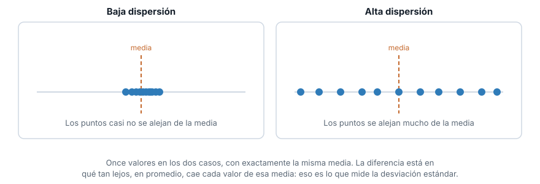
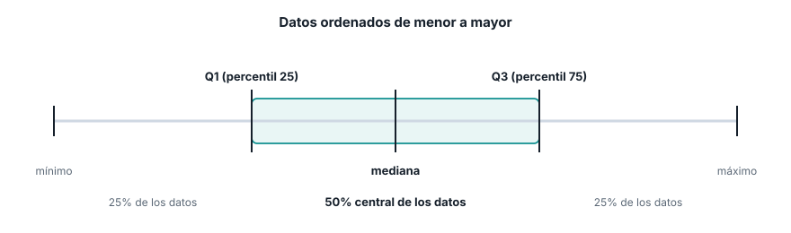
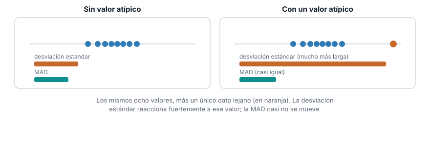
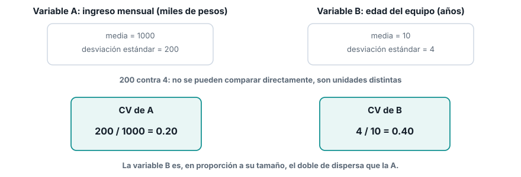
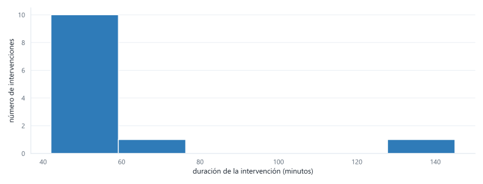

## Ruta de la sesión

::: {.columns}
::: {.column width="33%"}
**Bloque 1**

Localización

- Media
- Mediana
- Media truncada
- Moda
:::

::: {.column width="33%"}
**Bloque 2**

Dispersión

- Varianza y desviación estándar
- IQR
- MAD
- Coeficiente de variación
:::

::: {.column width="33%"}
**Bloque 3**

Distribución completa

- Tabla de frecuencias
- Histograma
:::
:::

## Los datos de hoy

Doce tiempos de intervención de mantenimiento, en minutos. No es un `DataFrame`: es una lista de
Python, tal cual la vas a recibir.

```python
tiempos = [42, 45, 47, 48, 48, 50, 51, 53, 55, 58, 60, 145]
```

. . .

[Una de esas intervenciones tomó muchísimo más tiempo que las demás.]{.grande}

## La regla del juego

::: {.aviso}
Nada de `.mean()`, `.median()`, `.std()`, `numpy`, `scipy` ni `statistics`.
:::

Para cada concepto vas a ver primero la fórmula. Después la vas a **implementar tú**, en Python
puro, usando solo:

- `sum()`, `len()`, `sorted()`, `min()`, `max()`
- bucles, comprensiones de lista, condicionales

Al final de cada bloque comparamos tu implementación con una posible solución, y la interpretamos.

## Bloque 1

[Localización]{.grande}

## La media

La estimación más simple de un valor típico: suma todos los valores y divide entre cuántos son.

$$
\bar{x} = \frac{\sum_{i=1}^{n} x_i}{n}
$$

. . .

Es sensible a **todos** los valores por igual, incluido el más extremo.

## ¿Qué significa la media?

Es el tiempo que le tocaría a **cada** intervención si repartieras el tiempo total de mantenimiento
en partes exactamente iguales entre las doce.

. . .

Ninguna intervención dura necesariamente ese tiempo: es un promedio matemático, no el tiempo real de
ningún caso. Sirve para calcular totales (tiempo total del mes = media por número de intervenciones),
pero puede engañar si la usas para describir "cuánto dura normalmente una intervención".

## Implementen la media

Escriban una función `media(datos)` que reciba la lista `tiempos` y devuelva la media, usando
solo `sum()` y `len()`.

```python
def media(datos):
    ...
```

[Tienen unos minutos. Después revisamos juntos.]{.pregunta}

## Una implementación posible {.codigo-largo}

```python
def media(datos):
    return sum(datos) / len(datos)

print(media(tiempos))
```

```text
58.5
```

## La mediana

Ordena los valores de menor a mayor y toma el valor central. Con $n$ par, promedia los dos valores
centrales.

$$
\text{mediana} =
\begin{cases}
x_{\left(\frac{n+1}{2}\right)} & \text{si } n \text{ es impar} \\[4pt]
\dfrac{x_{\left(\frac{n}{2}\right)} + x_{\left(\frac{n}{2}+1\right)}}{2} & \text{si } n \text{ es par}
\end{cases}
$$

## ¿Qué significa la mediana?

Ordena las doce intervenciones de más corta a más larga y párate justo en el medio. La mitad de las
intervenciones duró menos que ese valor, y la otra mitad duró más.

. . .

No le importa si la intervención más larga duró 100 minutos o 1000: su **posición** en el orden
sigue siendo la misma. Por eso es la medida que mejor responde "¿cuánto dura normalmente una
intervención?" cuando hay casos extremos de por medio.

## Media y mediana, bajo sesgo {.grafico}

{fig-alt="Tres curvas de distribución: simétrica con media igual a mediana, sesgada a la derecha con la media mayor que la mediana por la cola larga hacia valores altos, y sesgada a la izquierda con la media menor que la mediana"}

[Cuando la cola se estira hacia valores altos, la media queda por encima de la mediana. Es
exactamente lo que le pasa a `tiempos`, por la intervención de 145 minutos.]{.pie-grafico}

## Implementen la mediana

Escriban `mediana(datos)`. Ordenen la lista con `sorted()` y decidan qué hacer según si `len(datos)`
es par o impar. Con `tiempos`, $n = 12$: es par.

```python
def mediana(datos):
    ...
```

## Una implementación posible {.codigo-largo}

```python
def mediana(datos):
    ordenados = sorted(datos)
    n = len(ordenados)
    mitad = n // 2
    if n % 2 == 0:
        return (ordenados[mitad - 1] + ordenados[mitad]) / 2
    return ordenados[mitad]

print(mediana(tiempos))
```

```text
50.5
```

## La media truncada

Ordena los valores, descarta una proporción fija $p$ de cada extremo, y promedia lo que queda.

$$
\bar{x}_{\text{tr}} = \frac{\sum_{i=p+1}^{n-p} x_{(i)}}{n - 2p}
$$

Con `trim=0.1` y $n=12$: $p = \lfloor 12 \times 0.1 \rfloor = 1$. Se descarta 1 valor de cada extremo.

## ¿Qué significa la media truncada?

Es como el promedio de una competencia de clavados, donde se descartan la nota más alta y la más
baja de los jueces antes de promediar, para que un juez sesgado no manipule el resultado.

. . .

Aquí se descarta la intervención más corta y la más larga antes de promediar las diez restantes. Es
un punto intermedio entre la media (usa todos los valores) y la mediana (solo mira la posición
central): reduce la influencia de un caso extremo sin ignorarlo por completo.

## Implementen la media truncada

Escriban `media_truncada(datos, proporcion)`. Ordenen, calculen `p`, y usen slicing de listas
(`lista[p:n-p]`) para quedarse con el tramo central.

```python
def media_truncada(datos, proporcion):
    ...
```

## Una implementación posible {.codigo-largo}

```python
def media_truncada(datos, proporcion):
    ordenados = sorted(datos)
    n = len(ordenados)
    p = int(n * proporcion)
    recortados = ordenados[p:n - p]
    return sum(recortados) / len(recortados)

print(media_truncada(tiempos, 0.1))
```

```text
51.5
```

## Las tres, juntas

| Medida | Resultado |
|---|---:|
| Media | 58.5 |
| Media truncada (10%) | 51.5 |
| Mediana | 50.5 |

. . .

[La media queda 8 minutos por encima de la mediana. Una sola intervención (145 minutos) es
responsable de esa diferencia: sin ella, las tres estarían mucho más cerca.]{.grande}

## ¿Y la moda?

El valor que más se repite. En `tiempos`, el 48 aparece dos veces; ningún otro valor se repite.

```python
def moda(datos):
    conteos = {}
    for x in datos:
        ...
    # devuelvan el valor (o valores) con el conteo mas alto
```

## Revelado y discusión {.codigo-largo}

```python
def moda(datos):
    conteos = {}
    for x in datos:
        conteos[x] = conteos.get(x, 0) + 1
    maximo = max(conteos.values())
    return [valor for valor, veces in conteos.items() if veces == maximo]

print(moda(tiempos))
```

```text
[48]
```

::: {.definiciones}
Dos repeticiones en doce datos no es una señal fuerte. Con una variable numérica continua, la moda
casi nunca es la medida que conviene reportar.
:::

## Bloque 2

[Dispersión]{.grande}

## Varianza y desviación estándar

$$
s^2 = \frac{\sum_{i=1}^{n} (x_i - \bar{x})^2}{n - 1}
\qquad\qquad
s = \sqrt{s^2}
$$

. . .

Eleva al cuadrado cada distancia a la media, así que un valor lejano pesa mucho más que uno cercano.

## ¿Qué significa la desviación estándar?

Te dice, en promedio, qué tanto se aleja una intervención del tiempo típico. Es la regla de bolsillo
para decir "esta intervención fue normal" o "esta intervención fue rarísima".

. . .

La varianza, en cambio, casi no se interpreta sola: queda en "minutos al cuadrado", una unidad que
no significa nada intuitivo. Existe como paso matemático hacia la desviación estándar, no como un
número para reportar.

## Qué se ve cuando cambia la dispersión {.grafico}

{fig-alt="Once puntos con la misma media, una vez muy juntos (baja dispersión) y otra vez muy separados (alta dispersión)"}

[Misma media en los dos casos. La desviación estándar es lo que distingue un grupo del otro.]{.pie-grafico}

## Implementen varianza y desviación estándar

Escriban `varianza(datos)`, reutilizando la función `media` que ya escribieron. Después,
`desviacion_estandar(datos)` a partir de la varianza.

```python
def varianza(datos):
    ...

def desviacion_estandar(datos):
    ...
```

## Una implementación posible {.codigo-largo}

```python
def varianza(datos):
    m = media(datos)
    n = len(datos)
    return sum((x - m) ** 2 for x in datos) / (n - 1)

def desviacion_estandar(datos):
    return varianza(datos) ** 0.5

print(varianza(tiempos))
print(desviacion_estandar(tiempos))
```

```text
769.3636363636364
27.73740500413902
```

## Percentiles e IQR

El percentil $P$ es el valor tal que aproximadamente el $P$% de los datos queda por debajo. El IQR
es la diferencia entre el percentil 75 y el percentil 25:

$$
\text{IQR} = Q_3 - Q_1
$$

Para calcular un percentil por interpolación lineal sobre la lista ordenada, con posición
$pos = P \times (n-1)$:

$$
\text{percentil}(P) = x_{(\lfloor pos \rfloor)} + \left(pos - \lfloor pos \rfloor\right) \times
\left(x_{(\lfloor pos \rfloor + 1)} - x_{(\lfloor pos \rfloor)}\right)
$$

## ¿Qué significa el IQR? {.grafico}

{fig-alt="Recta con los datos ordenados marcando el percentil 25, la mediana y el percentil 75, con el rango intercuartílico resaltado como el 50 por ciento central"}

[El IQR es el ancho de esa banda central: si te quedas solo con la mitad de las intervenciones que
están justo en el centro, esas intervenciones varían en ese rango.]{.pie-grafico}

## Implementen el percentil y el IQR

Es "ordenar, encontrar la posición exacta (que puede caer entre dos datos), e interpolar entre esos
dos". Escriban `percentil(datos, p)` con `p` entre 0 y 1, y `iqr(datos)` a partir de dos llamadas a
`percentil`.

```python
def percentil(datos, p):
    ...

def iqr(datos):
    ...
```

## Una implementación posible {.codigo-largo}

```python
def percentil(datos, p):
    ordenados = sorted(datos)
    n = len(ordenados)
    posicion = p * (n - 1)
    piso = int(posicion)
    techo = min(piso + 1, n - 1)
    fraccion = posicion - piso
    return ordenados[piso] + fraccion * (ordenados[techo] - ordenados[piso])

def iqr(datos):
    return percentil(datos, 0.75) - percentil(datos, 0.25)

print(percentil(tiempos, 0.25), percentil(tiempos, 0.75))
print(iqr(tiempos))
```

```text
47.75 55.75
8.0
```

## MAD

La desviación absoluta mediana: la mediana de las distancias absolutas de cada valor a la mediana.

$$
\text{MAD} = \text{mediana}\left(|x_1 - m|, |x_2 - m|, \ldots, |x_n - m|\right)
$$

donde $m$ es la mediana de la variable. Fíjense: es la misma idea que la desviación estándar, pero
con medianas en vez de medias, y sin elevar al cuadrado.

## ¿Qué significa la MAD?

En promedio, usando la mediana como referencia, una intervención se aleja esa cantidad de minutos
del tiempo típico. Es a la desviación estándar lo que la mediana es a la media: una
versión que no se deja mover por un caso extremo.

## Por qué importa que sea robusta {.grafico}

{fig-alt="Comparación de la desviación estándar y la MAD con y sin un valor atípico: al agregar un valor lejano, la barra de la desviación estándar crece mucho mientras la barra de la MAD casi no cambia"}

[Agregar un solo valor lejano dispara la desviación estándar. La MAD casi no se entera.]{.pie-grafico}

## Implementen la MAD

Reutilicen la función `mediana` que ya escribieron, dos veces: una para encontrar $m$, y otra para
encontrar la mediana de las distancias absolutas.

```python
def mad(datos):
    ...
```

## Una implementación posible {.codigo-largo}

```python
def mad(datos):
    m = mediana(datos)
    desviaciones = [abs(x - m) for x in datos]
    return mediana(desviaciones)

print(mad(tiempos))
```

```text
4.0
```

. . .

[La desviación estándar (27.7) es casi siete veces la MAD (4.0). La diferencia es tan grande porque
una sola intervención de 145 minutos domina el cálculo de la desviación estándar, y la MAD no se
deja mover por ella.]{.grande}

## Coeficiente de variación

Divide la desviación estándar entre la media, para comparar dispersión entre variables en unidades
distintas:

$$
CV = \frac{s}{\bar{x}}
$$

## ¿Qué significa el coeficiente de variación?

Te dice qué tan "ancha" es una variable en relación con su propio tamaño típico, sin importar en qué
unidades esté medida. Sirve para comparar la dispersión relativa de dos variables
que no se pueden comparar directamente.

## Por qué no basta con comparar desviaciones {.grafico}

{fig-alt="Dos variables en escalas muy distintas: comparar sus desviaciones estándar directamente no dice mucho, pero el coeficiente de variación revela cuál es relativamente más dispersa"}

[200 contra 4 no se pueden comparar: son unidades distintas. 0.20 contra 0.40 sí.]{.pie-grafico}

## Impleméntenlo

Con `desviacion_estandar` y `media` ya escritas, esta es una línea.

```python
def coeficiente_variacion(datos):
    ...
```

## Revelado {.codigo-largo}

```python
def coeficiente_variacion(datos):
    return desviacion_estandar(datos) / media(datos)

print(coeficiente_variacion(tiempos))
```

```text
0.4741436752844277
```

[La desviación estándar equivale a casi la mitad de la media (47%). Para una variable de tiempos de
intervención, eso es bastante dispersión.]{.grande}

## Resumen del bloque 2

| Medida | Resultado | ¿Robusta al valor de 145? |
|---|---:|:---:|
| Desviación estándar | 27.74 | No |
| IQR | 8.00 | Sí |
| MAD | 4.00 | Sí |
| Coeficiente de variación | 0.47 | No (hereda de la desviación estándar) |

## Bloque 3

[Distribución completa]{.grande}

## Tabla de frecuencias

Divide el rango completo en $k$ contenedores de **igual ancho**, y cuenta cuántos valores caen en
cada uno.

$$
\text{ancho} = \frac{x_{\max} - x_{\min}}{k}
$$

Con `tiempos`: $x_{\min} = 42$, $x_{\max} = 145$. Con $k = 6$ contenedores, el ancho es
$(145 - 42) / 6 \approx 17.17$.

## ¿Para qué sirve esto?

Todo lo anterior (media, mediana, desviación estándar...) resume la variable en un solo número. La
tabla de frecuencias no resume nada: muestra **toda** la variable, agrupada, para que
veas de un vistazo dónde se concentran los datos y dónde hay huecos.

. . .

Es el paso que conecta los números que calculaste con la forma real de la distribución: por qué
`tiempos` tiene sesgo a la derecha, no solo que lo tiene.

## Implementen la tabla de frecuencias

Para cada valor, calculen a qué contenedor pertenece con
`indice = int((x - minimo) / ancho)`, y cuenten cuántos valores caen en cada índice. Ojo con el
valor máximo: puede calcular un índice uno más allá del último contenedor.

```python
def tabla_frecuencias(datos, k):
    ...
```

## Una implementación posible {.codigo-largo}

```python
def tabla_frecuencias(datos, k):
    minimo, maximo = min(datos), max(datos)
    ancho = (maximo - minimo) / k
    contenedores = [0] * k
    for x in datos:
        indice = int((x - minimo) / ancho)
        if indice == k:
            indice = k - 1
        contenedores[indice] += 1
    return contenedores, ancho, minimo

conteos, ancho, minimo = tabla_frecuencias(tiempos, 6)
for i, conteo in enumerate(conteos):
    inicio = minimo + i * ancho
    print(f"[{inicio:.1f}, {inicio + ancho:.1f}) -> {conteo}")
```

```text
[42.0, 59.2) -> 10
[59.2, 76.3) -> 1
[76.3, 93.5) -> 0
[93.5, 110.7) -> 0
[110.7, 127.8) -> 0
[127.8, 145.0) -> 1
```

## El histograma {.grafico}

{fig-alt="Histograma de los doce tiempos de intervención en seis contenedores: diez intervenciones concentradas en el primer contenedor, una en el segundo, y una sola intervención aislada en el último contenedor, correspondiente al valor atípico de 145 minutos"}

[Diez de doce intervenciones caen en el primer contenedor. Tres contenedores quedan vacíos. Y la de
145 minutos aparece sola, lejos de todas las demás.]{.pie-grafico}

## Lo que acabamos de construir

::: {.regla}
No llamaron a `.mean()` ni a `.std()` ni una sola vez.
:::

::: {.regla}
Escribieron, desde la ecuación, media, mediana, media truncada, varianza, desviación estándar,
percentil, IQR, MAD, coeficiente de variación y una tabla de frecuencias.
:::

::: {.regla}
La próxima vez que llamen `serie.mean()` en pandas, van a saber exactamente qué hace esa línea por
dentro.
:::

## Lo que viene

- **Semana 4.** Percentiles y diagramas de caja (boxplot) para variables numéricas, tablas de
  contingencia y gráficos de barras para categóricas.
- **Semana 5.** Gráficos de dispersión y condicionales, e informe exploratorio para cerrar la
  Unidad 1.
