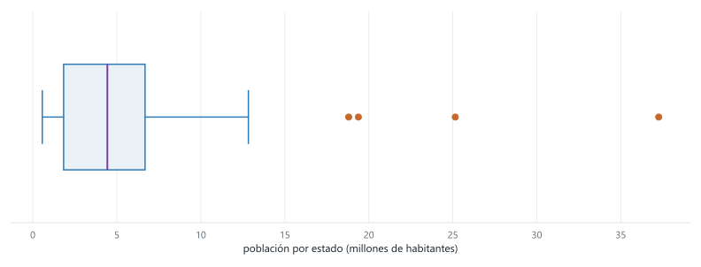
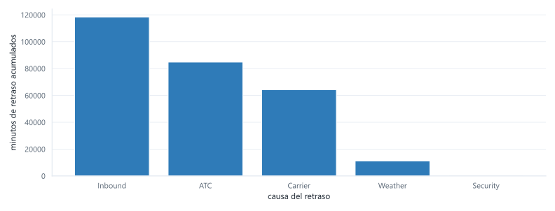
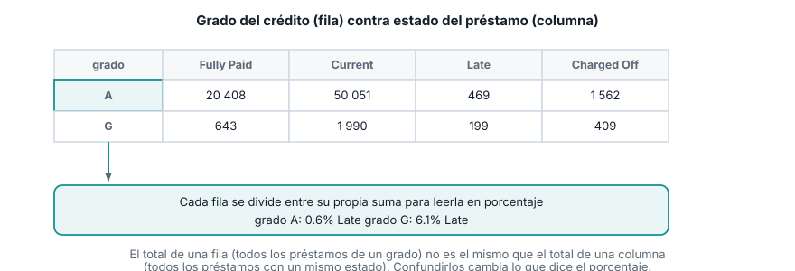
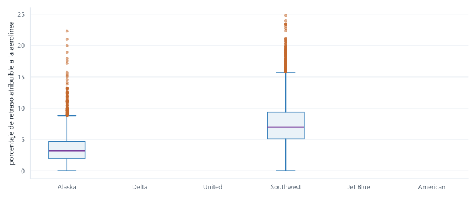

::: {.ficha}
|            |                                                          |
|------------|----------------------------------------------------------|
| Módulo     | Estadística para Analítica                               |
| Programa   | Especialización en Big Data                              |
| Unidad     | Unidad 1. Análisis descriptivo y exploratorio de datos   |
:::

[Abrir la presentación de la sesión](presentacion-boxplot-categoricas.html){.btn .btn-primary
role="button"}

## De qué va esta semana

Seguimos con el capítulo 1 de *Estadística práctica para ciencia de datos con R y Python* (Bruce,
Bruce y Gedeck, 2.ª edición), la misma fuente de la semana pasada. Esta semana cierra la caja de
herramientas para variables numéricas con los percentiles y el diagrama de caja (boxplot), y abre
la caja de herramientas para variables categóricas: gráficos de barras y tablas de contingencia.

La media, la mediana y la desviación estándar que calculaste la semana pasada resumen una variable
en un solo número. El boxplot va un paso más allá: resume la distribución completa en cinco puntos
de referencia (el mínimo dentro de rango, el percentil 25, la mediana, el percentil 75 y el máximo
dentro de rango) y señala aparte los valores atípicos. Es la herramienta que vas a usar todas las
semanas de aquí en adelante para comparar la distribución de una variable numérica entre varios
grupos de un vistazo, algo que un histograma por grupo hace mucho más difícil de leer.

Las variables categóricas no tienen media ni mediana: no puedes promediar "preventiva" y
"correctiva". Lo que sí puedes hacer es contar cuántas veces aparece cada categoría, y esa cuenta es
la base de un gráfico de barras cuando hay una sola variable categórica, y de una tabla de
contingencia cuando quieres cruzar dos.

El dataset guía sigue siendo `state.csv`, ya cargado la semana pasada. Para gráficos de barras y
tablas de contingencia usas dos datasets nuevos del mismo repositorio del libro: los minutos de
retraso acumulados por causa en el aeropuerto de Dallas-Fort Worth, y el historial de 450 961
préstamos de Lending Club con su calificación de riesgo y su estado de pago. Cierras con un caso
integrador sobre los retrasos de seis aerolíneas, comparando boxplots agrupados por categoría.

Al terminar deberías poder:

1. Calcular percentiles con pandas e interpretar qué fracción de los datos queda por debajo y por
   encima de cada uno.
2. Construir un diagrama de caja a partir de percentiles y el IQR, explicar la regla que fija dónde
   termina cada bigote, e identificar valores atípicos con esa misma regla.
3. Construir un gráfico de barras para una variable categórica, distinguirlo de un histograma, y
   explicar por qué un gráfico circular casi nunca es la mejor opción.
4. Construir una tabla de contingencia entre dos variables categóricas con `pd.crosstab`, calcular
   porcentajes por fila, e interpretar el hallazgo que resulta.
5. Comparar la distribución de una variable numérica entre varias categorías con un boxplot
   agrupado, e identificar cuándo dos grupos no se superponen.

## Recapitulación breve

`state` ya está en memoria desde la semana pasada. Si arrancas una sesión nueva, esta línea la
recupera:

```python
import pandas as pd

url = "https://raw.githubusercontent.com/gedeck/practical-statistics-for-data-scientists/master/data/state.csv"
state = pd.read_csv(url)
```

Recuerda las dos columnas numéricas: `Population` (población de cada uno de los 50 estados, censo
2010) y `Murder.Rate` (tasa de homicidios por cada 100 000 habitantes). Vas a trabajar `Population`
conmigo y `Murder.Rate` por tu cuenta, igual que la semana pasada.

## Percentiles

El percentil $P$ de una variable es el valor tal que aproximadamente el $P$% de los datos queda por
debajo de él. Los cuartiles son los percentiles 25, 50 y 75; el percentil 50 es la mediana que ya
conoces.

Para calcularlo por interpolación lineal sobre la lista ordenada $x_{(1)}, x_{(2)}, \ldots,
x_{(n)}$, se ubica primero una posición continua $pos = P \times (n - 1)$, y se interpola entre los
dos datos reales que rodean esa posición:

$$
\text{percentil}(P) = x_{(\lfloor pos \rfloor)} + \left(pos - \lfloor pos \rfloor\right) \times
\left(x_{(\lfloor pos \rfloor + 1)} - x_{(\lfloor pos \rfloor)}\right)
$$

Cuando $pos$ cae exactamente sobre un dato (por ejemplo, si $P \times (n-1)$ da un entero), el
percentil es ese dato tal cual: la parte fraccionaria de la interpolación es cero.

```python
percentiles = state["Population"].quantile([0.25, 0.5, 0.75])
print(percentiles)
```

```text
0.25    1833004.25
0.50    4436369.50
0.75    6680312.25
Name: Population, dtype: float64
```

`.quantile()` acepta un valor entre 0 y 1 (no entre 0 y 100) y usa exactamente esta interpolación
por defecto. El percentil 0.5 coincide con la mediana que calculaste la semana pasada (4 436 369.5):
son la misma medida, calculada con dos funciones distintas.

::: {.callout-note}
## Interpretación en contexto

El percentil 25 (1 833 004) dice que una cuarta parte de los 50 estados tiene menos de 1.83 millones
de habitantes. El percentil 75 (6 680 312) dice que tres cuartas partes de los estados tienen menos
de 6.68 millones, o, dicho al revés, que solo una cuarta parte supera esa cifra. Entre esos dos
valores queda el 50% central de los estados: ni los más chicos ni los más grandes, el grupo de en
medio.
:::

## El diagrama de caja (boxplot)

El diagrama de caja, propuesto por el estadístico John Tukey en 1977, resume una variable numérica
completa en cinco puntos de referencia, calculados a partir de los percentiles que acabas de ver.

::: {.diagrama}
{fig-alt="Diagrama de caja con sus partes rotuladas: la caja va del percentil 25 al percentil 75 con la mediana marcada adentro, cada bigote se extiende hasta el dato real mas alejado que sigue dentro de 1.5 veces el IQR desde el borde de la caja, y los puntos mas alla de ese limite se marcan aparte como atipicos."}
:::

La caja va del percentil 25 (`Q1`) al percentil 75 (`Q3`), con una línea marcando la mediana
adentro. El ancho de la caja es exactamente el IQR que calculaste la semana pasada:

$$
\text{IQR} = Q_3 - Q_1
$$

Los bigotes son la parte que más se presta a confusión. **No** se extienden una distancia fija de
1.5 veces el IQR: se extienden hasta el dato real más alejado que sigue dentro de ese límite. El
límite se calcula así:

$$
\text{límite inferior} = Q_1 - 1.5 \times \text{IQR} \qquad\qquad
\text{límite superior} = Q_3 + 1.5 \times \text{IQR}
$$

Cualquier dato entre esos dos límites queda cubierto por un bigote, hasta el más extremo de ellos.
Cualquier dato fuera de ese rango se dibuja aparte, como un punto individual: es un valor atípico
según esta regla. Matplotlib construye sus boxplots con esta misma convención.

```python
q1 = state["Population"].quantile(0.25)
q3 = state["Population"].quantile(0.75)
iqr = q3 - q1
limite_inferior = q1 - 1.5 * iqr
limite_superior = q3 + 1.5 * iqr

print("Q1:", q1)
print("Q3:", q3)
print("IQR:", iqr)
print("limite inferior:", limite_inferior)
print("limite superior:", limite_superior)

atipicos = state[(state["Population"] < limite_inferior) | (state["Population"] > limite_superior)]
print(atipicos[["State", "Population"]].sort_values("Population", ascending=False))
```

```text
Q1: 1833004.25
Q3: 6680312.25
IQR: 4847308.0
limite inferior: -5437957.75
limite superior: 13951274.25
         State  Population
4   California    37253956
42       Texas    25145561
31    New York    19378102
8      Florida    18801310
```

El IQR de `Population` es 4 847 308: exactamente el mismo número que calculaste la semana pasada con
`.quantile(0.75) - .quantile(0.25)`. El límite inferior sale negativo, así que ningún estado puede
quedar fuera por abajo (la población no puede ser negativa); el bigote inferior llega hasta Wyoming,
el estado con menos habitantes. Por arriba, cuatro estados superan el límite de 13 951 274 y quedan
marcados como atípicos: California, Texas, Nueva York y Florida. Son los mismos cuatro estados que
más alejaban la media de la mediana la semana pasada.

```python
import matplotlib.pyplot as plt

fig, ax = plt.subplots(figsize=(11, 4.2))
ax.boxplot(state["Population"] / 1_000_000, vert=False)
ax.set_xlabel("población por estado (millones de habitantes)")
plt.show()
```

::: {.diagrama}
{fig-alt="Diagrama de caja horizontal de la poblacion por estado en millones de habitantes, con la caja concentrada entre 1.8 y 6.7 millones y cuatro puntos atipicos hacia la derecha correspondientes a California, Texas, Nueva York y Florida."}
:::

::: {.callout-note}
## Interpretación en contexto

La caja, angosta y pegada a la izquierda del gráfico, dice que la mayoría de los estados tiene una
población relativamente baja y parecida entre sí. Los cuatro puntos sueltos a la derecha no son
ruido ni un error de los datos: son estados reales, mucho más poblados que el resto, y el boxplot
los separa visualmente en vez de dejar que estiren la escala del gráfico entero, como pasaría con un
histograma de pocos contenedores.
:::

::: {.callout-tip collapse="true"}
## Ejercicio: boxplot de `Murder.Rate`

Calcula los percentiles 25, 50 y 75 de `Murder.Rate`, el IQR, los límites del boxplot y los valores
atípicos que resulten. Antes de correr el código, piensa: la semana pasada viste que `Murder.Rate`
no tenía un atípico tan marcado como California. ¿Esperas cero atípicos, uno, o varios?

::: {.callout-tip collapse="true"}
## Solución

```python
percentiles_mr = state["Murder.Rate"].quantile([0.25, 0.5, 0.75])
print(percentiles_mr)

q1_mr = state["Murder.Rate"].quantile(0.25)
q3_mr = state["Murder.Rate"].quantile(0.75)
iqr_mr = q3_mr - q1_mr
limite_inf_mr = q1_mr - 1.5 * iqr_mr
limite_sup_mr = q3_mr + 1.5 * iqr_mr

print("IQR:", iqr_mr)
print("limite inferior:", limite_inf_mr)
print("limite superior:", limite_sup_mr)

atipicos_mr = state[(state["Murder.Rate"] < limite_inf_mr) | (state["Murder.Rate"] > limite_sup_mr)]
print(atipicos_mr[["State", "Murder.Rate"]])
```

```text
0.25    2.425
0.50    4.000
0.75    5.550
Name: Murder.Rate, dtype: float64
IQR: 3.125
limite inferior: -2.2625
limite superior: 10.2375
        State  Murder.Rate
17  Louisiana         10.3
```

Un único atípico: Louisiana, con una tasa de 10.3, apenas por encima del límite superior de 10.24.
Es coherente con lo que ya sabías: `Murder.Rate` tiene sesgo a la derecha, pero mucho más leve que
`Population`, así que el boxplot marca un solo estado en el límite en vez de un grupo de cuatro muy
por encima del resto.
:::
:::

## Variables categóricas: moda y gráficos de barras

Una variable categórica no tiene percentiles ni boxplot: no hay un orden numérico entre
"tormenta" y "falla mecánica" como causas de un retraso. Lo único que se puede hacer es contar
cuántas veces aparece cada categoría. El valor con el conteo más alto es la moda, y esa cuenta,
graficada, es un gráfico de barras.

El dataset de esta sección resume los minutos de retraso acumulados en el aeropuerto de
Dallas-Fort Worth, agrupados por causa: problema del transportista (`Carrier`), control de tráfico
aéreo (`ATC`), clima (`Weather`), seguridad (`Security`) y vuelo entrante retrasado (`Inbound`). Es
una sola fila con una columna por causa; para tratarla como una variable categórica hay que
transponerla.

```python
url_dfw = "https://raw.githubusercontent.com/gedeck/practical-statistics-for-data-scientists/master/data/dfw_airline.csv"
dfw = pd.read_csv(url_dfw)
print(dfw)

causas = dfw.transpose()
causas.columns = ["minutos"]
causas["porcentaje"] = (causas["minutos"] / causas["minutos"].sum() * 100).round(1)
print(causas.sort_values("minutos", ascending=False))
```

```text
    Carrier      ATC   Weather  Security    Inbound
0  64263.16  84856.5  11235.42    343.15  118427.82
            minutos  porcentaje
Inbound   118427.82        42.4
ATC        84856.50        30.4
Carrier    64263.16        23.0
Weather    11235.42         4.0
Security     343.15         0.1
```

```python
fig, ax = plt.subplots(figsize=(11, 4.2))
ax.bar(causas.index, causas["minutos"])
ax.set_xlabel("causa del retraso")
ax.set_ylabel("minutos de retraso acumulados")
plt.show()
```

::: {.diagrama}
{fig-alt="Grafico de barras con cinco causas de retraso de vuelos: retraso de vuelo entrante es la barra mas alta, seguida de control de trafico aereo, problema del transportista, clima, y seguridad como la barra mas baja, casi invisible."}
:::

::: {.callout-note}
## Interpretación en contexto

La categoría más frecuente (la moda) es "Inbound": el 42.4% de los minutos de retraso vienen de
vuelos que ya llegaban tarde desde otro aeropuerto, no de un problema en Dallas-Fort Worth mismo.
Junto con el control de tráfico aéreo (30.4%), estas dos causas explican más del 70% del retraso
total. La seguridad, en cambio, es prácticamente irrelevante (0.1%): en un análisis real, ahí no
vale la pena invertir esfuerzo de mejora.
:::

**Gráfico de barras contra histograma.** Los dos se parecen (barras verticales sobre un eje), y por
eso se confunden. La diferencia está en el eje horizontal: en un histograma, el eje es numérico y
continuo, y las barras van pegadas unas a otras porque representan contenedores que cubren todo el
rango sin huecos. En un gráfico de barras, el eje muestra categorías sin orden numérico, y las
barras van separadas porque no hay continuidad entre "clima" y "seguridad": podrías reordenarlas sin
que el gráfico pierda sentido, algo que no puedes hacer con los contenedores de un histograma.

**Por qué no un gráfico circular (de pastel).** Es una alternativa común para mostrar proporciones
entre categorías, pero el ojo humano compara longitudes y posiciones mucho mejor de lo que compara
ángulos y áreas. Con más de dos o tres categorías, un gráfico circular hace difícil saber cuál
porción es más grande sin leer las etiquetas de porcentaje una por una; un gráfico de barras
ordenado de mayor a menor responde esa pregunta con una mirada.

## Tablas de contingencia

Cuando quieres cruzar dos variables categóricas (no resumir una sola), la herramienta es la tabla de
contingencia: un recuento de cuántas observaciones caen en cada combinación posible de las dos
variables.

El dataset de esta sección trae 450 961 préstamos de Lending Club, cada uno con su calificación de
riesgo (`grade`, de A a G, siendo A la más segura) y su estado (`status`: pagado por completo,
vigente, atrasado o cancelado por incumplimiento).

```python
url_lc = "https://raw.githubusercontent.com/gedeck/practical-statistics-for-data-scientists/master/data/lc_loans.csv"
lc = pd.read_csv(url_lc)
print(lc.shape)
print(lc.head())
```

```text
(450961, 2)
        status grade
0   Fully Paid     B
1  Charged Off     C
2   Fully Paid     C
3   Fully Paid     C
4      Current     B
```

`pd.crosstab` construye la tabla de contingencia: una fila por cada valor de `grade`, una columna
por cada valor de `status`, y en cada celda el conteo de préstamos con esa combinación exacta.

```python
tabla = pd.crosstab(lc["grade"], lc["status"])
print(tabla)
```

```text
status  Charged Off  Current  Fully Paid  Late
grade
A              1562    50051       20408   469
B              5302    93852       31160  2056
C              6023    88928       23147  2777
D              5007    53281       13681  2308
E              2842    24639        5949  1374
F              1526     8444        2328   606
G               409     1990         643   199
```

Con `margins=True` se agregan la suma de cada fila y de cada columna, para verificar que los
conteos cuadran con el total del dataset:

```python
tabla_con_margen = pd.crosstab(lc["grade"], lc["status"], margins=True)
print(tabla_con_margen)
```

```text
status  Charged Off  Current  Fully Paid  Late     All
grade
A              1562    50051       20408   469   72490
B              5302    93852       31160  2056  132370
C              6023    88928       23147  2777  120875
D              5007    53281       13681  2308   74277
E              2842    24639        5949  1374   34804
F              1526     8444        2328   606   12904
G               409     1990         643   199    3241
All           22671   321185       97316  9789  450961
```

Los conteos por sí solos no responden la pregunta que más importa: ¿la calificación de riesgo
predice el resultado del préstamo? Para verlo hay que convertir cada fila a porcentaje, dividiendo
entre el total de esa fila (no entre el total de la tabla).

```python
porcentaje_fila = (tabla.div(tabla.sum(axis=1), axis=0) * 100).round(1)
print(porcentaje_fila)
```

```text
status  Charged Off  Current  Fully Paid  Late
grade
A               2.2     69.0        28.2   0.6
B               4.0     70.9        23.5   1.6
C               5.0     73.6        19.1   2.3
D               6.7     71.7        18.4   3.1
E               8.2     70.8        17.1   3.9
F              11.8     65.4        18.0   4.7
G              12.6     61.4        19.8   6.1
```

::: {.diagrama}
{fig-alt="Tabla de contingencia entre grado del credito y estado del prestamo, con una flecha que muestra como se divide una fila entre su propia suma para obtener el porcentaje de esa fila, comparando el 0.6 por ciento de atraso en el grado A contra el 6.1 por ciento en el grado G."}
:::

::: {.callout-note}
## Interpretación en contexto

El patrón es consistente en las cuatro columnas: a medida que la calificación baja de A a G, el
porcentaje de préstamos atrasados (`Late`) sube de 0.6% a 6.1%, y el porcentaje cancelado por
incumplimiento (`Charged Off`) sube de 2.2% a 12.6%. Al mismo tiempo, el porcentaje pagado por
completo baja de 28.2% a 19.8%. La calificación de riesgo, calculada antes de que el préstamo se
otorgue, sí anticipa cómo termina: es la evidencia de que el sistema de calificación está haciendo
su trabajo, no un adorno del reporte.
:::

::: {.callout-tip collapse="true"}
## Ejercicio: la calificación más baja

Calcula, solo para los préstamos con la calificación más baja que aparece en los datos, qué
porcentaje tiene estado `Late`. Verifica que coincide con la fila correspondiente de la tabla de
porcentajes que ya calculaste.

::: {.callout-tip collapse="true"}
## Solución

```python
grado_mas_bajo = lc[lc["grade"] == "G"]
print(len(grado_mas_bajo))

porcentaje_late = (grado_mas_bajo["status"] == "Late").mean() * 100
print(round(porcentaje_late, 1))
```

```text
3241
6.1
```

3241 préstamos tienen calificación G, la más baja del dataset. De esos, 6.1% están en `Late`,
exactamente el mismo número que aparece en la última fila de `porcentaje_fila`. Calcularlo de las
dos formas (filtrando y promediando una condición booleana, o leyendo la tabla ya armada) sirve para
confirmar que entiendes de dónde sale cada celda de la tabla de contingencia, no solo para leerla.
:::
:::

## Caso integrador: retrasos por aerolínea

Para cerrar, comparas la distribución de una variable numérica entre varias categorías: el
porcentaje de minutos de retraso atribuible directamente a la aerolínea (`pct_carrier_delay`), para
33 468 vuelos de seis aerolíneas distintas. Un boxplot agrupado pone un boxplot por categoría, uno
al lado del otro, sobre el mismo eje.

```python
url_air = "https://raw.githubusercontent.com/gedeck/practical-statistics-for-data-scientists/master/data/airline_stats.csv"
air = pd.read_csv(url_air)
print(air.shape)
print(air["airline"].unique())

resumen = air.groupby("airline")["pct_carrier_delay"].agg(
    ["median", lambda s: s.quantile(0.25), lambda s: s.quantile(0.75)]
)
resumen.columns = ["mediana", "Q1", "Q3"]
print(resumen.sort_values("mediana").round(2))
```

```text
(33468, 4)
['American' 'Alaska' 'Jet Blue' 'Delta' 'United' 'Southwest']
           mediana    Q1     Q3
airline
Alaska        3.23  1.94   4.69
Delta         5.55  3.81   7.82
United        6.45  4.03   9.63
Southwest     6.96  5.07   9.35
Jet Blue      7.66  5.34  10.28
American      8.43  6.34  10.99
```

```python
air.boxplot(column="pct_carrier_delay", by="airline", figsize=(11, 4.6))
plt.show()
```

::: {.diagrama}
{fig-alt="Seis diagramas de caja, uno por aerolinea, ordenados de menor a mayor mediana de porcentaje de retraso atribuible a la aerolinea: Alaska con la caja mas baja, seguida de Delta, United, Southwest, Jet Blue y American con la caja mas alta."}
:::

::: {.callout-tip collapse="true"}
## Ejercicio de cierre: redacta la conclusión

Compara el cuartil 75 (`Q3`) de Alaska con el cuartil 25 (`Q1`) de American en la tabla de arriba.
¿Qué significa, en términos del boxplot, que uno sea menor que el otro? Redacta la conclusión en dos
o tres oraciones, como si se la entregaras a un gerente de operaciones que decide con qué aerolíneas
mantener un acuerdo de nivel de servicio.

::: {.callout-tip collapse="true"}
## Una posible respuesta

El `Q3` de Alaska es 4.69 y el `Q1` de American es 6.34: el 75% de los vuelos de Alaska con más
retraso atribuible a la aerolínea todavía queda por debajo del 25% de los vuelos de American con
menos retraso. Dicho con el boxplot: la caja completa de Alaska queda por debajo de la caja completa
de American, sin superposición entre ellas. No es un caso aislado ni una diferencia de un par de
vuelos: es una diferencia sistemática entre las dos aerolíneas en la variable medida, visible de un
vistazo en el gráfico sin necesidad de leer una sola tabla de números.
:::
:::

## Ejercicio final: constrúyelo tú, de principio a fin

Todo lo anterior te dio el dataset, las preguntas y hasta la solución. Este último ejercicio no trae
nada de eso: te toca buscar los datos, decidir qué preguntar y justificar cada respuesta con lo que
aprendiste esta semana. No tiene solución en esta guía y no se evalúa, pero tráelo resuelto (o
avanzado) a la próxima sesión.

### Paso 1. Consigue un dataset con al menos una variable numérica y una categórica

Elige uno de estos dos caminos.

**Camino A: el dataset de respaldo del libro**, ya usado la semana pasada: `kc_tax.csv.gz`, con el
valor catastral, el área construida y el código postal de casi 500 000 viviendas del condado de
King. `ZipCode` es la variable categórica (aunque se vea como número, no tiene sentido promediarlo);
`TaxAssessedValue` o `SqFtTotLiving` son las numéricas.

```python
kc_tax = pd.read_csv(
    "https://raw.githubusercontent.com/gedeck/practical-statistics-for-data-scientists/master/data/kc_tax.csv.gz",
    compression="gzip",
)
print(kc_tax.shape)
print(kc_tax.head())
```

**Camino B: un dataset que tú busques**, en [datos.gov.co](https://www.datos.gov.co/), el [portal
de datos abiertos del Banco Mundial](https://datos.bancomundial.org/),
[Kaggle](https://www.kaggle.com/datasets) o el [UCI Machine Learning
Repository](https://archive.ics.uci.edu/). Debe tener al menos una variable numérica y una
categórica con pocas categorías (menos de 10, para que el boxplot agrupado o el gráfico de barras
sean legibles).

### Paso 2. Formula tus propias preguntas

Escribe al menos dos preguntas: una que se responda con un boxplot o percentiles de una variable
numérica (¿hay atípicos? ¿cuál es el rango del 50% central?), y otra que se responda con un gráfico
de barras o una tabla de contingencia de una o dos variables categóricas (¿qué categoría es más
frecuente? ¿la distribución de la variable numérica cambia según la categoría?).

### Paso 3. Responde y justifica cada una

Para cada pregunta, calcula la medida o el gráfico que la responde, y redacta la conclusión en dos o
tres oraciones, en el mismo tono ejecutivo del caso de las aerolíneas: qué significa para alguien que
va a decidir con ese resultado, no solo el número o el gráfico en sí.

### Paso 4. Si tienes una variable numérica y una categórica juntas, crúzalas

Construye un boxplot agrupado (como el de las aerolíneas) o, si tus dos variables son ambas
categóricas, una tabla de contingencia con porcentajes por fila. Interpreta si hay una diferencia
sistemática entre los grupos o si se superponen sin un patrón claro.

::: {.callout-warning}
## Antes de la próxima sesión

Revisa que tu trabajo cumpla las tres condiciones que pide el módulo para cualquier entrega:
**reproducible**, **trazable** y **ejecutiva** (ver la presentación del módulo).
:::

## Errores frecuentes

::: {.error-caso}
[Error 1]{.etiqueta}

### Confundir un gráfico de barras con un histograma

**Causa.** Los dos son barras verticales sobre un eje, y con pocas categorías o pocos contenedores
se ven parecidos a simple vista.

**Solución.** Pregúntate qué representa el eje horizontal. Si son categorías sin orden numérico
(causas de retraso, tipos de intervención), es un gráfico de barras, y las barras van separadas. Si
es un rango numérico dividido en contenedores contiguos, es un histograma, y las barras van pegadas.
:::

::: {.error-caso}
[Error 2]{.etiqueta}

### Asumir que el bigote del boxplot está siempre a 1.5 veces el IQR

**Causa.** La fórmula del límite ($Q_3 + 1.5 \times \text{IQR}$) es fácil de recordar mal como "el
bigote llega hasta ahí", cuando en realidad ese número es solo un límite, no la posición real del
bigote.

**Solución.** El bigote termina en el dato real más extremo que sigue dentro de ese límite, no en el
límite mismo. Con `Population`, el límite superior es 13 951 274, pero el bigote real llega solo
hasta Illinois, con 12 830 632 habitantes: el siguiente dato (California) ya está fuera del límite,
así que se dibuja aparte como atípico, y el bigote se queda en el último dato real que sí calificó.
:::

::: {.error-caso}
[Error 3]{.etiqueta}

### Leer un porcentaje de una tabla de contingencia sin saber sobre qué se calculó

**Causa.** Una tabla de contingencia admite porcentajes por fila, por columna o sobre el total, y
dan números distintos. Leer "12.6%" sin saber cuál de los tres es la tabla lleva a una conclusión
equivocada.

**Solución.** Antes de interpretar un porcentaje, identifica el denominador. En esta guía, "12.6% de
`Charged Off` en el grado G" significa 12.6% *de los préstamos del grado G* (porcentaje por fila),
no 12.6% de todos los préstamos cancelados del dataset ni 12.6% de todo el dataset completo. Cambiar
el eje de la división cambia lo que dice el número.
:::

## Lista de chequeo de la semana

::: {.checklist}
**Antes de la próxima sesión**

- [ ] Puedes calcular un percentil con `.quantile()` y explicar qué fracción de los datos queda por
      debajo de ese valor
- [ ] Puedes explicar de memoria la regla que fija dónde termina cada bigote de un boxplot, y por
      qué no es una distancia fija
- [ ] Resolviste los dos ejercicios intermedios (boxplot de `Murder.Rate`, calificación más baja de
      `lc_loans`) antes de revisar la solución, no después
- [ ] Puedes explicar la diferencia entre un gráfico de barras y un histograma con tus propias
      palabras
- [ ] Sabes construir una tabla de contingencia con `pd.crosstab` y calcular porcentajes por fila
- [ ] Completaste el caso integrador de `airline_stats.csv` con tu propia conclusión escrita
- [ ] Avanzaste el ejercicio final: al menos el Paso 1 (dataset elegido) y el Paso 2 (tus preguntas
      escritas) antes de la próxima sesión
:::

## Lo que viene

- **Semana 5.** Vas a explorar relaciones entre dos variables numéricas con gráficos de dispersión,
  y relaciones condicionadas a una tercera variable con gráficos condicionales. Cierras la Unidad 1
  con un informe exploratorio completo (30% de la nota).
- **Semana 6.** Empieza la Unidad 2: variables aleatorias, espacio muestral y función de
  distribución.

## Recursos

- Bruce, P., Bruce, A. y Gedeck, P. *Estadística práctica para ciencia de datos con R y Python.*
  2.ª edición, MARCOMBO, 2022. Capítulo 1: "Análisis exploratorio de datos". Fuente de esta guía.
- Datasets de esta guía, del repositorio de datos del libro:
  [`state.csv`](https://github.com/gedeck/practical-statistics-for-data-scientists/blob/master/data/state.csv),
  [`dfw_airline.csv`](https://github.com/gedeck/practical-statistics-for-data-scientists/blob/master/data/dfw_airline.csv),
  [`lc_loans.csv`](https://github.com/gedeck/practical-statistics-for-data-scientists/blob/master/data/lc_loans.csv) y
  [`airline_stats.csv`](https://github.com/gedeck/practical-statistics-for-data-scientists/blob/master/data/airline_stats.csv)
- Documentación de `pandas.DataFrame.quantile`: [pandas.pydata.org/docs/reference/api/pandas.DataFrame.quantile.html](https://pandas.pydata.org/docs/reference/api/pandas.DataFrame.quantile.html)
- Documentación de `pandas.crosstab`: [pandas.pydata.org/docs/reference/api/pandas.crosstab.html](https://pandas.pydata.org/docs/reference/api/pandas.crosstab.html)

::: {.pie-doc}
Estadística para Analítica. Institución Universitaria Pascual Bravo. Facultad de Ingeniería.
Semestre 2026-02.

**Transparencia.** La redacción de esta guía contó con el apoyo de inteligencia artificial,
usando el modelo Claude Opus 5 de Anthropic. Todo el contenido fue revisado y validado. Las salidas
de terminal y los gráficos son reales, producidos al ejecutar estos mismos programas durante la
preparación del material.
:::
