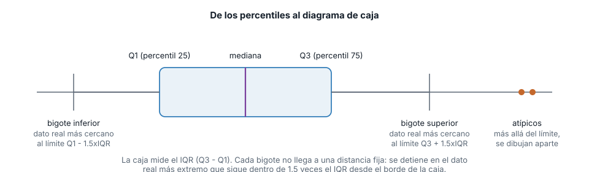
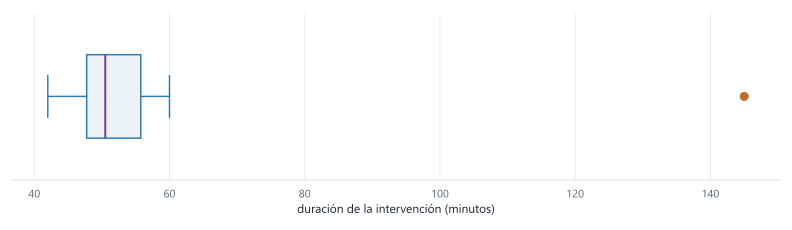

## Ruta de la sesión

::: {.columns}
::: {.column width="33%"}
**Bloque 1**

Percentiles y boxplot

- Percentil
- IQR
- Bigotes y atípicos
:::

::: {.column width="33%"}
**Bloque 2**

Variables categóricas

- Conteo
- Moda
- Gráfico de barras
:::

::: {.column width="33%"}
**Bloque 3**

Cruce de categorías

- Tabla de contingencia
- Porcentaje por fila
:::
:::

## Los datos de hoy

Los mismos doce tiempos de intervención de mantenimiento de la semana pasada, en minutos, más el
tipo de cada intervención y el turno en que ocurrió.

```python
tiempos = [42, 45, 47, 48, 48, 50, 51, 53, 55, 58, 60, 145]

tipos = ["preventiva", "preventiva", "correctiva", "preventiva", "predictiva", "preventiva",
         "correctiva", "preventiva", "predictiva", "correctiva", "preventiva", "correctiva"]

turnos = ["mañana", "mañana", "mañana", "tarde", "tarde", "tarde",
          "tarde", "noche", "noche", "mañana", "tarde", "noche"]
```

## La regla del juego

::: {.aviso}
Nada de `.quantile()`, `.boxplot()`, `value_counts()`, `Counter` ni `pd.crosstab`.
:::

Van a reutilizar las funciones `percentil()` e `iqr()` que ya escribieron la semana pasada, y a
construir desde cero las que faltan: clasificar atípicos, contar categorías y cruzar dos variables.

## Bloque 1

[Percentiles y boxplot]{.grande}

## Percentiles: lo que ya escribieron

La semana pasada implementaron esto para el IQR. Hoy lo usan para algo más: decidir dónde termina
cada bigote del boxplot.

```python
def percentil(datos, p):
    ordenados = sorted(datos)
    n = len(ordenados)
    posicion = p * (n - 1)
    piso = int(posicion)
    techo = min(piso + 1, n - 1)
    fraccion = posicion - piso
    return ordenados[piso] + fraccion * (ordenados[techo] - ordenados[piso])

def iqr(datos):
    return percentil(datos, 0.75) - percentil(datos, 0.25)

print(percentil(tiempos, 0.25), percentil(tiempos, 0.75))
print(iqr(tiempos))
```

```text
47.75 55.75
8.0
```

## ¿Qué significa el boxplot?

Toma esos dos percentiles como los bordes de una caja, con la mediana marcada adentro. La caja sola
ya te dice dónde está el 50% central de las intervenciones: entre 47.75 y 55.75 minutos.

. . .

Los bigotes se extienden desde la caja, pero **no** una distancia fija: llegan hasta el dato real
más lejano que sigue dentro de $1.5 \times \text{IQR}$ desde el borde correspondiente. Cualquier dato
más allá de ese límite se marca aparte, como atípico.

## De los percentiles al boxplot {.grafico}

{fig-alt="Diagrama de caja con sus partes rotuladas: la caja va del percentil 25 al percentil 75 con la mediana marcada adentro, cada bigote se extiende hasta el dato real mas alejado que sigue dentro de 1.5 veces el IQR desde el borde de la caja, y los puntos mas alla de ese limite se marcan aparte como atipicos"}

[La caja mide el IQR. El bigote no mide una distancia fija: mide hasta dónde llega un dato real
dentro del límite.]{.pie-grafico}

## Implementen la clasificación de atípicos

Con `percentil()` e `iqr()` ya escritas, calculen los dos límites y devuelvan la lista de valores
que quedan fuera de ellos.

```python
def clasificar_atipicos(datos):
    ...
```

[Pista: el límite superior es `percentil(datos, 0.75) + 1.5 * iqr(datos)`.]{.pregunta}

## Una implementación posible {.codigo-largo}

```python
def clasificar_atipicos(datos):
    q1 = percentil(datos, 0.25)
    q3 = percentil(datos, 0.75)
    ancho = iqr(datos)
    limite_inferior = q1 - 1.5 * ancho
    limite_superior = q3 + 1.5 * ancho
    return [x for x in datos if x < limite_inferior or x > limite_superior]

print(clasificar_atipicos(tiempos))
```

```text
[145]
```

. . .

[Un solo atípico, la intervención de 145 minutos. El bigote superior no llega hasta ahí: se queda en
60, el dato real más alto que sigue dentro del límite.]{.grande}

## El boxplot completo {.grafico}

{fig-alt="Diagrama de caja horizontal de los doce tiempos de intervencion, con la caja entre 47.75 y 55.75 minutos, los bigotes hasta 42 y 60 minutos, y un punto atipico aislado en 145 minutos"}

[Diez de las doce intervenciones caben entre la caja y los bigotes. La de 145 minutos queda sola,
lejos de todo lo demás.]{.pie-grafico}

## Bloque 2

[Variables categóricas]{.grande}

## ¿Por qué no hay media de `tipos`?

`tipos` no es numérica: no existe un "promedio" entre "preventiva" y "correctiva". Lo único que se
puede hacer con una variable categórica es contar cuántas veces aparece cada valor.

. . .

Esa cuenta es la moda (el valor más frecuente) y, graficada, es un gráfico de barras.

## Implementen el conteo

Escriban `contar(datos)`, que recorra la lista y devuelva un diccionario con el conteo de cada
categoría. Es la misma idea que usaron para la moda de `tiempos` la semana pasada, aplicada a texto
en vez de a números.

```python
def contar(datos):
    ...
```

## Una implementación posible {.codigo-largo}

```python
def contar(datos):
    conteos = {}
    for x in datos:
        conteos[x] = conteos.get(x, 0) + 1
    return conteos

print(contar(tipos))
```

```text
{'preventiva': 6, 'correctiva': 4, 'predictiva': 2}
```

. . .

[La moda es "preventiva", con 6 de las 12 intervenciones. En pandas, esta misma cuenta se obtiene
con `serie.value_counts()`.]{.grande}

## Gráfico de barras contra histograma

Un histograma agrupa un rango numérico continuo en contenedores contiguos: las barras van pegadas.
Un gráfico de barras muestra categorías sin orden numérico: las barras van separadas, porque no hay
continuidad entre "preventiva" y "correctiva".

. . .

::: {.definiciones}
Evita el gráfico circular (de pastel) con más de dos o tres categorías: el ojo compara longitudes
mucho mejor que ángulos. Un gráfico de barras ordenado de mayor a menor se lee de un vistazo; un
gráfico circular obliga a leer las etiquetas una por una.
:::

## Bloque 3

[Cruce de categorías]{.grande}

## Tabla de contingencia

Cuando quieres cruzar dos variables categóricas (`turno` y `tipo`), no basta con contar cada una por
separado: necesitas el conteo de cada combinación de las dos.

```python
print(contar(turnos))
```

```text
{'mañana': 4, 'tarde': 5, 'noche': 3}
```

## Implementen el cruce

Escriban `tabla_cruzada(a, b)`, que reciba dos listas paralelas (misma posición = mismo caso) y
devuelva un diccionario con el conteo de cada combinación `(a[i], b[i])`.

```python
def tabla_cruzada(a, b):
    ...
```

[Pista: usen una tupla `(a[i], b[i])` como llave del diccionario.]{.pregunta}

## Una implementación posible {.codigo-largo}

```python
def tabla_cruzada(a, b):
    conteos = {}
    for x, y in zip(a, b):
        clave = (x, y)
        conteos[clave] = conteos.get(clave, 0) + 1
    return conteos

for clave, conteo in sorted(tabla_cruzada(turnos, tipos).items()):
    print(clave, conteo)
```

```text
('mañana', 'correctiva') 2
('mañana', 'preventiva') 2
('noche', 'correctiva') 1
('noche', 'predictiva') 1
('noche', 'preventiva') 1
('tarde', 'correctiva') 1
('tarde', 'predictiva') 1
('tarde', 'preventiva') 3
```

## Contra `pd.crosstab`

```python
import pandas as pd

df = pd.DataFrame({"turno": turnos, "tipo": tipos})
tabla = pd.crosstab(df["turno"], df["tipo"])
print(tabla)
```

```text
tipo    correctiva  predictiva  preventiva
turno
mañana           2           0           2
noche            1           1           1
tarde            1           1           3
```

. . .

[Coincide con lo que ya construyeron a mano, solo que en forma de tabla en vez de diccionario. En la
guía, van a leer esta misma tabla por porcentaje de fila, no solo por conteo.]{.grande}

## Lo que acabamos de construir

::: {.regla}
Clasificaron atípicos con la misma regla que usa matplotlib, a partir de los percentiles que ya
sabían calcular.
:::

::: {.regla}
Contaron categorías y cruzaron dos variables categóricas sin `value_counts()` ni `pd.crosstab()`,
antes de usarlos.
:::

::: {.regla}
La próxima vez que vean un boxplot o una tabla de contingencia, van a saber exactamente qué cuenta y
qué regla hay detrás de cada número.
:::

## Lo que viene

- **Semana 5.** Gráficos de dispersión y condicionales, e informe exploratorio para cerrar la
  Unidad 1.
- **Semana 6.** Empieza la Unidad 2: variables aleatorias, espacio muestral y función de
  distribución.
