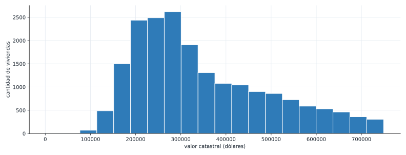
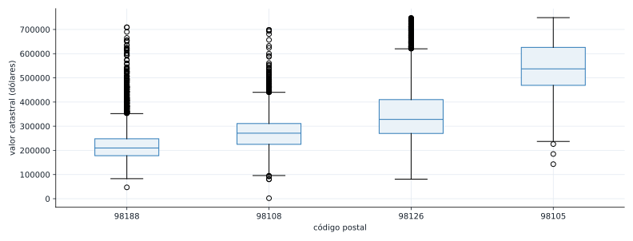

::: {.ficha}
|            |                                                          |
|------------|----------------------------------------------------------|
| Módulo     | Estadística para Analítica                               |
| Programa   | Especialización en Big Data                              |
| Unidad     | Unidad 1. Análisis descriptivo y exploratorio de datos   |
:::

[Abrir la presentación de la sesión](presentacion-dispersion-condicionales.html){.btn .btn-primary
role="button"}

## De qué va esta semana

Cerramos el capítulo 1 de *Estadística práctica para ciencia de datos con R y Python* (Bruce, Bruce
y Gedeck, 2.ª edición), la misma fuente de las dos semanas anteriores. Hasta ahora resumiste una
variable a la vez: un histograma, un boxplot, un gráfico de barras. Esta semana respondes una
pregunta distinta: ¿dos variables numéricas se mueven juntas, y esa relación cambia según una
tercera variable?

El dataset guía es `kc_tax.csv.gz`, del repositorio del libro: casi 500 000 viviendas del condado de
King (Seattle, EE. UU.), con su valor catastral, su área construida y su código postal. Ya lo
conocías como dataset de respaldo del ejercicio final de las Semanas 03 y 04; esta semana pasa a ser
el dataset principal. Vas a ver un problema práctico que no te había tocado todavía: con cientos de
miles de puntos, un gráfico de dispersión común se vuelve ilegible, y necesitas otra herramienta para
leerlo. Después, reutilizas `airline_stats.csv` (ya conocido de la Semana 04) para un ejercicio con
un resultado bien distinto: ni la relación general ni la relación por grupo son fuertes.

Esta semana cierra la Unidad 1 y trae un entregable: un informe exploratorio (10% de la nota, dentro
del 30% del cierre de unidad). El detalle del entregable lo recibes aparte del docente; esta guía te
enseña las herramientas y, al final, un ejemplo completo de cómo se arma un informe así.

Al terminar deberías poder:

1. Calcular la correlación entre dos variables numéricas con `.corr()` e interpretar su signo y su
   magnitud.
2. Reconocer el sobregraficado en un gráfico de dispersión con muchos puntos, y resolverlo con un
   gráfico hexagonal (hexbin).
3. Construir un gráfico condicional (el mismo gráfico repetido por cada categoría de una tercera
   variable) y decidir si la relación entre las dos variables numéricas cambia según la categoría.
4. Explicar por qué una correlación, alta o baja, nunca prueba una relación de causa y efecto por sí
   sola.
5. Reunir en un solo informe las herramientas de toda la Unidad 1: tabla de frecuencias, histograma,
   medidas de localización y dispersión, boxplot, gráfico de barras, tabla de contingencia y, ahora,
   dispersión y gráficos condicionales.

## Recapitulación breve: la correlación con datos que ya conoces

Antes de un dataset nuevo, calculemos la correlación entre las dos columnas numéricas de `state.csv`,
ya cargado en las dos semanas anteriores.

```python
import pandas as pd

url = "https://raw.githubusercontent.com/gedeck/practical-statistics-for-data-scientists/master/data/state.csv"
state = pd.read_csv(url)

correlacion = state["Population"].corr(state["Murder.Rate"])
print("correlacion Population vs Murder.Rate:", round(correlacion, 3))
```

```text
correlacion Population vs Murder.Rate: 0.182
```

## El coeficiente de correlación

El coeficiente de correlación de Pearson mide qué tan fuerte es la relación lineal entre dos
variables numéricas, en una escala de -1 a 1:

$$
r = \frac{\sum_{i=1}^{n} (x_i - \bar{x})(y_i - \bar{y})}
{\sqrt{\sum_{i=1}^{n} (x_i - \bar{x})^2} \sqrt{\sum_{i=1}^{n} (y_i - \bar{y})^2}}
$$

Un valor cercano a 1 dice que, cuando una variable sube, la otra tiende a subir también, de forma
casi proporcional. Cercano a -1 dice lo contrario: cuando una sube, la otra tiende a bajar. Cercano a
0 dice que no hay una relación lineal clara entre las dos.

::: {.callout-note}
## Interpretación en contexto

0.182 es una correlación débil: saber cuánta población tiene un estado casi no te dice nada sobre su
tasa de homicidios. No es cero (hay una tendencia leve a que estados más poblados tengan una tasa un
poco más alta), pero está lejos de una relación fuerte. Vas a ver en un momento un ejemplo con una
correlación mucho más marcada.
:::

## El gráfico de dispersión

Un gráfico de dispersión pone una variable en cada eje y dibuja un punto por observación. Es la
herramienta que responde visualmente la misma pregunta que el coeficiente de correlación responde
con un número.

```python
url_kc = "https://raw.githubusercontent.com/gedeck/practical-statistics-for-data-scientists/master/data/kc_tax.csv.gz"
kc_tax = pd.read_csv(url_kc, compression="gzip")
print(kc_tax.shape)
print(kc_tax.head())
```

```text
(498249, 3)
   TaxAssessedValue  SqFtTotLiving  ZipCode
0               NaN           1730  98117.0
1          206000.0           1870  98002.0
2          303000.0           1530  98166.0
3          361000.0           2000  98108.0
4          459000.0           3150  98108.0
```

Antes de graficar, filtramos: descartamos filas sin valor catastral, y nos quedamos con viviendas de
menos de 750 000 dólares y entre 100 y 3500 pies cuadrados, para dejar fuera errores de captura y
propiedades atípicas que estirarían los ejes sin aportar nada a la lectura.

```python
kc_tax0 = kc_tax.loc[
    (kc_tax.TaxAssessedValue < 750000) & (kc_tax.SqFtTotLiving > 100) & (kc_tax.SqFtTotLiving < 3500),
    :,
].dropna()
print("filas tras filtrar:", len(kc_tax0))

correlacion_kc = kc_tax0["TaxAssessedValue"].corr(kc_tax0["SqFtTotLiving"])
print("correlacion TaxAssessedValue vs SqFtTotLiving:", round(correlacion_kc, 3))
```

```text
filas tras filtrar: 409456
correlacion TaxAssessedValue vs SqFtTotLiving: 0.536
```

0.536 ya es una correlación moderada: a más área construida, tiende a haber un valor catastral más
alto, aunque la relación está lejos de ser perfecta (hay casas grandes baratas y casas chicas caras).
Grafiquemos una muestra de 5000 viviendas para verla:

```python
import matplotlib.pyplot as plt

muestra = kc_tax0.sample(n=5000, random_state=1)
fig, ax = plt.subplots(figsize=(11, 4.2))
ax.scatter(muestra["SqFtTotLiving"], muestra["TaxAssessedValue"], s=8, alpha=0.5)
ax.set_xlabel("área construida (pies cuadrados)")
ax.set_ylabel("valor catastral (dólares)")
plt.show()
```

::: {.diagrama}
{fig-alt="Grafico de dispersion de 5000 viviendas, area construida contra valor catastral, con una nube de puntos que sube de izquierda a derecha pero muy densa en el centro, dificil de leer donde se concentran la mayoria de los puntos."}
:::

## El problema del sobregraficado

Con 5000 puntos, el centro del gráfico ya es una mancha densa: no puedes distinguir si ahí hay 50
viviendas superpuestas o 500. El problema empeora si graficas las 409 456 filas completas: la mayoría
de los puntos quedan unos encima de otros, y el gráfico deja de decir nada sobre dónde se concentran
realmente los datos. A este problema se le llama **sobregraficado** (*overplotting*), y aparece cada
vez que el número de puntos es grande en relación con el espacio disponible para dibujarlos.

La solución no es graficar menos datos: es cambiar de herramienta. Un gráfico **hexagonal** (hexbin)
divide el plano en celdas de forma hexagonal, cuenta cuántos puntos caen en cada una, y colorea cada
celda según ese conteo. En vez de puntos individuales, ves una densidad, exactamente como un
histograma en dos dimensiones.

```python
fig, ax = plt.subplots(figsize=(11, 4.2))
hb = ax.hexbin(kc_tax0["SqFtTotLiving"], kc_tax0["TaxAssessedValue"], gridsize=40, cmap="Blues", mincnt=1)
fig.colorbar(hb, ax=ax, label="viviendas por celda")
ax.set_xlabel("área construida (pies cuadrados)")
ax.set_ylabel("valor catastral (dólares)")
plt.show()
```

::: {.diagrama}
{fig-alt="Grafico hexagonal de las 409456 viviendas filtradas, con celdas mas oscuras concentradas entre 1000 y 2500 pies cuadrados y entre 200000 y 500000 dolares, mostrando con claridad donde se acumula la mayoria de los datos, algo que el grafico de puntos no dejaba ver."}
:::

::: {.callout-note}
## Interpretación en contexto

El hexbin muestra algo que la nube de puntos escondía: la inmensa mayoría de las 409 456 viviendas
caen en una zona concentrada, entre 1000 y 2500 pies cuadrados y entre 200 000 y 500 000 dólares. Los
puntos sueltos en los extremos del gráfico de dispersión, que parecían ocupar buena parte del área
visual, en realidad son una fracción pequeña del dataset.
:::

## Gráficos condicionales

Hasta aquí tratamos las 409 456 viviendas como un solo grupo. Pero el dataset trae una tercera
variable, `ZipCode`, que separa las viviendas por zona. Un gráfico condicional repite el mismo
gráfico de dispersión una vez por cada valor de esa tercera variable, en paneles uno al lado del
otro, para ver si la relación entre las dos variables numéricas se sostiene igual en cada grupo o
cambia.

```python
zips = [98188, 98105, 98108, 98126]
sub = kc_tax0.loc[kc_tax0.ZipCode.isin(zips)].copy()
sub["ZipCode"] = sub["ZipCode"].astype(int).astype(str)

resumen_zip = sub.groupby("ZipCode")[["TaxAssessedValue", "SqFtTotLiving"]].median()
print(resumen_zip)

correlacion_por_zip = sub.groupby("ZipCode").apply(
    lambda d: d["TaxAssessedValue"].corr(d["SqFtTotLiving"]), include_groups=False
)
print(correlacion_por_zip.round(3))
```

```text
         TaxAssessedValue  SqFtTotLiving
ZipCode
98105            537000.0         1690.0
98108            271000.0         1530.0
98126            328000.0         1370.0
98188            210000.0         1560.0
ZipCode
98105    0.702
98108    0.667
98126    0.737
98188    0.648
dtype: float64
```

```python
fig, axes = plt.subplots(1, 4, figsize=(11, 3.0), sharex=True, sharey=True)
for ax, z in zip(axes, [str(z) for z in zips]):
    d = sub.loc[sub.ZipCode == z]
    ax.scatter(d["SqFtTotLiving"], d["TaxAssessedValue"], s=8, alpha=0.5)
    ax.set_title(f"código postal {z}")
    ax.set_xlabel("área (pies2)")
axes[0].set_ylabel("valor catastral ($)")
plt.show()
```

::: {.diagrama}
{fig-alt="Cuatro graficos de dispersion, uno por codigo postal (98188, 98105, 98108, 98126), cada uno con una relacion mas clara y menos dispersa entre area construida y valor catastral que el grafico general sin dividir por zona."}
:::

::: {.callout-note}
## Interpretación en contexto

Esta es la parte más importante de la semana: la correlación general, sin condicionar, era 0.536.
Condicionada por código postal, sube a un rango de 0.648 a 0.737 en las cuatro zonas. Dentro de cada
zona, el área construida predice el valor catastral mucho mejor que en el dataset completo. Tiene
sentido: parte de la variación del precio que el gráfico general no explicaba se debía a la zona
misma (algunas zonas son más caras por ubicación, no solo por tamaño de la vivienda), y condicionar
por zona elimina esa fuente de variación, dejando ver la relación real entre área y precio dentro de
un mismo mercado local.
:::

**Por qué esto importa más allá de este dataset.** Un gráfico condicional no es solo "el mismo
gráfico repetido varias veces": es una herramienta para descubrir si una tercera variable está
mezclando grupos que en realidad se comportan distinto. Antes de concluir que dos variables tienen
una relación débil (o fuerte) a partir del gráfico general, vale la pena preguntar: ¿hay una tercera
variable categórica razonable para condicionar, y cambia la conclusión si la uso?

::: {.callout-tip collapse="true"}
## Ejercicio: retrasos por aerolínea

Con `airline_stats.csv` (ya conocido de la Semana 04), calcula la correlación entre
`pct_carrier_delay` (retraso atribuible a la aerolínea) y `pct_atc_delay` (retraso atribuible al
control de tráfico aéreo) para las 33 468 filas completas. Después, calcula esa misma correlación
condicionada por `airline`. Antes de correr el código: ¿esperas que condicionar por aerolínea suba la
correlación, como pasó con los códigos postales, o que se quede igual de débil en cada grupo?

::: {.callout-tip collapse="true"}
## Solución

```python
url_air = "https://raw.githubusercontent.com/gedeck/practical-statistics-for-data-scientists/master/data/airline_stats.csv"
air = pd.read_csv(url_air)
print(air.shape)
print(air["airline"].unique())

correlacion_air = air["pct_carrier_delay"].corr(air["pct_atc_delay"])
print("correlacion general:", round(correlacion_air, 3))

correlacion_por_aerolinea = air.groupby("airline").apply(
    lambda d: d["pct_carrier_delay"].corr(d["pct_atc_delay"]), include_groups=False
)
print(correlacion_por_aerolinea.round(3).sort_values())
```

```text
(33468, 4)
['American' 'Alaska' 'Jet Blue' 'Delta' 'United' 'Southwest']
correlacion general: 0.144
airline
Alaska       0.067
American     0.105
United       0.145
Jet Blue     0.153
Delta        0.170
Southwest    0.210
dtype: float64
```

```python
aerolineas = sorted(air["airline"].unique())

fig, axes = plt.subplots(2, 3, figsize=(11, 6.0), sharex=True, sharey=True)
for ax, a in zip(axes.flat, aerolineas):
    d = air.loc[air.airline == a]
    ax.scatter(d["pct_carrier_delay"], d["pct_atc_delay"], s=8, alpha=0.4)
    ax.set_title(a)
for ax in axes[-1, :]:
    ax.set_xlabel("retraso por aerolínea (%)")
for ax in axes[:, 0]:
    ax.set_ylabel("retraso por ATC (%)")
plt.show()
```

::: {.diagrama}
{fig-alt="Seis graficos de dispersion, uno por aerolinea, mostrando en todos una nube de puntos dispersa sin una relacion clara entre el porcentaje de retraso atribuible a la aerolinea y al control de trafico aereo."}
:::

Al contrario del ejemplo de las viviendas, aquí condicionar por aerolínea **no** revela una relación
más fuerte: la correlación general (0.144) y las seis correlaciones por aerolínea (entre 0.067 y
0.210) son todas débiles. La lección no es que condicionar siempre suba la correlación: es que
condicionar te deja verificar si una relación débil sigue siendo débil dentro de cada grupo, o si
estaba escondiendo algo. Aquí confirma que sigue siendo débil en las seis aerolíneas por igual.
:::
:::

## Correlación no es causalidad

Antes de cerrar la unidad, una advertencia que aplica a todo lo que calculaste hoy: un coeficiente de
correlación alto, o un gráfico de dispersión con una tendencia clara, nunca prueban por sí solos que
una variable *causa* el cambio en la otra. El área construida y el valor catastral están
correlacionados en parte porque construir más área cuesta más, pero ninguna medida de correlación
descarta otras explicaciones (una tercera variable, como la zona, que afecta a las dos a la vez; o
simple coincidencia en una muestra pequeña). La correlación es evidencia de que dos variables se
mueven juntas, no una prueba de por qué.

## Cierre de la Unidad 1: la caja de herramientas completa

::: {.diagrama}
{fig-alt="Diagrama con seis tarjetas que resumen toda la caja de herramientas de la Unidad 1 segun el numero y tipo de variables: una numerica usa histograma y tabla de frecuencias de la semana 3, una categorica usa grafico de barras de la semana 4, dos categoricas usan tabla de contingencia de la semana 4, una numerica mas una categorica usa boxplot agrupado de la semana 4, dos numericas usan dispersion de la semana 5, y dos numericas mas una categorica usan dispersion condicional de la semana 5."}
:::

Un informe exploratorio no usa una sola herramienta: combina varias, según la pregunta. Para cerrar,
armamos un mini informe sobre las cuatro zonas de `kc_tax0` que ya trabajamos, mezclando herramientas
de las tres semanas de la unidad.

```python
resumen_cierre = sub.groupby("ZipCode")["TaxAssessedValue"].agg(["count", "median", "std"]).round(0)
print(resumen_cierre)
```

```text
         count    median       std
ZipCode
98105     4481  537000.0  102713.0
98108     5535  271000.0   71323.0
98126     5631  328000.0  112092.0
98188     4043  210000.0   74077.0
```

```python
fig, ax = plt.subplots(figsize=(11, 4.2))
ax.hist(sub["TaxAssessedValue"], bins=20)
ax.set_xlabel("valor catastral (dólares)")
ax.set_ylabel("cantidad de viviendas")
plt.show()
```

::: {.diagrama}
{fig-alt="Histograma del valor catastral de las viviendas de las cuatro zonas seleccionadas, concentrado entre 150000 y 450000 dolares con una cola mas corta hacia valores altos."}
:::

```python
fig, ax = plt.subplots(figsize=(11, 4.2))
orden = sub.groupby("ZipCode")["TaxAssessedValue"].median().sort_values().index
ax.boxplot([sub.loc[sub.ZipCode == z, "TaxAssessedValue"] for z in orden], tick_labels=orden)
ax.set_xlabel("código postal")
ax.set_ylabel("valor catastral (dólares)")
plt.show()
```

::: {.diagrama}
{fig-alt="Boxplot del valor catastral agrupado por codigo postal, ordenado de menor a mayor mediana: 98188 con la caja mas baja, seguido de 98108, 98126 y 98105 con la caja mas alta."}
:::

**Ejemplo de conclusión ejecutiva**, del tipo que se espera en el informe de esta semana: "Las cuatro
zonas analizadas tienen valores catastrales muy distintos: la mediana va de 210 000 dólares en el
código postal 98188 a 537 000 en el 98105, sin superposición entre las cajas de esas dos zonas. Con
5000 viviendas de muestra, el área construida predice el valor catastral con una correlación de
0.536, pero esa cifra sube a entre 0.648 y 0.737 cuando se calcula dentro de cada zona por separado:
buena parte de la variación de precio que parecía "ruido" en el análisis general en realidad se
explica por la zona, no por el tamaño de la vivienda."

## Ejercicio final: constrúyelo tú, de principio a fin

Igual que en las dos semanas anteriores, este ejercicio no trae solución. A diferencia de las
anteriores, esta vez el resultado es justo lo que necesitas para el entregable de la semana.

### Paso 1. Retoma tu dataset

Usa el mismo dataset que trabajaste en el ejercicio final de la Semana 03 o 04 (`kc_tax.csv.gz` o el
que hayas elegido), o continúa con uno nuevo si el anterior no tenía al menos dos variables
numéricas.

### Paso 2. Encuentra una relación entre dos variables numéricas

Calcula la correlación entre dos variables numéricas de tu dataset y grafica la dispersión. Si tienes
más de unos pocos miles de puntos, revisa si necesitas un hexbin en vez de un gráfico de puntos.

### Paso 3. Condiciona por una tercera variable

Si tu dataset tiene una variable categórica con pocas categorías, repite el gráfico de dispersión
condicionado por ella. Compara la correlación general contra la correlación dentro de cada grupo:
¿sube, baja o se queda igual?

### Paso 4. Arma tu informe exploratorio

Reúne en un solo documento las herramientas de toda la unidad que apliquen a tu dataset: tabla de
frecuencias e histograma, medidas de localización y dispersión, boxplot, gráfico de barras o tabla de
contingencia si tienes variables categóricas, y el gráfico de dispersión (condicional si corresponde)
de esta semana. Cierra con una conclusión ejecutiva, en el mismo tono del ejemplo de arriba.

::: {.callout-warning}
## Antes de la próxima sesión

Revisa que tu informe cumpla las tres condiciones del módulo: **reproducible**, **trazable** y
**ejecutivo** (ver la presentación del módulo). Con esto llegas listo al entregable de cierre de la
Unidad 1.
:::

## Errores frecuentes

::: {.error-caso}
[Error 1]{.etiqueta}

### Confundir correlación con causalidad

**Causa.** Una correlación alta, o un gráfico de dispersión con una tendencia clara, se siente como
prueba suficiente de que una variable causa el cambio en la otra.

**Solución.** Antes de afirmar causalidad, pregunta si existe una tercera variable que podría explicar
las dos a la vez. En el ejemplo de esta guía, la zona (código postal) afecta tanto el tamaño típico
de las viviendas como su precio; parte de la correlación entre área y valor catastral podría venir de
ahí, no de que el área "cause" el precio de forma directa y aislada.
:::

::: {.error-caso}
[Error 2]{.etiqueta}

### Graficar un dataset grande sin revisar el sobregraficado

**Causa.** Un gráfico de dispersión se ve razonable con unos cientos de puntos, y es tentador usar el
mismo código sin cambios sobre un dataset de cientos de miles de filas.

**Solución.** Antes de interpretar un gráfico de dispersión, pregúntate cuántos puntos estás
dibujando. Si el centro del gráfico se ve como una mancha sólida en vez de puntos distinguibles,
cambia a un hexbin o toma una muestra representativa, como se hizo en esta guía.
:::

::: {.error-caso}
[Error 3]{.etiqueta}

### Reportar una correlación general sin revisar si cambia por grupo

**Causa.** Calcular `.corr()` sobre el dataset completo y reportar ese único número, sin preguntarse
si una variable categórica disponible podría estar mezclando grupos con comportamientos distintos.

**Solución.** Si tienes una variable categórica razonable, calcula también la correlación condicionada
por esa variable, como se hizo con los códigos postales de esta guía. A veces sube (como en las
viviendas), a veces se mantiene igual de débil (como en las aerolíneas): las dos son conclusiones
válidas, pero solo las conoces si haces la comparación.
:::

## Lista de chequeo de la semana

::: {.checklist}
**Antes de la próxima sesión**

- [ ] Puedes calcular una correlación con `.corr()` e interpretar si es débil, moderada o fuerte
- [ ] Puedes explicar qué es el sobregraficado y por qué un hexbin lo resuelve
- [ ] Resolviste el ejercicio intermedio de `airline_stats.csv` antes de revisar la solución, no
      después
- [ ] Puedes explicar con tus propias palabras por qué correlación no es causalidad
- [ ] Sabes construir un gráfico condicional y comparar la correlación general contra la correlación
      por grupo
- [ ] Completaste el mini informe de cierre de `kc_tax0` y entendiste cómo se conecta con el
      entregable de la semana
- [ ] Avanzaste tu propio informe exploratorio con tu dataset del ejercicio final
:::

## Lo que viene

- **Entregable de esta semana.** Informe exploratorio de cierre de la Unidad 1 (10%, dentro del 30%
  del cierre). El docente entrega el detalle completo aparte.
- **Semana 6.** Empieza la Unidad 2: variables aleatorias, espacio muestral y función de
  distribución.

## Recursos

- Bruce, P., Bruce, A. y Gedeck, P. *Estadística práctica para ciencia de datos con R y Python.*
  2.ª edición, MARCOMBO, 2022. Capítulo 1: "Análisis exploratorio de datos". Fuente de esta guía.
- Datasets de esta guía, del repositorio de datos del libro:
  [`state.csv`](https://github.com/gedeck/practical-statistics-for-data-scientists/blob/master/data/state.csv),
  [`kc_tax.csv.gz`](https://github.com/gedeck/practical-statistics-for-data-scientists/blob/master/data/kc_tax.csv.gz) y
  [`airline_stats.csv`](https://github.com/gedeck/practical-statistics-for-data-scientists/blob/master/data/airline_stats.csv)
- Documentación de `pandas.Series.corr`: [pandas.pydata.org/docs/reference/api/pandas.Series.corr.html](https://pandas.pydata.org/docs/reference/api/pandas.Series.corr.html)
- Documentación de `matplotlib.pyplot.hexbin`: [matplotlib.org/stable/api/_as_gen/matplotlib.pyplot.hexbin.html](https://matplotlib.org/stable/api/_as_gen/matplotlib.pyplot.hexbin.html)

::: {.pie-doc}
Estadística para Analítica. Institución Universitaria Pascual Bravo. Facultad de Ingeniería.
Semestre 2026-02.

**Transparencia.** La redacción de esta guía contó con el apoyo de inteligencia artificial,
usando el modelo Claude Opus 5 de Anthropic. Todo el contenido fue revisado y validado. Las salidas
de terminal y los gráficos son reales, producidos al ejecutar estos mismos programas durante la
preparación del material.
:::
