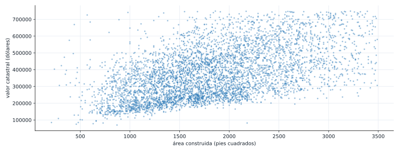
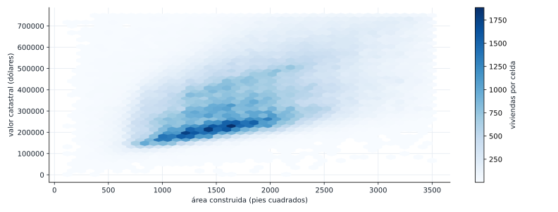
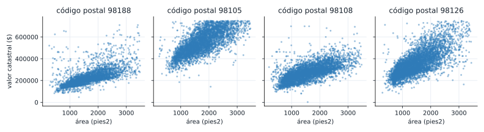
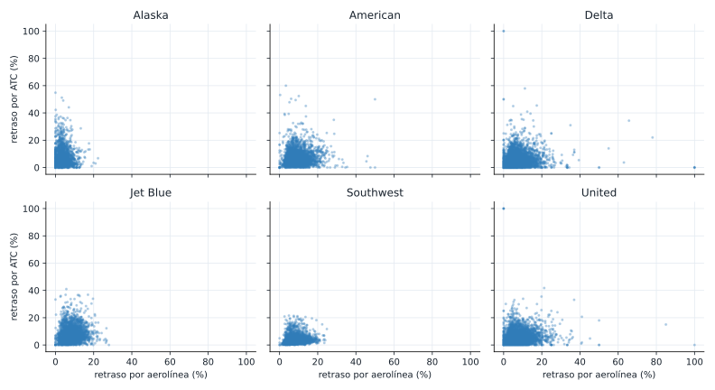

## Ruta de la sesión

::: {.columns}
::: {.column width="33%"}
**Bloque 1**

Correlación

- Coeficiente de Pearson
- De -1 a 1
- No es causalidad
:::

::: {.column width="33%"}
**Bloque 2**

Dispersión

- Un punto por dato
- Sobregraficado
- Hexbin
:::

::: {.column width="33%"}
**Bloque 3**

Condicionales

- Mismo gráfico, por grupo
- ¿Sube o baja la relación?
- Cierre de la Unidad 1
:::
:::

## Los datos de hoy

Los mismos doce tiempos de intervención de mantenimiento (minutos) de las semanas anteriores, más una
variable numérica nueva: el costo de cada intervención, en miles de pesos.

```python
tiempos = [42, 45, 47, 48, 48, 50, 51, 53, 55, 58, 60, 145]

costo = [180, 190, 205, 200, 210, 220, 230, 235, 250, 265, 270, 520]
```

## La regla del juego

::: {.aviso}
Nada de `.corr()`, `numpy.corrcoef` ni `scipy.stats.pearsonr`. Construimos la correlación desde su
fórmula, con Python puro, y la verificamos al final contra `pandas`.
:::

## ¿Qué mide la correlación?

Si dos variables suben y bajan juntas, la correlación es cercana a 1. Si una sube cuando la otra
baja, es cercana a -1. Si no hay relación lineal clara, es cercana a 0.

Antes de calcular nada: mirando las dos listas de la diapositiva anterior, ¿esperas una correlación
cercana a 1, a -1, o a 0 entre `tiempos` y `costo`?

## Construye la media (ya la conoces)

```python
def media(valores):
    return sum(valores) / len(valores)


print(media(tiempos))
print(media(costo))
```

```text
61.833333333333336
231.25
```

## Construye la correlación desde su fórmula

$$
r = \frac{\sum (x_i - \bar{x})(y_i - \bar{y})}{\sqrt{\sum (x_i - \bar{x})^2} \sqrt{\sum (y_i - \bar{y})^2}}
$$

```python
def correlacion(x, y):
    mx, my = media(x), media(y)
    numerador = sum((xi - mx) * (yi - my) for xi, yi in zip(x, y))
    denominador_x = sum((xi - mx) ** 2 for xi in x) ** 0.5
    denominador_y = sum((yi - my) ** 2 for yi in y) ** 0.5
    return numerador / (denominador_x * denominador_y)


r = correlacion(tiempos, costo)
print(round(r, 3))
```

```text
0.991
```

## Verifica contra pandas

```python
import pandas as pd

r_pandas = pd.Series(tiempos).corr(pd.Series(costo))
print(round(r_pandas, 3))
```

```text
0.991
```

Coincide exactamente con la función manual. `tiempos` y `costo` están casi perfectamente
correlacionados: la intervención de 145 minutos, la más larga y la más cara (520), no es un dato
raro, es consistente con el patrón del resto.

## De la lista pequeña al dataset grande

::: {.aviso}
Con 12 datos, un gráfico de dispersión se lee de un vistazo. Con 400 000, no.
:::

`kc_tax.csv.gz` trae 409 456 viviendas del condado de King, con su valor catastral y su área
construida. La correlación es 0.536: moderada, mucho más débil que la de `tiempos` y `costo`, y con
demasiados puntos para dibujarlos todos como puntos individuales.

## El sobregraficado

::: {.diagrama}
{fig-alt="Grafico de dispersion de 5000 viviendas, muy denso en el centro, dificil de distinguir puntos individuales."}
:::

Con solo una muestra de 5000 viviendas, el centro ya es una mancha densa.

## La solución: hexbin

::: {.diagrama}
{fig-alt="Grafico hexagonal de las 409456 viviendas, con celdas coloreadas segun la cantidad de viviendas que caen en cada una."}
:::

Cada celda cuenta cuántas viviendas caen ahí. La densidad reemplaza al punto individual.

## Gráficos condicionales: ¿cambia la relación por zona?

::: {.diagrama}
{fig-alt="Cuatro graficos de dispersion, uno por codigo postal, cada uno con una relacion mas clara entre area y valor catastral que el grafico general."}
:::

Correlación general: 0.536. Por código postal: entre 0.648 y 0.737.

## ¿Siempre sube al condicionar?

::: {.diagrama}
{fig-alt="Seis graficos de dispersion, uno por aerolinea, todos con una nube de puntos dispersa sin relacion clara."}
:::

No. Con `airline_stats.csv`, la correlación general (0.144) y las seis correlaciones por aerolínea
(0.067 a 0.210) siguen siendo débiles. Condicionar confirma, no siempre revela.

## Correlación no es causalidad

::: {.aviso}
Que dos variables se muevan juntas no prueba que una cause el cambio en la otra.
:::

El área construida y el valor catastral están correlacionados, pero la zona (código postal) afecta a
las dos a la vez. Antes de hablar de causa, pregunta si hay una tercera variable de por medio.

## Cierre de la Unidad 1: toda la caja de herramientas

::: {.diagrama}
{fig-alt="Diagrama con seis tarjetas que resumen la caja de herramientas de la Unidad 1 segun el numero y tipo de variables involucradas, con la semana en que se vio cada una."}
:::

## Lo que sigue

- Entregable de la semana: informe exploratorio de cierre de la Unidad 1 (10%, dentro del 30% del
  cierre). El docente entrega el detalle aparte.
- La guía trae un ejemplo completo de cómo se arma ese informe, combinando herramientas de las tres
  semanas de la unidad.
- Semana 6: empieza la Unidad 2, variables aleatorias y probabilidad.
