## Ruta de la sesión

::: {.columns}
::: {.column width="24%"}
**Bases**

- Experimento aleatorio
- Espacio muestral
- Eventos
- Probabilidad
:::

::: {.column width="24%"}
**Variable aleatoria**

- Por qué hace falta
- Definición formal
- Discreta o continua
- Su distribución
:::

::: {.column width="24%"}
**Funciones de distribución**

- PMF
- Densidad (PDF)
- CDF
- CDF y la relación entre las tres
:::

::: {.column width="24%"}
**De la teoría a los datos**

- Realización y muestra
- Distribución empírica
- Simulación y cierre
:::
:::

## Los datos de hoy

Cuatro experimentos cotidianos van a acompañar toda la sesión, del más simple al más rico.

- Lanzar **dos monedas** y anotar cara o sello de cada una.
- Lanzar **dos dados** y sumar los puntos obtenidos.
- Cronometrar cuántos minutos se espera el **próximo bus** en un paradero.
- Contar cuántos **artículos defectuosos** salen al revisar una caja.

## Convención de notación

Antes de empezar, un mapa de los símbolos que se van a usar durante toda la sesión. Cada uno se explica de nuevo la primera vez que aparece en contexto.

| Símbolo | Nombre | Significado |
|---|---|---|
| $\Omega$ | Espacio muestral | Conjunto de todos los resultados posibles de un experimento aleatorio |
| $\omega$ | Resultado elemental | Un resultado individual dentro de $\Omega$ |
| $A$, $B$ | Evento | Un subconjunto de $\Omega$, una condición sobre el resultado |
| $P(\cdot)$ | Medida de probabilidad | Asigna a cada evento un número entre 0 y 1 |

## Convención de notación (continuación)

| Símbolo | Nombre | Significado |
|---|---|---|
| $X$ | Variable aleatoria | Función que traduce cada resultado de $\Omega$ a un número real |
| $x$ | Valor observado | Un número concreto que $X$ puede tomar |
| $p_X(x)$ | Función de masa de probabilidad (PMF) | $P(X = x)$, caso discreto |
| $f_X(x)$ | Función de densidad (PDF) | Densidad de probabilidad alrededor de $x$, caso continuo |
| $F_X(x)$ | Función de distribución acumulada (CDF) | $P(X \leq x)$, discreta o continua |

## Bloque 1

[El experimento aleatorio]{.grande}

## El experimento aleatorio: definición

Un **experimento determinístico** siempre da el mismo resultado en las mismas condiciones, como hervir agua a nivel del mar y que hierva a 100 grados Celsius.

Un **experimento aleatorio** es un proceso cuyo resultado no se puede predecir con certeza antes de observarlo, aunque se repita en condiciones parecidas.

. . .

Tiene tres rasgos que lo distinguen:

1. Se puede repetir, al menos en principio, tantas veces como se quiera.
2. Antes de ejecutarlo se puede listar el conjunto de resultados posibles.
3. El resultado de una repetición concreta no se puede anticipar con certeza.

## ¿Por qué importa esta distinción?

Toda la teoría de probabilidad se construye sobre experimentos aleatorios, no sobre deterministicos: sin incertidumbre no hay nada que modelar.

. . .

Los tres rasgos son la prueba práctica para decidir si un fenómeno es aleatorio antes de aplicarle cualquier herramienta de esta unidad: espacio muestral, eventos, probabilidad y variable aleatoria solo tienen sentido sobre un proceso incierto.

## Situación: lanzar dos monedas

Van a lanzar dos monedas al aire, una después de la otra, y anotar cómo cae cada una.

Antes de lanzarlas no saben qué va a pasar, pero sí saben de antemano que cada moneda solo puede caer de dos formas.

[¿Este proceso es un experimento aleatorio? Revisen los tres rasgos.]{.pregunta}

## Ejemplo resuelto: dos monedas sí son un experimento aleatorio

- **Rasgo 1, se puede repetir.** Se puede volver a lanzar las dos monedas cuantas veces se quiera.
- **Rasgo 2, resultados listables de antemano.** Antes de lanzar ya se sabe que cada moneda puede caer cara o sello.
- **Rasgo 3, no se puede anticipar el resultado.** Aunque se sepa que hay cuatro combinaciones posibles, no se puede decir cuál va a salir en un lanzamiento concreto.

. . .

[Cumple los tres rasgos: es un experimento aleatorio.]{.grande}

## Ejercicio

Clasifiquen este proceso: cronometrar cuántos minutos exactos pasan hasta que llega el próximo bus a un paradero.

[¿Es un experimento determinístico o aleatorio? Justifiquen con los tres rasgos.]{.pregunta}

## Respuesta

Es **aleatorio**:

- Se puede repetir: se puede cronometrar otro bus.
- Se pueden listar los resultados posibles de antemano: cualquier número real no negativo de minutos.
- No se puede anticipar el tiempo exacto de una espera concreta, aunque se conozca el promedio histórico.

## Ejercicio 2: otro contexto, un dado

Clasifiquen este proceso: lanzar un dado de seis caras y anotar el número que queda hacia arriba.

[¿Es un experimento determinístico o aleatorio? Justifiquen con los tres rasgos.]{.pregunta}

## Respuesta

Es **aleatorio**:

- Se puede repetir: se puede volver a lanzar el dado cuantas veces se quiera.
- Se pueden listar los resultados posibles de antemano: 1, 2, 3, 4, 5 o 6.
- No se puede anticipar con certeza cuál de los seis va a salir en un lanzamiento concreto.

. . .

[El dado se suma como cuarto ejemplo guía junto a las monedas, el bus y los artículos defectuosos.]{.grande}

## Bloque 2

[El espacio muestral]{.grande}

## El espacio muestral: definición

El **espacio muestral**, denotado $\Omega$ (omega mayúscula), es el conjunto de todos los resultados posibles de un experimento aleatorio.

Cada resultado individual se llama **resultado elemental** y se denota $\omega$ (omega minúscula).

. . .

Un espacio muestral bien construido cumple dos condiciones: cubre todos los resultados posibles, y no los solapa entre sí.

Según cuántos resultados tenga, $\Omega$ puede ser **finito**, **infinito discreto** (contable pero interminable) o **continuo** (un intervalo completo de $\mathbb{R}$, el conjunto de los números reales).

. . .

En notación de conjuntos, un espacio muestral finito se escribe listando cada resultado elemental:

$$\Omega = \{\omega_1, \omega_2, \ldots, \omega_k\}$$

donde $k$ es el número total de resultados posibles.

## ¿Qué significa construir bien un espacio muestral?

Olvidar un resultado deja $\Omega$ incompleto: cualquier probabilidad calculada después queda mal, porque falta un caso.

. . .

Solapar resultados (dos elementos que en el fondo describen lo mismo de dos formas) rompe la condición de que cada repetición caiga en exactamente uno.

$\Omega$ es el punto de partida de todo lo que sigue en esta unidad: eventos, probabilidad y variables aleatorias se construyen sobre él.

## Situación: dos monedas al aire

Van a lanzar dos monedas y anotar si cada una cae cara (C) o sello (S).

[¿Cuántos resultados distintos son posibles, y cuáles son?]{.pregunta}

## Ejemplo resuelto: $\Omega$ de las dos monedas {.grafico}

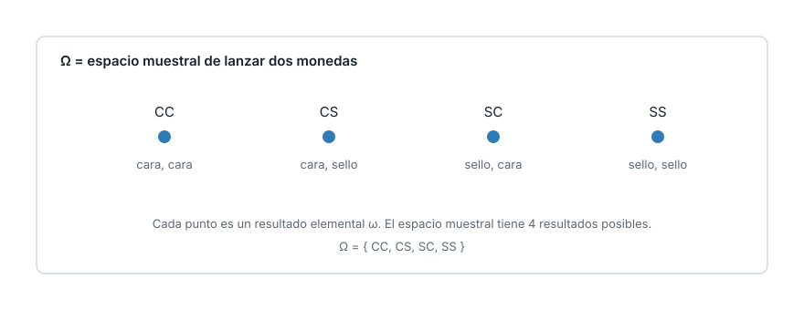{fig-alt="Espacio muestral Omega de lanzar dos monedas, con los cuatro resultados elementales CC, CS, SC y SS marcados como puntos dentro de un rectangulo"}

[Cada moneda puede caer C o S: hay 2 por 2 igual a 4 combinaciones. Omega = {CC, CS, SC, SS}, un espacio muestral finito.]{.pie-grafico}

## Ejercicio

Un experimento aleatorio consiste en lanzar una moneda hasta que salga la primera cara, contando cuántos lanzamientos tomó.

[Escriban $\Omega$ para este experimento. ¿Es finito, infinito discreto o continuo?]{.pregunta}

## Respuesta

$$\Omega = \{1, 2, 3, \ldots\}$$

El número de lanzamientos hasta la primera cara.

. . .

Es **infinito discreto**: se puede enumerar uno por uno (1, 2, 3 y así sucesivamente) pero la lista nunca termina, porque en principio la primera cara podría tardar cualquier cantidad de lanzamientos.

## Ejercicio 2: otro contexto, un dado

Lanzan un dado de seis caras una sola vez y anotan el número que sale.

[¿Cuál es $\Omega$ para este experimento? ¿Es finito, infinito discreto o continuo?]{.pregunta}

## Respuesta

$$\Omega = \{1, 2, 3, 4, 5, 6\}$$

. . .

[Es **finito**: hay exactamente seis resultados posibles, todos listables de antemano.]{.grande}

## Bloque 3

[Eventos]{.grande}

## Un evento: definición

Un **evento** $A$ es cualquier subconjunto de $\Omega$.

- **Evento simple**: contiene un solo resultado elemental, como $\{CC\}$.
- **Evento compuesto**: contiene más de uno, como $A = \{CC, CS\}$.

. . .

Tres operaciones de conjuntos sobre eventos:

- **Unión** ($A \cup B$): resultados en $A$, en $B$, o en ambos.
- **Intersección** ($A \cap B$): resultados en $A$ y en $B$ a la vez.
- **Complemento** ($A^c$): resultados que no están en $A$.

Dos eventos son **mutuamente excluyentes** cuando $A \cap B = \emptyset$ (el conjunto vacío).

## ¿Qué significa un evento?

Un evento no es un número: es una condición sobre el resultado, como "la primera moneda cae cara".

. . .

Agrupar resultados en un evento es el paso que permite, en el bloque siguiente, asignarles una probabilidad.

Distinguir $A \cap B$ de $A \cup B$ evita el error más común al combinar dos condiciones: contar de más o de menos.

## Situación: dos condiciones sobre las dos monedas

Sea $A$ el evento "la primera moneda cae cara" y $B$ el evento "la segunda moneda cae cara".

[¿Qué resultados de $\Omega$ = {CC, CS, SC, SS} pertenecen a cada uno, y cuáles pertenecen a los dos a la vez?]{.pregunta}

## Ejemplo resuelto: A, B y sus combinaciones {.grafico}

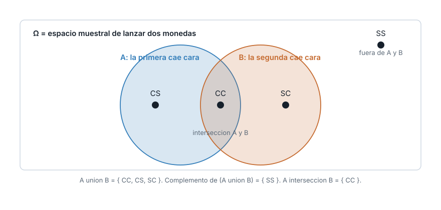{fig-alt="Diagrama de conjuntos con el espacio muestral de las dos monedas y dos eventos A y B superpuestos: A es que la primera moneda caiga cara, B que la segunda caiga cara, con la interseccion, la union y el complemento senalados"}

[A = {CC, CS}, B = {CC, SC}. A intersección B = {CC}. A unión B = {CC, CS, SC}. El complemento de la unión es {SS}.]{.pie-grafico}

## Ejercicio

Definan $C$ = "las dos monedas caen igual" y $D$ = "la primera moneda cae sello".

[Encuentren C, D y C intersección D. ¿C y D son mutuamente excluyentes?]{.pregunta}

## Respuesta

$C = \{CC, SS\}$, $D = \{SC, SS\}$.

$$C \cap D = \{SS\}$$

. . .

[No es el conjunto vacío: C y D no son mutuamente excluyentes, porque comparten el resultado SS.]{.grande}

## Ejercicio 2: otro contexto, un dado

Lanzan un dado de seis caras. Sea $A$ el evento "sale un número par".

[¿Qué resultados de $\Omega = \{1, 2, 3, 4, 5, 6\}$ pertenecen a $A$? ¿Cuál es su complemento $A^c$?]{.pregunta}

## Respuesta {.grafico}

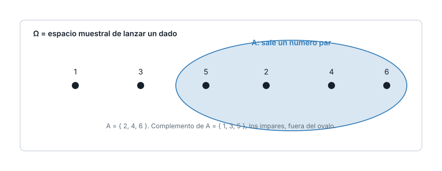{fig-alt="Espacio muestral de lanzar un dado con seis resultados posibles, con el evento A de sacar un numero par marcado con un ovalo alrededor de 2, 4 y 6"}

[A = {2, 4, 6}. El complemento $A^c$ = {1, 3, 5}, los resultados impares, que quedan fuera del ovalo.]{.pie-grafico}

## Bloque 4

[La probabilidad sobre $\Omega$]{.grande}

## La medida de probabilidad: definición

Una **medida de probabilidad** $P$ asigna a cada evento un número entre 0 y 1, y cumple los **axiomas de Kolmogorov**:

1. $P(A) \geq 0$ para todo evento $A$.
2. $P(\Omega) = 1$.
3. Si $A \cap B = \emptyset$, entonces $P(A \cup B) = P(A) + P(B)$.

. . .

Con $n$ resultados igualmente probables: $P(A) = |A| / n$, donde $|A|$ es el número de resultados que contiene $A$.

Regla de la unión para dos eventos cualesquiera, se solapen o no:

$$P(A \cup B) = P(A) + P(B) - P(A \cap B)$$

## ¿Qué significa cada axioma?

El axioma 1 dice que ninguna probabilidad es negativa: no existe "menos que imposible".

El axioma 2 dice que el resultado de cualquier repetición siempre cae en $\Omega$, así que la certeza total vale 1.

. . .

El axioma 3 solo permite sumar directamente cuando los eventos no se solapan. Si se solapan, hay que restar la intersección para no contarla dos veces, que es justo lo que hace la regla de la unión.

## Situación: ¿qué tan probable es cada evento?

Con las dos monedas, que tienen la misma chance de caer cara y sello, cada uno de los cuatro resultados de $\Omega$ tiene la misma chance de ocurrir.

$A$ = "la primera cae cara", $B$ = "la segunda cae cara".

[¿Cuánto vale P(A), P(B) y P(A unión B)?]{.pregunta}

## Ejemplo resuelto: aplicar la regla de la unión

$$P(A) = \frac{|A|}{4} = \frac{2}{4} = 0{,}5 \qquad P(B) = 0{,}5$$

$$P(A \cap B) = \frac{|\{CC\}|}{4} = 0{,}25$$

$$P(A \cup B) = 0{,}5 + 0{,}5 - 0{,}25 = 0{,}75$$

. . .

[Sumar sin restar daría 1,0, que sobreestima: la intersección {CC} se contaría dos veces.]{.grande}

## Ejercicio

Con $C = \{CC\}$ y $D = \{SS\}$ del bloque anterior, que ya vimos que son mutuamente excluyentes.

[Calculen P(C unión D) usando el axioma 3, sin restar nada.]{.pregunta}

## Respuesta

$$P(C) = \frac{1}{4} = 0{,}25 \qquad P(D) = \frac{1}{4} = 0{,}25$$

. . .

Como $C \cap D = \emptyset$, el axioma 3 aplica directo:

$$P(C \cup D) = 0{,}25 + 0{,}25 = 0{,}5$$

## Ejercicio 2: otro contexto, un dado

Con el dado del bloque anterior, sea $A$ = "sale un número par" y $B$ = "sale un número mayor que 4" (es decir, 5 o 6).

[Calculen P(A), P(B) y P(A unión B) con la regla de la unión.]{.pregunta}

## Respuesta

$$P(A) = \frac{|\{2,4,6\}|}{6} = 0{,}5 \qquad P(B) = \frac{|\{5,6\}|}{6} \approx 0{,}3333$$

$$P(A \cap B) = \frac{|\{6\}|}{6} \approx 0{,}1667$$

. . .

$$P(A \cup B) = 0{,}5 + 0{,}3333 - 0{,}1667 = 0{,}6667$$

[El 6 pertenece a los dos eventos a la vez, por eso hay que restar su probabilidad para no contarlo dos veces.]{.grande}

## Bloque 5

[La variable aleatoria]{.grande}

## La variable aleatoria: definición

Una **variable aleatoria** es una función $X: \Omega \to \mathbb{R}$ que asigna un número real a cada resultado del espacio muestral.

- $X$ (mayúscula): la función completa, la regla de conversión.
- $x$ (minúscula): un valor concreto que $X$ puede tomar, una observación.

. . .

El conjunto de todos los valores que $X$ puede tomar se llama su **rango**, **imagen** o **soporte**.

## ¿Por qué hace falta una variable aleatoria?

Trabajar con la etiqueta completa del resultado (CS frente a SC) es trabajo de más cuando la pregunta solo depende de un número, como cuántas caras salieron en total.

. . .

Con veinte monedas, $\Omega$ tendría más de un millón de resultados posibles, mientras que "número de caras" solo puede ser un entero entre 0 y 20.

[Una variable aleatoria traduce el resultado a un número, y con ese número basta.]{.grande}

## Situación: dos formas de convertir el mismo resultado

Sobre las dos monedas, definan $X$ = número de caras obtenidas, y $Y$ = 1 si la primera moneda cae cara, 0 si cae sello.

[Para el resultado $\omega$ = SC, ¿cuánto vale X y cuánto vale Y?]{.pregunta}

## Ejemplo resuelto: X y Y sobre SC {.grafico}

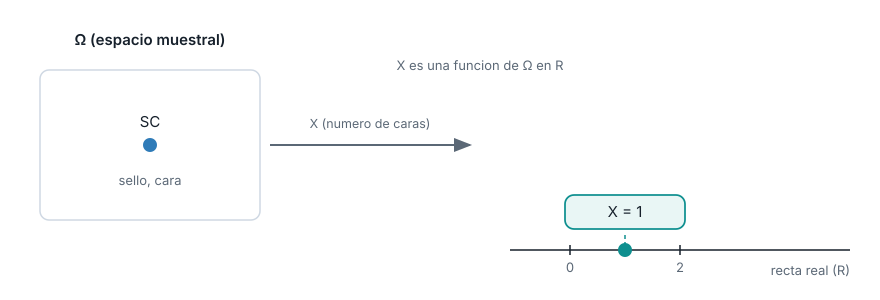{fig-alt="La variable aleatoria X como funcion que lleva el resultado SC del espacio muestral de las dos monedas al numero real 1 sobre la recta de los numeros reales, ilustrando que X es una funcion y no un numero"}

[X(SC) = 1: SC tiene exactamente una cara. Y(SC) = 0: la primera moneda de SC cae sello. El mismo resultado, dos números distintos según qué pregunta interese.]{.pie-grafico}

## Ejercicio

Con las mismas $X$ y $Y$ del ejemplo anterior, evalúenlas sobre el resultado $\omega = CC$.

[¿Cuánto vale X(CC)? ¿Cuánto vale Y(CC)?]{.pregunta}

## Respuesta

$$X(CC) = 2 \qquad Y(CC) = 1$$

Las dos monedas de CC caen cara: dos caras en total, y la primera también cae cara.

. . .

[El soporte de X en este experimento es {0, 1, 2}: no hay forma de obtener otro valor con dos lanzamientos.]{.grande}

## Ejercicio 2: otro contexto, un dado

Sobre el dado, definan $W$ = 1 si sale un número par, 0 si sale impar.

[¿Cuánto vale W(4) y cuánto vale W(5)?]{.pregunta}

## Respuesta

$$W(4) = 1 \qquad W(5) = 0$$

. . .

[4 es par, así que W lo traduce a 1. 5 es impar, así que W lo traduce a 0. El soporte de W es {0, 1}.]{.grande}

## Bloque 6

[Discretas y continuas]{.grande}

## Discreta y continua: definición

Una variable aleatoria es **discreta** cuando su rango es finito o infinito pero contable, se puede poner en una lista aunque no termine.

Es **continua** cuando su rango es un intervalo completo de $\mathbb{R}$, con infinitos valores posibles entre cualquier par de ellos.

. . .

Las variables discretas suelen surgir de **contar**; las continuas, de **medir**.

. . .

En notación formal, con $R_X$ el rango de $X$:

$$X \text{ discreta} \iff R_X = \{x_1, x_2, \ldots\} \text{ es contable} \qquad X \text{ continua} \iff R_X \text{ es un intervalo de } \mathbb{R}$$

## ¿Cuándo confunde la clasificación?

El tiempo de espera de un bus, cronometrado en segundos enteros, se ve discreto en los datos, pero la variable real sigue siendo continua.

. . .

El redondeo es una limitación del instrumento de medición, no una propiedad del fenómeno.

La pregunta correcta no es si los datos observados tienen huecos, sino si la cantidad que se mide podría, en principio, tomar cualquier valor real dentro de su rango.

## Situación: contar defectuosos, medir minutos

Una fábrica revisa una caja de 10 artículos y cuenta cuántos salen defectuosos.

En un paradero, se cronometra cuántos minutos pasan hasta que llega el próximo bus.

[¿Cuál de las dos variables es discreta y cuál es continua?]{.pregunta}

## Ejemplo resuelto: clasificar las dos variables

**Número de defectuosos en la caja**: discreta, con rango finito $\{0, 1, 2, \ldots, 10\}$, porque se obtiene contando.

. . .

**Minutos de espera del bus**: continua, con rango $[0, \infty)$, porque en principio puede tomar cualquier valor real no negativo.

## Ejercicio

Clasifiquen estas dos variables:

(a) Litros de gasolina consumidos en un viaje.

(b) Número de artículos defectuosos en una caja de 20 unidades.

[¿Cuál es discreta y cuál es continua? Justifiquen con la definición.]{.pregunta}

## Respuesta

**(a) Litros de gasolina consumidos**: continua. Se mide, y puede tomar cualquier valor no negativo, con cualquier grado de precisión decimal.

. . .

**(b) Número de artículos defectuosos en una caja de 20**: discreta. Se cuenta, y su rango es el conjunto finito $\{0, 1, \ldots, 20\}$.

## Ejercicio 2: otro contexto, un dado

Clasifiquen estas dos variables:

(a) La suma de los puntos al lanzar dos dados.

(b) La temperatura corporal de una persona, medida con un termómetro digital.

[¿Cuál es discreta y cuál es continua? Justifiquen con la definición.]{.pregunta}

## Respuesta

**(a) Suma de dos dados**: discreta. Se obtiene contando puntos, y su rango es el conjunto finito $\{2, 3, \ldots, 12\}$.

. . .

**(b) Temperatura corporal**: continua. Se mide, y en principio puede tomar cualquier valor real dentro de un rango fisiológico, con cualquier grado de precisión decimal.

## Bloque 7

[La distribución de X]{.grande}

## La distribución de una variable aleatoria: definición

La **distribución** de una variable aleatoria $X$ es la descripción completa de cómo se reparte la probabilidad entre los valores que $X$ puede tomar.

. . .

Dos variables aleatorias con el mismo rango pueden tener distribuciones distintas: la probabilidad no tiene por qué repartirse igual entre sus valores.

Conocer la distribución de $X$ permite calcular cualquier probabilidad que la involucre, como $P(X \leq 1)$ o $P(X > 0)$.

## ¿Por qué no basta con saber el rango?

Saber que $X$ puede valer 0, 1 o 2 no dice qué tan probable es cada valor.

. . .

Sin la distribución, "puede pasar" y "casi siempre pasa" quedan indistinguibles: la distribución completa esa información que el rango, por sí solo, no da.

## Situación: ¿todos los valores de X pesan igual?

$X$ = número de caras en las dos monedas, con la misma chance de cara y sello, puede valer 0, 1 o 2.

De los cuatro resultados de $\Omega$, dos producen $X = 1$ (CS y SC), y solo uno produce cada uno de $X = 0$ y $X = 2$.

[¿Cómo se reparte la probabilidad entre esos tres valores?]{.pregunta}

## Ejemplo resuelto: la distribución de X

| x | frecuencia | P(X = x) |
|---:|---:|---:|
| 0 | 1 | 0,25 |
| 1 | 2 | 0,50 |
| 2 | 1 | 0,25 |

. . .

[X = 1 ocurre el doble de seguido que X = 0 o X = 2, porque dos resultados distintos de $\Omega$ producen una sola cara.]{.grande}

## Ejercicio

Ahora imaginen dos monedas cargadas, donde cada una tiene 0,7 de probabilidad de caer cara.

[¿P(X = 0) sería mayor, menor o igual que 0,25? Razonen sin calcular el número exacto.]{.pregunta}

## Respuesta

**Menor.** $P(X = 0)$ requiere que las dos monedas caigan sello.

. . .

Con monedas cargadas hacia cara, caer sello es menos probable (0,3 cada una), así que la combinación de dos sellos es todavía menos probable que con las dos monedas del bloque anterior.

## Por qué se multiplican las dos probabilidades {.grafico}

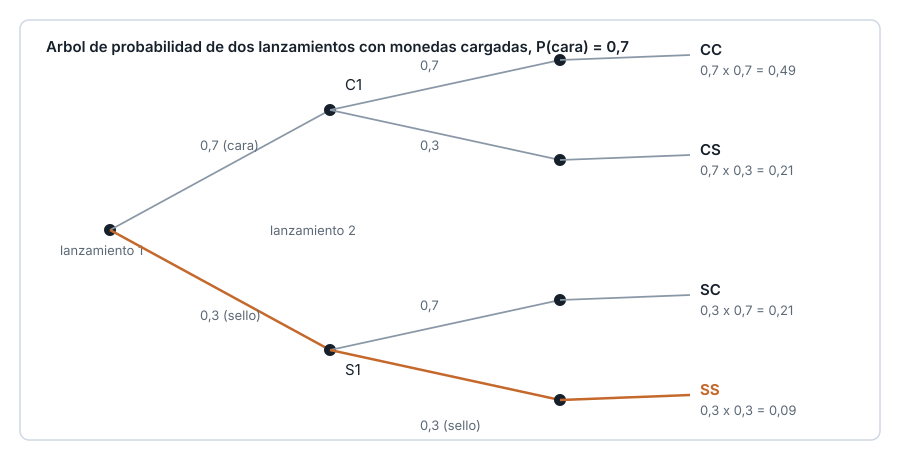{fig-alt="Arbol de probabilidad de dos lanzamientos con monedas cargadas donde cada rama muestra 0,7 para cara y 0,3 para sello, con las cuatro probabilidades conjuntas en las hojas y la hoja sello-sello destacada con el calculo 0,3 por 0,3 igual a 0,09"}

[El resultado del primer lanzamiento no cambia la probabilidad del segundo: los dos lanzamientos son independientes. Cuando dos resultados son independientes, la probabilidad de que ocurran los dos a la vez es el producto de sus probabilidades individuales: P(sello y sello) = P(sello) por P(sello) = 0,3 por 0,3 = 0,09. El Tema 2 de esta unidad retoma esta idea de forma completa, con independencia y probabilidad condicional.]{.pie-grafico}

## Ejercicio 2: otro contexto, un dado

Lancen dos dados de seis caras, uno independiente del otro.

[Usando la misma idea de independencia del ejemplo anterior, ¿cuál es la probabilidad de que ambos salgan 6?]{.pregunta}

## Respuesta

$$P(\text{dado 1} = 6) = \frac{1}{6} \qquad P(\text{dado 2} = 6) = \frac{1}{6}$$

. . .

Como los dos lanzamientos son independientes, sus probabilidades se multiplican:

$$P(\text{ambos} = 6) = \frac{1}{6} \times \frac{1}{6} = \frac{1}{36} \approx 0{,}0278$$

## Bloque 8

[La función de masa de probabilidad]{.grande}

## La PMF: definición

Para una variable discreta $X$, la **función de masa de probabilidad** (PMF) se denota $p_X(x)$ y se define:

$$p_X(x) = P(X = x)$$

. . .

Cumple dos propiedades:

$$p_X(x) \geq 0 \text{ para todo } x \qquad \sum_x p_X(x) = 1$$

## ¿Qué dice la PMF que no dice el rango?

El rango solo dice qué valores son posibles; la PMF dice, para cada uno, cuánta probabilidad concentra.

. . .

Una PMF con un pico marcado en un valor dice que ese valor es mucho más frecuente que los de los extremos.

Verificar que la suma de todas las $p_X(x)$ da 1 es la comprobación más rápida de que una tabla de probabilidades está completa.

## Situación: la suma de dos dados

Se lanzan dos dados de seis caras y se suma el resultado. El espacio muestral tiene 36 combinaciones igualmente probables.

La suma puede valer cualquier entero entre 2 y 12.

[¿Todos los valores son igual de probables?]{.pregunta}

## Ejemplo resuelto: la PMF de la suma de dos dados {.grafico}

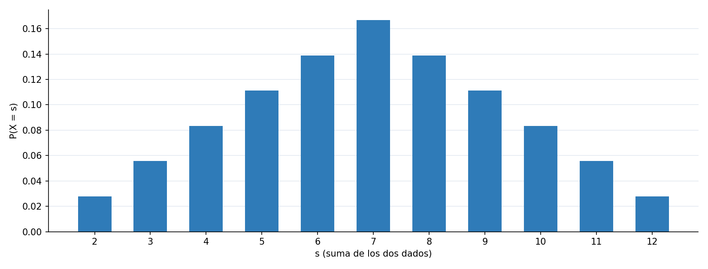{fig-alt="Grafico de barras de la funcion de masa de probabilidad de la suma de dos dados de seis caras, con las probabilidades exactas para cada suma entre 2 y 12 y un pico en el valor 7"}

[Sumar 2 solo tiene una combinacion posible; sumar 7 tiene seis. p(7) = 6/36, el valor mas probable. p(2) = p(12) = 1/36, los menos probables.]{.pie-grafico}

## Ejercicio

Sumar 8 tiene cinco combinaciones posibles (2-6, 3-5, 4-4, 5-3, 6-2).

[Calculen p(8). ¿Es mayor o menor que p(7)?]{.pregunta}

## Respuesta

$$p_X(8) = \frac{5}{36} \approx 0{,}1389$$

. . .

[Es menor que p(7) = 6/36. La PMF decrece a ambos lados de 7, que es el pico único porque tiene más combinaciones que cualquier otro valor.]{.grande}

## Ejercicio 2: comparar dos PMF

Retomen las monedas del bloque 7: $X$ = número de caras con las dos monedas (misma chance de cara y sello), y $X'$ = número de caras con las dos monedas cargadas (P(cara) = 0,7). Ya calcularon $p_{X'}(0) = 0{,}09$.

[Con $p_{X'}(1) = 0{,}42$ y $p_{X'}(2) = 0{,}49$, verifiquen que la PMF de $X'$ cumple sus dos propiedades. ¿En qué se diferencia su forma de la de $X$?]{.pregunta}

## Respuesta {.grafico}

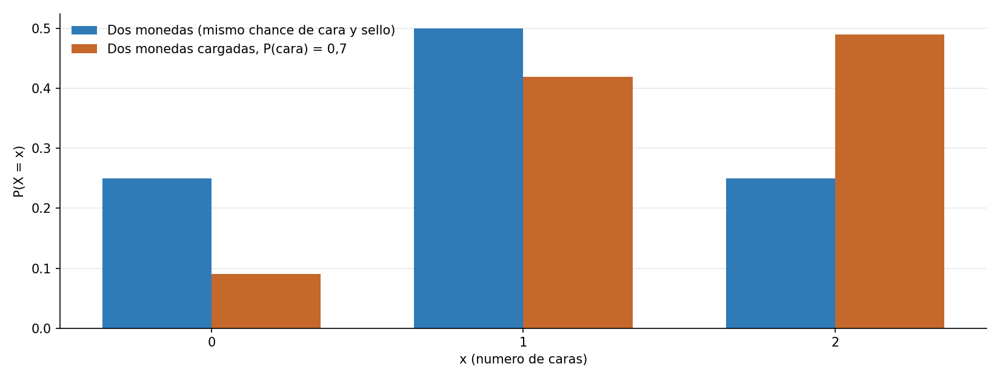{fig-alt="Grafico de barras comparando la funcion de masa de probabilidad del numero de caras con dos monedas con la misma chance de cara y sello contra dos monedas cargadas con probabilidad 0,7 de cara, mostrando que la version cargada concentra mas probabilidad en el valor 2"}

[0,09 + 0,42 + 0,49 = 1: cumple la segunda propiedad, y los tres valores son no negativos. A diferencia de la PMF simetrica de X, la de $X'$ esta corrida hacia 2, porque cara es mas probable que sello en cada moneda.]{.pie-grafico}

## Bloque 9

[La función de densidad]{.grande}

## La PDF: definición

Para una variable continua $X$, la **función de densidad de probabilidad** (PDF) se denota $f_X(x)$. La probabilidad de caer en un intervalo es el área bajo la curva:

$$P(a < X \leq b) = \int_a^b f_X(x)\,dx$$

. . .

$f_X(x) \geq 0$ para todo $x$, y el área bajo toda la curva vale 1. $f_X(x)$ por sí sola **no** es una probabilidad: solo se convierte en probabilidad al integrarla sobre un intervalo.

## ¿Por qué P(X = x) = 0 en variables continuas?

Preguntar por un punto exacto, como esperar exactamente 5 minutos, deja un intervalo de ancho cero.

. . .

El área bajo la curva sobre un intervalo de ancho cero es cero, sin importar qué tan alta sea la densidad ahí.

Con variables continuas solo tienen sentido las preguntas sobre intervalos, nunca sobre un valor puntual exacto.

## Situación: la espera de un bus

El tiempo de espera hasta el próximo bus, en un paradero dado, promedia 6 minutos y sigue una distribución exponencial.

[¿Cuál es la probabilidad de esperar entre 2 y 10 minutos?]{.pregunta}

## Ejemplo resuelto: el área entre 2 y 10 minutos {.grafico}

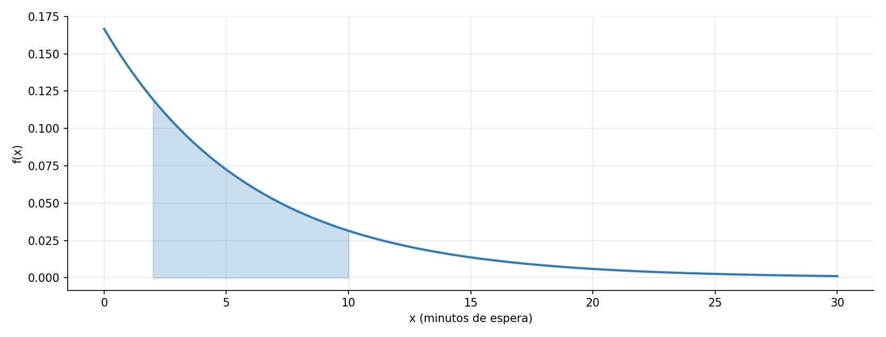{fig-alt="Funcion de densidad exponencial del tiempo de espera de un bus con media 6 minutos, con el area bajo la curva entre 2 y 10 minutos sombreada, que representa la probabilidad de esperar entre 2 y 10 minutos"}

[P(2 < X <= 10) es el area sombreada bajo la curva entre 2 y 10, y vale aproximadamente 0,5277.]{.pie-grafico}

## Ejercicio

Sin calcular ningún número.

[¿Cuánto vale P(X = 5), la probabilidad de esperar exactamente 5 minutos con precisión infinita? Justifiquen con la definición de densidad.]{.pregunta}

## Respuesta

$$P(X = 5) = 0$$

. . .

Hay infinitos valores posibles alrededor de 5, como 5,001 o 5,0001, y ninguno concentra una porción positiva del área total.

[No significa que esperar 5 minutos sea imposible: significa que un punto exacto sobre una variable continua siempre tiene probabilidad cero.]{.grande}

## Ejercicio 2: otra forma de densidad

El tiempo de viaje de ese mismo bus entre dos paraderos es uniforme entre 20 y 40 minutos: la densidad es constante, $f(x) = 1/20$ para $20 \leq x \leq 40$, y cero fuera de ese intervalo.

[¿Cuánto vale P(25 < X <= 30)? Recuerden que el área bajo una densidad constante es un rectángulo.]{.pregunta}

## Respuesta

$$P(25 < X \leq 30) = \int_{25}^{30} \frac{1}{20}\,dx = \frac{1}{20} \times (30 - 25) = \frac{5}{20} = 0{,}25$$

. . .

[Con densidad constante, el área es simplemente el ancho del intervalo por la altura de la densidad: no hace falta una integral más elaborada.]{.grande}

## Bloque 10

[La función de distribución acumulada]{.grande}

## La CDF: definición

La **función de distribución acumulada** (CDF) de una variable aleatoria $X$ se denota $F_X(x)$ y se define, para discretas y continuas por igual:

$$F_X(x) = P(X \leq x)$$

. . .

Cumple cuatro propiedades: toma valores entre 0 y 1, es no decreciente, tiende a 0 cuando $x$ tiende a menos infinito y a 1 cuando $x$ tiende a más infinito, y es continua por la derecha.

## ¿Qué significa acumular?

La CDF en un valor $x$ responde: ¿qué tan probable es no pasarme de $x$?

. . .

Ser no decreciente tiene sentido: acumular hasta un valor más alto nunca puede dar menos que acumular hasta uno más bajo.

En variables discretas, la CDF sube en saltos, uno por cada valor con probabilidad positiva. En continuas, sube sin saltos.

## Situación: dos preguntas de acumulado

Con la suma de dos dados: ¿cuál es la probabilidad de sumar 7 o menos?

Con el tiempo de espera del bus: ¿cuál es la probabilidad de esperar 5 minutos o menos?

[¿Cómo se calculan estas dos preguntas con la misma herramienta?]{.pregunta}

## Ejemplo resuelto: la CDF discreta y la continua {.grafico}

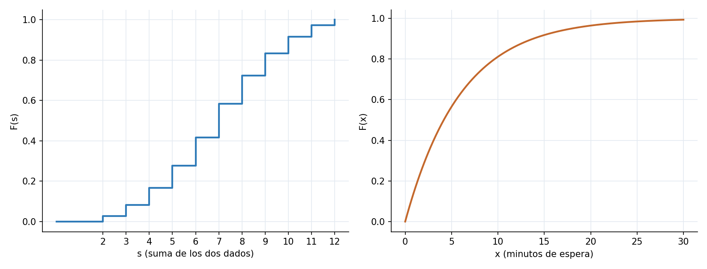{fig-alt="Dos graficas de funcion de distribucion acumulada lado a lado: a la izquierda una escalera discreta para la suma de dos dados, a la derecha una curva continua para el tiempo de espera de un bus, ambas crecientes de 0 a 1"}

[F(7) = 0,5833 para la suma de dos dados, en escalera. F(5) = 0,5654 para la espera del bus, en curva suave.]{.pie-grafico}

## Ejercicio

La tabla de la CDF de la suma de dos dados da $F_X(6) = 0{,}4167$ y $F_X(7) = 0{,}5833$.

[¿Cuánto vale el salto en s = 7? ¿Con qué otra cantidad de esta unidad coincide ese número?]{.pregunta}

## Respuesta

$$0{,}5833 - 0{,}4167 = 0{,}1667$$

. . .

[Coincide exactamente con p(7), la PMF de la suma de dos dados en 7: los saltos de la CDF discreta siempre miden la PMF en ese punto.]{.grande}

## Ejercicio 2: la CDF de las monedas cargadas

Con las monedas cargadas del bloque 7, $X'$ = número de caras, con $p_{X'}(0) = 0{,}09$, $p_{X'}(1) = 0{,}42$ y $p_{X'}(2) = 0{,}49$.

[Calculen $F_{X'}(1) = P(X' \leq 1)$.]{.pregunta}

## Respuesta

$$F_{X'}(1) = p_{X'}(0) + p_{X'}(1) = 0{,}09 + 0{,}42 = 0{,}51$$

. . .

[Se suman las probabilidades de todos los valores del rango que son menores o iguales a 1: solo 0 y 1 cumplen esa condición.]{.grande}

## Bloque 11

[De la CDF a las probabilidades]{.grande}

## Tres fórmulas y dos relaciones

$$P(X \leq x) = F_X(x) \qquad P(X > x) = 1 - F_X(x) \qquad P(a < X \leq b) = F_X(b) - F_X(a)$$

. . .

Caso discreto, de la CDF a la PMF, donde $F_X(x^-)$ es el límite de $F_X$ por la izquierda de $x$:

$$p_X(x) = F_X(x) - F_X(x^-)$$

Caso continuo, de la CDF a la PDF, la densidad es la derivada de la acumulada:

$$f_X(x) = F_X'(x)$$

## ¿Por qué conviene usar la CDF?

Una vez calculada la CDF, no hace falta volver a sumar la PMF o a integrar la PDF cada vez que cambia la pregunta.

. . .

Restar dos valores de $F_X$ da directamente la probabilidad de cualquier intervalo.

La relación entre PMF o PDF y CDF va en las dos direcciones: acumular para construir la CDF, y diferenciar o restar para recuperarla.

## Situación: tres preguntas sobre la espera del bus

Con la CDF exponencial de media 6 ya calculada, un pasajero pregunta: ¿esperar 5 minutos o menos?, ¿esperar más de 5?, ¿esperar entre 2 y 10?

[¿Cómo se responden las tres sin volver a integrar la densidad?]{.pregunta}

## Ejemplo resuelto: las tres preguntas del pasajero

$$P(X \leq 5) = F_X(5) = 0{,}5654$$

$$P(X > 5) = 1 - 0{,}5654 = 0{,}4346$$

$$P(2 < X \leq 10) = F_X(10) - F_X(2) = 0{,}5277$$

. . .

[El último coincide exactamente con el área sombreada del bloque 9, obtenida ahora restando dos valores de la CDF en vez de integrar.]{.grande}

## Ejercicio

Con la tabla de la CDF de la suma de dos dados: $F_X(5) = 0{,}2778$ y $F_X(9) = 0{,}8333$.

[Calculen P(5 < suma <= 9) restando dos valores de la CDF.]{.pregunta}

## Respuesta

$$P(5 < X \leq 9) = F_X(9) - F_X(5) = 0{,}8333 - 0{,}2778 = 0{,}5555$$

. . .

[Es la probabilidad acumulada entre los valores 6, 7, 8 y 9 de la suma, sin sumar sus cuatro probabilidades una por una.]{.grande}

## Ejercicio 2: la cola derecha de los dados

Con la misma tabla de la CDF de la suma de dos dados, $F_X(9) = 0{,}8333$.

[Calculen P(suma > 9) usando la fórmula del complemento, sin sumar las probabilidades de 10, 11 y 12 una por una.]{.pregunta}

## Respuesta

$$P(X > 9) = 1 - F_X(9) = 1 - 0{,}8333 = 0{,}1667$$

. . .

[Coincide con sumar p(10) + p(11) + p(12) = 0,0833 + 0,0556 + 0,0278, pero la resta con la CDF llega al mismo resultado en un solo paso.]{.grande}

## Bloque 12

[De la teoría a los datos]{.grande}

## Realización y distribución empírica: definición

Al repetir el experimento $n$ veces, cada repetición produce una **realización** $X_i$ de la variable aleatoria.

Una vez observada, cada $X_i$ deja de ser incierta: es un número fijo, parte de la **muestra observada**.

. . .

La **función de distribución empírica**, $\hat{F}_n(x)$, se calcula como la proporción de realizaciones que no superan $x$:

$$\hat{F}_n(x) = \frac{1}{n}\sum_{i=1}^{n} \mathbb{1}(X_i \leq x)$$

donde $\mathbb{1}(X_i \leq x)$ vale 1 si se cumple la condición y 0 si no.

## ¿En qué se diferencia de la CDF teórica?

$F_X$ viene de un modelo fijado de antemano; $\hat{F}_n$ depende de la muestra concreta que se observó.

. . .

Dos muestras distintas del mismo experimento producen dos $\hat{F}_n$ ligeramente distintas, aunque ambas vengan de la misma $F_X$.

Comparar $\hat{F}_n$ contra $F_X$ es la forma de preguntar si un modelo teórico describe bien lo que realmente se observa.

## Situación: cronometrar 200 esperas reales

Alguien se para en el paradero y cronometra el tiempo de espera cada vez que llega un bus, durante 200 repeticiones.

[¿Se parecerá la distribución de esos 200 tiempos observados a la exponencial teórica de media 6 minutos?]{.pregunta}

## Ejemplo resuelto: la ECDF contra la teórica {.grafico}

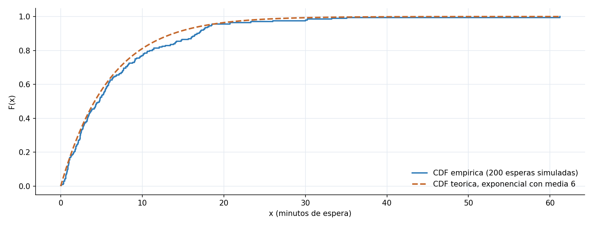{fig-alt="Comparacion entre la funcion de distribucion acumulada empirica de 200 tiempos de espera de bus simulados y la funcion de distribucion acumulada teorica exponencial con media 6 minutos, mostrando que la empirica sigue de cerca a la teorica"}

[Con una muestra simulada de 200 esperas, la escalera empirica queda muy cerca de la curva teorica en todo momento, sin coincidir exactamente.]{.pie-grafico}

## Ejercicio

[Si la muestra creciera de 200 a 2000 esperas, ¿la distancia entre la ECDF y la CDF teórica aumentaría, disminuiría o quedaría igual? Justifiquen.]{.pregunta}

## Respuesta

**Disminuiría.** Con más repeticiones, la proporción observada se acerca más a la probabilidad teórica que la generó.

. . .

[Es la misma razón por la que un dado lanzado 2000 veces reparte sus caras más parejo, en proporción, que uno lanzado solo 6 veces.]{.grande}

## Ejercicio 2: otro contexto, un dado

Lanzan un dado 6 veces y anotan cuántas veces sale cada cara. Después lo lanzan 600 veces y vuelven a contar.

[¿En cuál de los dos casos esperarían que la proporción observada de cada cara esté más cerca de 1/6, la probabilidad teórica? Justifiquen con la idea de la distribución empírica.]{.pregunta}

## Respuesta

**En el de 600 lanzamientos.**

. . .

[La función de distribución empírica se acerca a la teórica a medida que crece el número de repeticiones. Con solo 6 lanzamientos, una sola cara de más o de menos cambia mucho la proporción observada; con 600, esas diferencias pesan mucho menos.]{.grande}

## Bloque 13

[Simulación y cierre]{.grande}

## El ejercicio integrador: definición

Este bloque reúne PMF o PDF, CDF y distribución empírica en un solo flujo, sobre el mismo modelo del tiempo de espera del bus.

. . .

Se compara la proporción observada en una muestra simulada de 500 esperas contra la probabilidad teórica de la exponencial.

Un buen acuerdo entre lo observado y lo teórico es evidencia a favor de usar ese modelo para responder preguntas futuras.

## ¿Por qué importa esta comparación en analítica?

Un modelo teórico solo es útil si describe razonablemente los datos reales que va a tratar de predecir.

. . .

Verificar el acuerdo entre lo observado y lo teórico es el paso final antes de confiar en un modelo para decisiones concretas, y esta misma lógica se repite en el resto de la especialización.

## Situación: 500 esperas y una pregunta concreta

Se simulan 500 tiempos de espera con el modelo exponencial de media 6 minutos.

[¿Qué proporción de esas 500 esperas fue de 5 minutos o menos, y qué tan cerca queda de lo que predice la teoría?]{.pregunta}

## Ejemplo resuelto: observado contra teórico {.grafico}

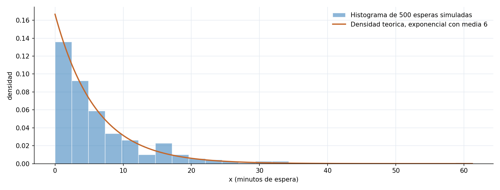{fig-alt="Histograma de 500 tiempos de espera de bus simulados con la curva de densidad exponencial teorica de media 6 minutos superpuesta, mostrando que el histograma sigue de cerca la forma de la densidad teorica"}

[Proporcion observada en 500 esperas simuladas: 0,56. Probabilidad teorica F(5): 0,5654. El histograma sigue de cerca la forma de la densidad teorica.]{.pie-grafico}

## Ejercicio: cambiar el escenario

Repitan mentalmente el mismo cálculo cambiando la media de espera de 6 a 3 minutos, con la fórmula $P(X \leq 5) = 1 - e^{-5/\text{media}}$.

[¿La probabilidad de esperar 5 minutos o menos sube o baja frente al escenario de media 6? Justifiquen antes de calcular el número exacto.]{.pregunta}

## Respuesta

**Sube.** Con una media de espera más corta, esperar 5 minutos o menos se vuelve más probable, porque el bus tiende a llegar más rápido en general.

. . .

$$P(X \leq 5) = 1 - e^{-5/3} \approx 0{,}8111$$

[Muy por encima del 0,5654 del escenario de media 6.]{.pie-grafico}

## Ejercicio 2: cambiar el tamaño de la muestra

Ahora, en vez de cambiar la media de espera, imaginen que la simulación se repite con solo 10 esperas en lugar de 500, manteniendo la media en 6 minutos.

[¿La proporción observada de esperas de 5 minutos o menos se acercaría más o menos a la probabilidad teórica de 0,5654? Justifiquen sin ejecutar el código.]{.pregunta}

## Respuesta

**Se acercaría menos.**

. . .

[Es la misma idea del bloque 12: con menos repeticiones, la proporción observada depende mucho de qué esperas concretas salieron en esa muestra pequeña, y se aleja más fácilmente del valor teórico que con 500 esperas.]{.grande}

## Lo que construimos hoy

::: {.regla}
Partiendo de un experimento aleatorio, construyeron un espacio muestral, definieron eventos sobre él y les asignaron una probabilidad con los axiomas de Kolmogorov.
:::

::: {.regla}
Tradujeron resultados a números con una variable aleatoria, y describieron cómo se reparte su probabilidad con la PMF, la PDF y la CDF, según sea discreta o continua.
:::

::: {.regla}
Compararon una distribución teórica contra datos observados, la base de cualquier modelo de probabilidad que se use después para tomar decisiones.
:::

## El hilo completo de la unidad {.grafico}

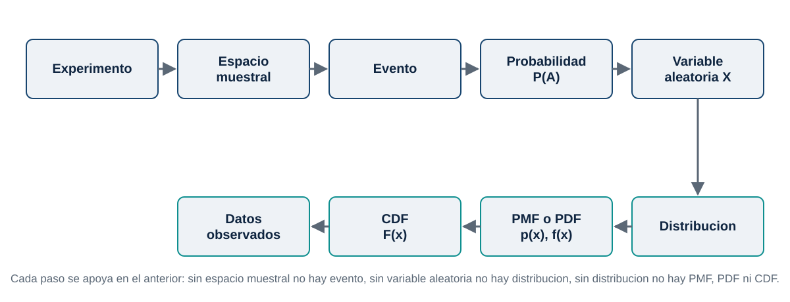{fig-alt="Diagrama de flujo con nueve pasos: experimento, espacio muestral, evento, probabilidad y variable aleatoria en una fila superior, seguidos de distribucion, PMF o PDF, CDF y datos observados en una fila inferior, conectados por flechas que muestran el hilo conceptual completo de la unidad"}

## Lo que viene

- **Tema 2.** Probabilidad condicional, independencia y el teorema de Bayes.
- **Tema 3.** Valor esperado y varianza de una variable aleatoria.
- **Temas 4 y 5.** Modelos discretos y continuos concretos (uniforme, binomial, Poisson, normal, exponencial), que ya usan todo lo visto hoy.
