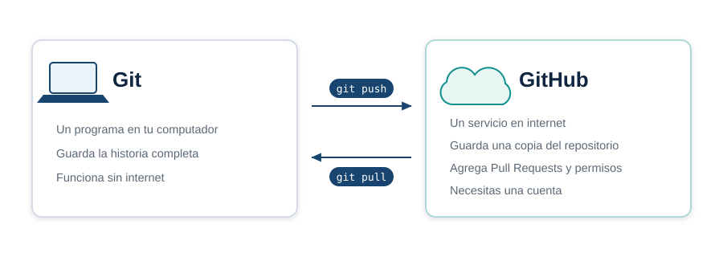
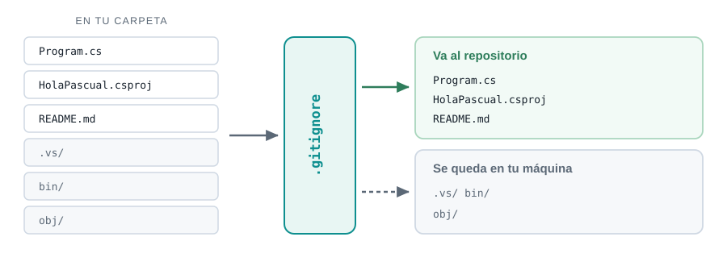
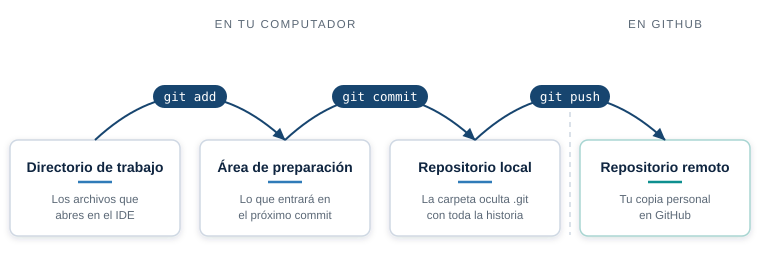
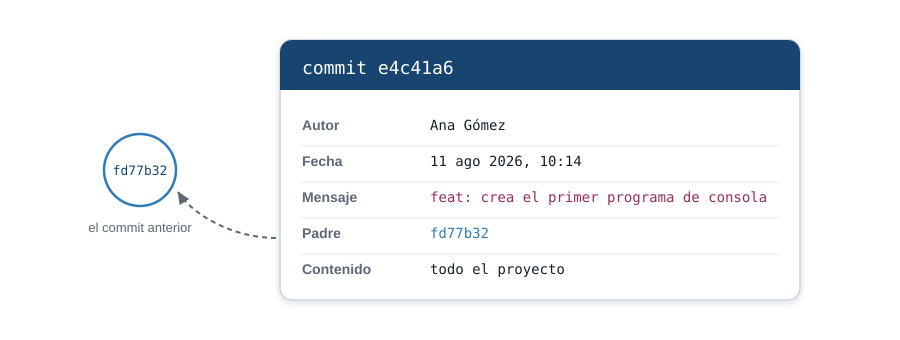
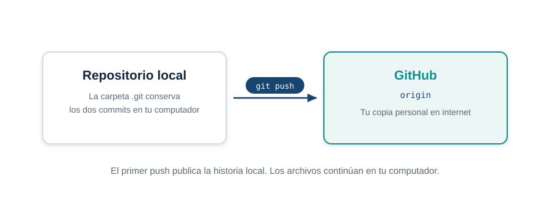

::: {.ficha}
|            |                                                          |
|------------|----------------------------------------------------------|
| Asignatura | Herramientas de Programación I (ET0047)                  |
| Programa   | Tecnología en Desarrollo de Software                     |
| Unidad     | Unidad 1. Aplicaciones de consola con un IDE             |
| Dedicación | 4 horas de encuentro sincrónico y 8 de trabajo independiente |
:::

## Lo que vas a lograr

La semana tiene dos sesiones. En la primera dejas el entorno instalado y un programa de C#
ejecutándose. En la segunda conviertes ese mismo proyecto en un repositorio de Git y publicas su
historial en GitHub.

Objetivos concretos:

1. Explicar qué es un IDE y qué hace cada una de sus partes.
2. Instalar y verificar el SDK de .NET, Visual Studio 2026 Community y Git.
3. Crear, compilar y ejecutar un proyecto de consola desde la terminal y desde el IDE.
4. Registrar cambios con `init`, `status`, `add`, `commit`, `log` y `diff`.
5. Publicar el repositorio local en GitHub mediante un remoto y `push`.

::: {.callout-important}
## Si trabajas en macOS o Linux, resuélvelo estas primeras semanas

Las unidades 1 y 2 son programas de consola y corren igual en los tres sistemas. La **unidad 3 usa
Windows Forms, que solo existe en Windows**. Desde la semana 11 vas a necesitar Windows: una
máquina virtual, arranque dual o la sala de cómputo de la institución.

Ocúpate de esto ahora. Enterarte en la semana 11 te deja sin margen.
:::

## Sesión 1. El IDE y tu primer programa

### Qué es un IDE

IDE significa *Integrated Development Environment*, entorno de desarrollo integrado. Es un solo
programa que reúne las herramientas que necesitas para escribir software. Sin él tendrías que
usarlas por separado, cada una con su propia forma de invocarse.

Estas son las partes que lo componen y para qué sirve cada una:

| Parte | Qué hace |
|---|---|
| Editor de código | Escribes el código. Colorea la sintaxis, autocompleta nombres y subraya los errores mientras escribes |
| Compilador | Traduce tu código a algo que la máquina puede ejecutar. Si hay errores de sintaxis, los reporta y no genera nada |
| Depurador | Detiene el programa en el punto que le indiques y te deja ver el valor de cada variable en ese instante |
| Gestor de proyectos | Organiza los archivos, las referencias y la configuración de compilación |
| Terminal integrada | Ejecuta comandos sin salir del entorno |
| Control de versiones | Registra el historial de cambios y lo sincroniza con un repositorio remoto |

En este curso el IDE es **Visual Studio 2026 Community**, el lenguaje es **C#** y la plataforma es
**.NET 10**.

Conviene separar tres cosas que se confunden:

- **C#** es el lenguaje. Las palabras y las reglas con las que escribes.
- **.NET** es la plataforma. Las bibliotecas que ya vienen hechas y el motor que ejecuta tu
  programa.
- **Visual Studio** es el IDE. La herramienta con la que trabajas sobre los dos anteriores.

Puedes programar en C# sin Visual Studio. No puedes hacerlo sin .NET.

#### Versiones de referencia

Esta guía se probó con estas versiones. Instala la misma línea o una superior.

| Herramienta | Versión probada |
|---|---|
| SDK de .NET | 10.0.103 |
| Git | 2.50.0 |
| Visual Studio 2026 Community | 18.3 |

::: {.callout-note}
### Sobre la versión de Visual Studio

El número de Visual Studio viene del proyecto donde probé el resto del material, no de la máquina
donde preparé esta guía. Si el instalador te ofrece otro, instálalo igual: cualquier versión de
Visual Studio 2026 Community sirve para el curso.
:::

### Instalación paso a paso

#### [1]{.paso} SDK de .NET

Es lo que compila y ejecuta tu código. Descarga la versión **10** desde
[dotnet.microsoft.com/download](https://dotnet.microsoft.com/download).

Instala el **SDK**, no el Runtime. El Runtime solo ejecuta programas ya compilados. El SDK además
los construye, que es justo lo que vas a hacer todo el semestre. Es el error de instalación más
común del curso.

Acepta las opciones por omisión del instalador.

#### [2]{.paso} Visual Studio 2026 Community

Descarga desde
[visualstudio.microsoft.com](https://visualstudio.microsoft.com/es/vs/community/). La edición
Community es gratuita para estudiantes.

En el instalador aparece una lista de **cargas de trabajo**. Marca **Desarrollo de escritorio de
.NET**. Con esa basta: incluye lo necesario para las aplicaciones de consola de las unidades 1 y 2
y para Windows Forms en la unidad 3.

No marques las demás cargas. Cada una suma varios gigabytes que no vas a usar.

::: {.callout-warning}
### Reserva espacio y tiempo

La instalación pasa de **8 GB** de descarga. Con una conexión doméstica puede tomar una hora larga.
Empieza la descarga antes del encuentro sincrónico, no durante.

Deja **20 GB libres en disco** antes de arrancar.
:::

#### [3]{.paso} Git

Descarga desde [git-scm.com/downloads](https://git-scm.com/downloads) y acepta las opciones por
omisión.

Lo usarás en la segunda sesión para guardar el historial del proyecto que vas a crear.

#### [4]{.paso} Solo si usas macOS o Linux: VS Code

Visual Studio 2026 es únicamente para Windows. Microsoft retiró Visual Studio para Mac en agosto de
2024 y nunca existió para Linux.

Instala [VS Code](https://code.visualstudio.com/) y la extensión **C# Dev Kit**, publicada por
Microsoft:

```bash
code --install-extension ms-dotnettools.csdevkit
```

Con VS Code y el SDK de .NET haces completas las unidades 1 y 2. Para la unidad 3 necesitas
Windows.

### Verificación

Abre una terminal **nueva**. Las que ya estaban abiertas no ven los cambios que los instaladores
hicieron en el `PATH`, y los comandos van a fallar aunque la instalación esté bien.

Ejecuta:

```bash
dotnet --version
git --version
```

Estas son las respuestas reales de la máquina donde preparé la guía:

```text
> dotnet --version
10.0.103

> git --version
git version 2.50.0.windows.2
```

Los números pueden ser mayores que los de arriba y no pasa nada. Lo que importa es que ningún
comando responda con un error.

Para ver todos los SDK instalados:

```bash
dotnet --list-sdks
```

```text
10.0.103 [C:\Program Files\dotnet\sdk]
```

### Tu primer programa desde la terminal

Vas a hacerlo primero sin el IDE. Así ves los pasos que Visual Studio automatiza, y te queda un
camino que funciona aunque el IDE falle.

#### Paso 1: crea el proyecto

Ubícate en la carpeta donde guardas tus trabajos y ejecuta:

```bash
dotnet new console -o HolaPascual
```

La salida es esta. Donde dice `<tu carpeta>` va la ruta real de tu equipo:

```text
La plantilla "Aplicación de consola" se creó correctamente.

Procesando acciones posteriores a la creación...
Restaurando <tu carpeta>\HolaPascual\HolaPascual.csproj:
  Determinando los proyectos que se van a restaurar...
  Se ha restaurado <tu carpeta>\HolaPascual\HolaPascual.csproj (en 91 ms).
Restauración realizada correctamente.
```

Se creó una carpeta `HolaPascual` con dos archivos que importan.

#### Paso 2: mira lo que se creó

El primero es `HolaPascual.csproj`, el archivo de proyecto:

```xml
<Project Sdk="Microsoft.NET.Sdk">

  <PropertyGroup>
    <OutputType>Exe</OutputType>
    <TargetFramework>net10.0</TargetFramework>
    <ImplicitUsings>enable</ImplicitUsings>
    <Nullable>enable</Nullable>
  </PropertyGroup>

</Project>
```

Dice cuatro cosas: que el resultado es un ejecutable, que apunta a .NET 10, que importa las
bibliotecas más comunes sin que las escribas, y que avisa cuando una variable puede quedar sin
valor.

El segundo es `Program.cs`, tu código:

```csharp
// See https://aka.ms/new-console-template for more information
Console.WriteLine("Hello, World!");
```

Dos líneas. Una de ellas es un comentario.

#### Paso 3: ejecútalo

Entra a la carpeta y ejecuta:

```bash
cd HolaPascual
dotnet run
```

```text
Hello, World!
```

Ya tienes un programa de C# funcionando.

#### Paso 4: escribe tu propio código

Abre `Program.cs` y reemplaza su contenido por esto:

```csharp
// Herramientas de Programacion I - Semana 01
// Primer programa: entrada por teclado y salida por consola.

Console.WriteLine("Herramientas de Programacion I");
Console.WriteLine("Tecnologia en Desarrollo de Software");
Console.WriteLine();

Console.Write("Escribe tu nombre: ");
string? nombre = Console.ReadLine();

Console.WriteLine();
Console.WriteLine($"Hola, {nombre}. Tu entorno de desarrollo funciona.");
```

Ejecuta `dotnet run` otra vez y escribe tu nombre cuando lo pida:

```text
Herramientas de Programacion I
Tecnologia en Desarrollo de Software

Escribe tu nombre: Ana Maria

Hola, Ana Maria. Tu entorno de desarrollo funciona.
```

Cuatro cosas nuevas aparecieron ahí:

- `Console.WriteLine` escribe y salta de línea. `Console.Write` escribe y se queda en la misma
  línea, que es lo que quieres cuando pides un dato.
- `Console.ReadLine` espera a que el usuario teclee algo y presione Enter, y devuelve lo que
  escribió.
- `string? nombre` guarda ese texto. El signo de interrogación advierte que podría no llegar nada.
- `$"Hola, {nombre}."` mete el valor de la variable dentro del texto. Se llama interpolación y la
  vas a usar todo el semestre.

#### Paso 5: compila sin ejecutar

`dotnet run` compila y ejecuta de un solo golpe. Cuando solo quieres saber si el código está bien
escrito, usa:

```bash
dotnet build
```

```text
  Determinando los proyectos que se van a restaurar...
  Todos los proyectos están actualizados para la restauración.
  HolaPascual -> <tu carpeta>\HolaPascual\bin\Debug\net10.0\HolaPascual.dll

Compilación correcta.
    0 Advertencia(s)
    0 Errores

Tiempo transcurrido 00:00:01.11
```

Esas dos líneas del final, advertencias y errores, son las que vas a mirar cada vez que algo no
funcione.

### El mismo programa desde Visual Studio

Ahora repítelo con el IDE. El resultado es idéntico; cambia cuánto trabajo haces tú.

1. Abre Visual Studio y elige **Crear un proyecto**.
2. Busca la plantilla **Aplicación de consola** y confirma que dice **C#**. Hay plantillas con
   nombre parecido para otros lenguajes.
3. Ponle nombre `HolaVisual` y elige la carpeta donde guardas tus trabajos.
4. En la pantalla siguiente, deja **.NET 10.0** como framework de destino.
5. Presiona `F5` para ejecutar.

Se abre una ventana de consola con la salida. Al lado tienes el **Explorador de soluciones**, que
es el mismo `.csproj` y el mismo `Program.cs` de antes, presentados en forma de árbol.

#### Prueba el depurador

Esta es la razón principal para usar un IDE. Pega tu código de la sección anterior en el
`Program.cs` de este proyecto y haz esto:

1. Haz clic en el margen izquierdo, a la altura de la línea `string? nombre = Console.ReadLine();`.
   Aparece un punto rojo: es un **punto de interrupción**.
2. Presiona `F5`. El programa arranca y se detiene justo en esa línea, antes de ejecutarla.
3. Presiona `F10` para avanzar una línea. Escribe tu nombre en la consola cuando lo pida.
4. Pasa el cursor sobre `nombre`. Visual Studio te muestra el valor que tiene en ese momento.
5. Presiona `F5` para dejar que termine.

Acabas de ver el programa por dentro mientras corre. Cuando un ejercicio dé un resultado raro, esto
es lo que te dice por qué.

### Errores frecuentes

::: {.error-caso}
[Error 1]{.etiqueta}

#### dotnet no se reconoce como comando

**Causa.** Abriste la terminal antes de instalar el SDK, así que esa ventana no ve el `PATH` nuevo.

**Solución.** Cierra **todas** las terminales y abre una nueva. Si el error sigue, vuelve a ejecutar
el instalador del SDK y revisa que terminara sin errores.
:::

::: {.error-caso}
[Error 2]{.etiqueta}

#### Instalé .NET pero dotnet build falla

**Causa.** Instalaste el Runtime en lugar del SDK. El Runtime ejecuta programas ya compilados y no
sabe compilar.

**Solución.** Ejecuta `dotnet --list-sdks`. Si no imprime ninguna línea, no tienes SDK. Vuelve a
[dotnet.microsoft.com/download](https://dotnet.microsoft.com/download) y descarga el que dice
**SDK**.
:::

::: {.error-caso}
[Error 3]{.etiqueta}

#### La ventana de la consola se cierra de inmediato

**Causa.** Ejecutaste con `Ctrl+F5` en Visual Studio, o hiciste doble clic sobre el `.exe`. El
programa termina y la ventana se va con él.

**Solución.** Ejecuta con `F5`, que mantiene la ventana abierta al terminar. También puedes agregar
`Console.ReadKey();` como última línea para que espere una tecla.
:::

::: {.error-caso}
[Error 4]{.etiqueta}

#### El proyecto no compila y no encuentro qué cambié

**Causa.** Casi siempre falta un punto y coma, o hay una llave sin cerrar.

**Solución.** Mira la ventana **Lista de errores** de Visual Studio, o la salida de `dotnet build`
en la terminal. Cada error trae archivo y número de línea. **Corrige siempre el primero de la
lista**: un error temprano genera otros en cascada, y al arreglarlo suelen desaparecer varios.
:::

::: {.error-caso}
[Error 5]{.etiqueta}

#### Los acentos y las eñes salen como símbolos raros en la consola

**Causa.** La consola de Windows usa una codificación distinta a la del archivo de código.

**Solución.** Escribe los mensajes sin tildes, como en los ejemplos de esta guía: es la opción que
usa el curso por defecto. Si prefieres ver los acentos en tu propia consola, la Semana 2 trae la
línea opcional que lo permite.
:::

## Cierre de la sesión 1

Antes de pasar a Git, confirma lo siguiente:

- [ ] `dotnet --version` responde con la versión del SDK.
- [ ] `git --version` responde.
- [ ] `HolaPascual` ejecuta con `dotnet run`.
- [ ] Modificaste `Program.cs` y el programa te saluda con tu nombre.
- [ ] Abriste el proyecto en Visual Studio y probaste un punto de interrupción.
- [ ] Si usas macOS o Linux, sabes cómo vas a acceder a Windows para la unidad 3.

## Sesión 2. Git y GitHub con HolaPascual

En esta sesión no creas otro ejercicio. Tomas `HolaPascual`, el proyecto que ya funciona, y le
agregas un historial verificable. Al final tendrás el mismo proyecto en tu computador y en GitHub.

[Abrir la presentación de Git y GitHub](presentacion-git-github.html){.btn .btn-primary
role="button"}

### Git y GitHub cumplen trabajos distintos

**Git** es el programa que registra cambios en tu computador. Funciona sin internet. **GitHub** es
un servicio web que recibe una copia del repositorio para consultarla, compartirla y recuperarla
desde otro equipo.

Un repositorio de Git guarda versiones del proyecto llamadas *commits*. Cada commit registra el
autor, la fecha, un mensaje y el estado de los archivos en ese momento.

{fig-alt="Git es un programa local y GitHub es un servicio en internet"}

### Configura tu identidad

Git necesita saber quién firma los commits. Ejecuta estos comandos una sola vez en tu computador.
Reemplaza los datos de ejemplo por los tuyos. Usa el correo asociado a tu cuenta de GitHub si
quieres que la plataforma relacione los commits con tu perfil.

```bash
git config --global user.name "Ana Maria Perez"
git config --global user.email "ana.perez@example.com"
git config --global init.defaultBranch main
```

Comprueba la configuración:

```bash
git config --global user.name
git config --global user.email
git config --global init.defaultBranch
```

```text
Ana Maria Perez
ana.perez@example.com
main
```

Tu nombre y tu correo producirán una salida distinta.

### Prepara el `.gitignore` de .NET

`dotnet run`, `dotnet build` y Visual Studio generan carpetas que puedes reconstruir. Versionarlas
solo agrega archivos temporales y diferencias innecesarias. Crea un archivo llamado `.gitignore`
en la raíz de `HolaPascual` con este contenido:

```gitignore
.vs/
bin/
obj/
*.user
*.suo
```

El punto inicial forma parte del nombre. En Windows, créalo desde Visual Studio o desde la terminal
si el Explorador no acepta el nombre.

{fig-alt="El gitignore deja pasar Program.cs, el archivo de proyecto y README, y excluye .vs, bin y obj"}

### Inicia el repositorio y revisa su estado

Abre la terminal en la carpeta `HolaPascual`. No ejecutes `git init` en la carpeta que contiene
todas tus clases.

```bash
git init
git status --short
```

La primera orden crea la carpeta oculta `.git`. La segunda muestra los archivos que Git todavía no
sigue:

```text
?? .gitignore
?? HolaPascual.csproj
?? Program.cs
```

`??` significa "archivo nuevo sin seguimiento". Las carpetas `bin` y `obj` no aparecen porque el
`.gitignore` ya las filtró.

### Agrega un README

Crea `README.md` en la raíz del proyecto:

```markdown
# HolaPascual

Primer programa de consola de Herramientas de Programación I.
```

Este archivo explica el propósito del repositorio cuando alguien lo abre en GitHub.

### Prepara y registra el primer commit

Git trabaja con tres zonas: los archivos que editas, el área de preparación y el historial. `add`
selecciona lo que entrará al próximo commit. `commit` registra esa selección.

{fig-alt="Directorio de trabajo, área de preparación, repositorio local y repositorio remoto"}

### Escribe mensajes de commit con una convención

Git acepta cualquier texto como mensaje. En este curso adoptamos **Conventional Commits** como
convención de equipo para que el historial sea fácil de leer. La forma básica es:

```text
tipo: descripción breve
```

Cuando el proyecto crezca, puedes añadir un alcance entre paréntesis para indicar qué parte
cambió:

```text
tipo(alcance): descripción breve
```

Escribe la descripción en minúscula, con un verbo que diga qué hace el cambio y sin punto final.
El alcance es opcional. Por ejemplo, `salida`, `entrada`, `readme` o `config`.

| Tipo | Cuándo usarlo | Ejemplo en HolaPascual |
|---|---|---|
| `feat` | Agregas una funcionalidad que la persona usuaria puede observar | `feat(entrada): solicita el nombre` |
| `fix` | Corriges un comportamiento incorrecto | `fix(salida): evita saludar con un nombre vacío` |
| `docs` | Cambias documentación, como `README.md`, sin cambiar el programa | `docs: explica cómo ejecutar HolaPascual` |
| `style` | Cambias formato, espacios o sangría sin alterar el comportamiento | `style: ordena la sangría de Program.cs` |
| `refactor` | Reorganizas el código sin agregar funcionalidad ni corregir un fallo | `refactor: extrae la construcción del saludo` |
| `test` | Agregas o ajustas pruebas automatizadas | `test: verifica el saludo con nombre` |
| `chore` | Haces mantenimiento o configuración sin agregar funcionalidad | `chore: configura el gitignore de .NET` |

`style` no significa cambiar el diseño de la salida del programa: solo cubre formato del código
sin cambio de comportamiento. `chore` cubre tareas de mantenimiento, configuración o
dependencias que tampoco agregan funcionalidad.

Compara estos mensajes:

| Mensaje | Veredicto | Razón |
|---|---|---|
| `feat: crea el primer programa de consola` | Bueno | Declara el tipo y el resultado del cambio |
| `feat(salida): informa que Git registra el cambio` | Bueno | Añade un alcance útil y explica el comportamiento |
| `cambios` | Malo | No declara tipo ni explica qué cambió |
| `fix cosas` | Malo | No usa la forma de la convención y sigue siendo impreciso |
| `feat: actualiza Program.cs` | Malo | Nombra el archivo, pero no explica el propósito del cambio |

Ejecuta:

```bash
git add .
git status --short
```

```text
A  .gitignore
A  HolaPascual.csproj
A  Program.cs
A  README.md
```

La `A` indica que cada archivo está preparado. Registra el commit:

```bash
git commit -m "feat: crea el primer programa de consola"
```

El texto que imprime Git incluye un hash y un conteo de líneas que varían según tu proyecto. La
comprobación estable es esta:

```bash
git status --short
git log --oneline
```

`status` no imprime nada cuando no quedan cambios. `log` muestra una línea similar a esta:

```text
<hash> feat: crea el primer programa de consola
```

`<hash>` representa los primeros caracteres del identificador real de tu commit.

{fig-alt="Elementos que guarda un commit de Git"}

### Observa un cambio antes de registrarlo

Agrega esta instrucción al final de `Program.cs`:

```csharp
Console.WriteLine("Este cambio queda registrado con Git.");
```

Mira la diferencia:

```bash
git diff
```

La salida muestra las líneas anteriores con `-` y las nuevas con `+`. Los encabezados y números de
línea dependen del contenido actual de tu archivo. Confirma el cambio con:

```bash
git status --short
```

```text
 M Program.cs
```

El espacio antes de `M` indica que modificaste el archivo en el directorio de trabajo, pero todavía
no lo preparaste. Regístralo:

```bash
git add Program.cs
git commit -m "feat(salida): informa que Git registra el cambio"
git log --oneline
```

El historial queda en este orden:

```text
<hash nuevo> feat(salida): informa que Git registra el cambio
<hash inicial> feat: crea el primer programa de consola
```

Los hashes serán distintos en cada computador. Los mensajes y el orden deben coincidir.

{fig-alt="Los dos commits del laboratorio, con main y HEAD sobre el más reciente"}

### Crea el repositorio vacío en GitHub

1. Inicia sesión en [github.com](https://github.com/).
2. Selecciona **New repository**.
3. Escribe `HolaPascual` como nombre.
4. Elige visibilidad pública o privada según prefieras.
5. Deja sin marcar **Add a README file**, **Add .gitignore** y **Choose a license**.
6. Selecciona **Create repository**.

El repositorio debe quedar vacío porque tu computador ya tiene los primeros commits. Si GitHub
crea otro commit con un README, aparecen dos historias que todavía no necesitas reconciliar.

### Conecta y publica

Copia la URL HTTPS que GitHub muestra para el repositorio. Sustituye `<usuario>` por tu nombre de
usuario real:

```bash
git remote add origin https://github.com/<usuario>/HolaPascual.git
git remote -v
git push -u origin main
```

`remote add` guarda la dirección con el nombre `origin`. `push` envía los commits y `-u` deja
conectada la rama local `main` con la remota. GitHub puede abrir el navegador para que autorices el
acceso. Esa pantalla y la salida de la terminal cambian según el sistema y el método de
autenticación.

{fig-alt="Repositorio remoto en GitHub y copia local del historial"}

Recarga la página del repositorio y comprueba que aparecen `Program.cs`, `HolaPascual.csproj`,
`README.md`, `.gitignore` y los dos commits. No deben aparecer `.vs`, `bin` ni `obj`.

### El flujo que repetirás

Después del primer `push`, el ciclo cotidiano es corto:

```bash
git status
git diff
git add <archivo>
git commit -m "tipo: describe el cambio"
git push
```

Usa mensajes que expliquen el cambio. `feat: agrega el saludo por nombre` informa más que
`cambios` o `actualiza Program.cs`.

::: {.callout-note}
## Ampliación: ramas y Pull Requests

Una rama permite trabajar aparte de `main`. Un Pull Request propone incorporar esa rama desde
GitHub y facilita revisar el cambio. Los usarás cuando el proyecto necesite colaboración. En esta
sesión basta con reconocer los conceptos; conflictos, etiquetas y reversión quedan para otro
momento.
:::

## Lista de chequeo de la semana

- [ ] El SDK de .NET, Visual Studio y Git funcionan.
- [ ] `HolaPascual` compila y ejecuta.
- [ ] Git tiene configurados tu nombre, correo y rama inicial `main`.
- [ ] `.gitignore` excluye `.vs`, `bin` y `obj`.
- [ ] El historial local tiene al menos dos commits con mensajes claros.
- [ ] `git status --short` queda vacío después del último commit.
- [ ] GitHub muestra los archivos y commits del proyecto.

## Trabajo independiente

Completa estas actividades después de cada sesión:

1. **Después de la sesión 1:** termina la instalación, repite el proyecto sin mirar la guía,
   provoca un error de compilación y recorre el programa con el depurador.
2. **Después de la sesión 2:** repite el flujo de Git en un proyecto de prueba, amplía el
   `README.md`, registra el cambio y publícalo con `git push`.

Conserva `HolaPascual`: lo usarás como referencia cuando empieces con variables y entrada de datos
en la Semana 2.

## Recursos

- SDK de .NET: [dotnet.microsoft.com/download](https://dotnet.microsoft.com/download)
- Visual Studio Community: [visualstudio.microsoft.com](https://visualstudio.microsoft.com/es/vs/community/)
- Git: [git-scm.com/downloads](https://git-scm.com/downloads)
- GitHub: [docs.github.com](https://docs.github.com/es)
- Referencia de Git: [git-scm.com/docs](https://git-scm.com/docs)
- Documentación de C#: [learn.microsoft.com/dotnet/csharp](https://learn.microsoft.com/es-es/dotnet/csharp/)

::: {.pie-doc}
Herramientas de Programación I (ET0047). Institución Universitaria Pascual Bravo.
Facultad de Ingeniería. Semestre 2026-02.

**Transparencia.** La redacción de esta guía contó con el apoyo de inteligencia artificial,
usando el modelo Claude Opus 5 de Anthropic. Todo el contenido fue revisado y validado. Las salidas
de terminal son reales, tomadas durante la preparación del material.
:::
