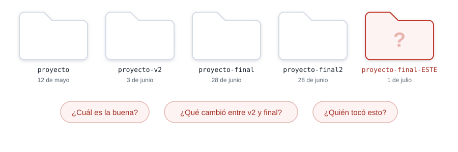

## Ruta de la sesión

::: {.columns}
::: {.column width="50%"}
**Primera parte**

1. Git y GitHub
2. Identidad
3. `.gitignore`
4. `init` y `status`
5. Primer commit
:::

::: {.column width="50%"}
**Segunda parte**

1. `diff` y segundo commit
2. `log`
3. Repositorio vacío en GitHub
4. Remoto y `push`
5. Verificación
:::
:::

## Sin control de versiones {.solo-diagrama}

{fig-alt="Cinco carpetas con nombres parecidos y preguntas que ninguna responde"}

## Lo que necesitamos

- Volver a un estado anterior.
- Saber quién cambió qué y cuándo.
- Explicar cada cambio con un mensaje.
- Recuperar el proyecto desde otro computador.

. . .

[Git registra la historia. GitHub aloja una copia.]{.grande}

## Git y GitHub son distintos {.solo-diagrama}

{fig-alt="Git es un programa en el computador y GitHub es un servicio en internet"}

## Laboratorio: identifica tus commits

Una sola vez por computador:

```bash
git config --global user.name "Tu nombre"
git config --global user.email "tu.correo@example.com"
git config --global init.defaultBranch main
```

Usa el correo asociado a GitHub si quieres que los commits aparezcan en tu perfil.

## `.gitignore` para este proyecto

Créalo en la raíz de `HolaPascual` antes de iniciar el repositorio:

```gitignore
.vs/
bin/
obj/
*.user
*.suo
```

`bin` y `obj` se reconstruyen. `Program.cs`, el `.csproj` y `README.md` sí describen el proyecto.

## Lo que queda fuera {.solo-diagrama}

{fig-alt="El gitignore deja pasar Program.cs, el archivo de proyecto y README, y excluye .vs, bin y obj"}

## Laboratorio: inicia HolaPascual

Abre la terminal en la raíz del proyecto:

```bash
git init
git status --short
```

- `.git` guarda la historia local.
- `??` identifica archivos nuevos sin seguimiento.
- Ejecuta `init` una sola vez en cada proyecto.

## Dónde vive cada cambio {.solo-diagrama}

{fig-alt="Directorio de trabajo, área de preparación, repositorio local y repositorio remoto"}

## Convención de mensajes

Git acepta cualquier mensaje. En el curso adoptamos **Conventional Commits** como convención de
equipo:

```text
tipo: descripción breve
tipo(alcance): descripción breve
```

- El alcance es opcional: `salida`, `entrada`, `readme` o `config`.
- Escribe una descripción breve, en minúscula, con verbo y sin punto final.
- El mensaje explica el propósito del cambio, no solo el archivo modificado.

## Tipos para cambios funcionales

| Tipo | Úsalo cuando... | Ejemplo |
|---|---|---|
| `feat` | agregas funcionalidad observable | `feat(entrada): solicita el nombre` |
| `fix` | corriges un comportamiento incorrecto | `fix(salida): evita saludar con un nombre vacío` |
| `refactor` | reorganizas sin agregar funcionalidad ni corregir un fallo | `refactor: extrae la construcción del saludo` |
| `test` | agregas o ajustas pruebas | `test: verifica el saludo con nombre` |

## Tipos para apoyo y mantenimiento

| Tipo | Úsalo cuando... | Ejemplo |
|---|---|---|
| `docs` | solo cambias documentación | `docs: explica cómo ejecutar HolaPascual` |
| `style` | cambias formato sin alterar el comportamiento | `style: ordena la sangría de Program.cs` |
| `chore` | haces mantenimiento o configuración sin funcionalidad | `chore: configura el gitignore de .NET` |

`style` cubre espacios, sangría y formato del código. `chore` cubre configuración, dependencias y
otras tareas de mantenimiento.

## Mensajes que sí ayudan

::: {.columns}
::: {.column width="52%"}
**Buenos**

- `feat: crea el primer programa de consola`
- `feat(salida): informa que Git registra el cambio`
- `docs: explica cómo ejecutar HolaPascual`
:::

::: {.column width="48%"}
**Malos**

- `cambios`: no dice qué ocurrió.
- `fix cosas`: no sigue la forma y es impreciso.
- `feat: actualiza Program.cs`: nombra el archivo, no el propósito.
:::
:::

## Laboratorio: primer commit

```bash
git add .
git status --short
git commit -m "feat: crea el primer programa de consola"
```

- `add` selecciona contenido.
- `commit` registra esa selección.
- El mensaje explica el cambio, no el nombre del archivo.

## Qué guarda un commit {.solo-diagrama}

{fig-alt="Un commit guarda autor, fecha, mensaje, contenido y vínculo con el commit anterior"}

## Laboratorio: mira antes de guardar

Agrega una instrucción al final de `Program.cs`:

```csharp
Console.WriteLine("Este cambio queda registrado con Git.");
```

```bash
git diff
git status --short
```

`diff` muestra el cambio que todavía no está en el próximo commit.

## Laboratorio: segundo commit

```bash
git add Program.cs
git commit -m "feat(salida): informa que Git registra el cambio"
git log --oneline
```

Los hashes serán distintos en cada computador. El orden y los mensajes deben coincidir.

## La historia es una cadena {.solo-diagrama}

{fig-alt="Los dos commits del laboratorio, con main y HEAD sobre el más reciente"}

## GitHub: crea un repositorio vacío

1. Selecciona **New repository**.
2. Escribe `HolaPascual`.
3. Elige la visibilidad.
4. Deja sin marcar README, `.gitignore` y licencia.
5. Selecciona **Create repository**.

::: {.aviso}
Tu computador ya tiene la historia. No crees otra historia desde GitHub.
:::

## El remoto {.solo-diagrama}

{fig-alt="GitHub guarda una copia y el computador conserva el repositorio local"}

## Laboratorio: conecta y publica

```bash
git remote add origin https://github.com/<usuario>/HolaPascual.git
git remote -v
git push -u origin main
```

- `origin` es el nombre corto de la dirección.
- `push` sube los commits.
- `-u` conecta `main` local con `origin/main`.

GitHub puede abrir el navegador para autorizar el acceso.

## Verifica en GitHub

Debes encontrar:

- `Program.cs`, `HolaPascual.csproj`, `README.md` y `.gitignore`.
- Dos commits con mensajes claros.
- Ninguna carpeta `.vs`, `bin` u `obj`.

. . .

Si falta el último commit, ejecuta `git push`.

## El flujo desde ahora

```bash
git status
git diff
git add <archivo>
git commit -m "tipo: describe el cambio"
git push
```

[Cambios pequeños, mensajes claros y un historial que puedas explicar.]{.grande}

::: {.nota-final}
Herramientas de Programación I. Institución Universitaria Pascual Bravo. Semestre 2026-02.

Redacción apoyada por Claude Opus 5 de Anthropic. Contenido revisado y validado.
:::
