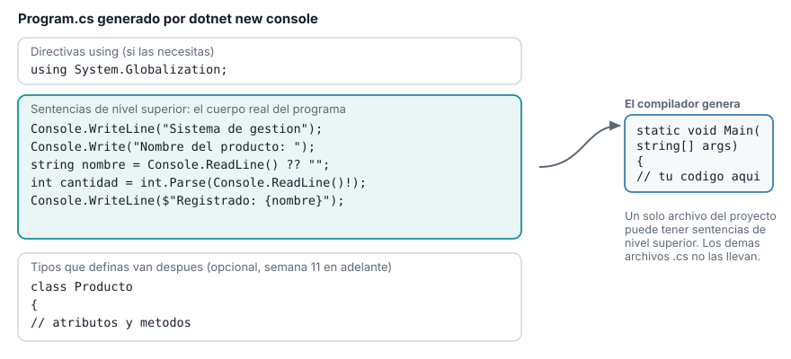
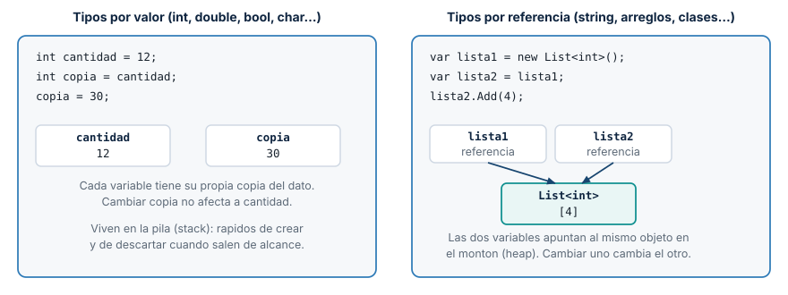
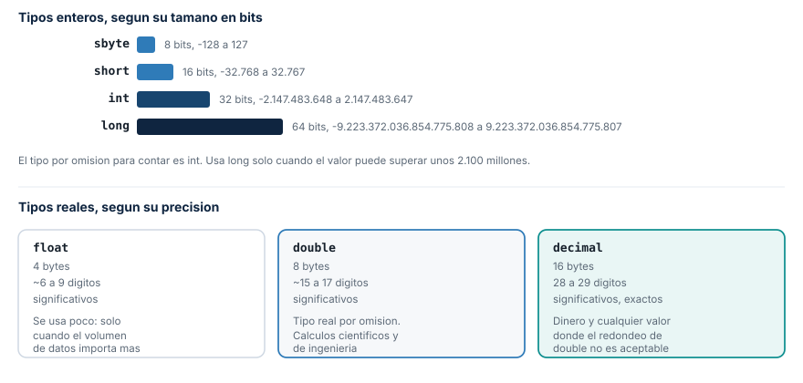
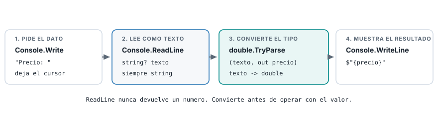
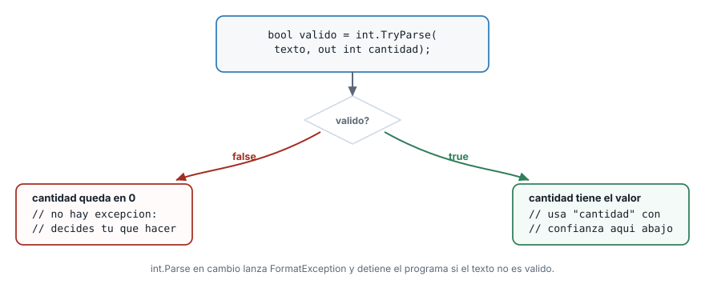

## Ruta de la sesión

::: {.columns}
::: {.column width="50%"}
**Primera parte**

1. Acentos en la consola (opcional)
2. Anatomía de un programa
3. Sintaxis y convenciones
4. Tipos por valor y por referencia
:::

::: {.column width="50%"}
**Segunda parte**

1. Tipos numéricos y precisión
2. Entrada y salida por consola
3. Convert, Parse y TryParse
4. Caso de uso: registro de producto
:::
:::

## De HolaPascual a hoy

- Ya tienes el entorno, un programa que ejecuta y un repositorio en GitHub.
- Hoy abres ese `Program.cs` y entiendes cada línea que ya escribiste.
- Al final de la sesión vas a leer datos del usuario sin que un error tumbe tu programa.

. . .

[Todo lo de hoy alimenta el sistema de gestión que vas a construir el resto del semestre.]{.grande}

## Opcional: los acentos en la consola

Pendiente de la Semana 1. El curso usa la consola con su configuración por defecto y evita tildes
en lo que imprime, así que no necesitas nada especial para seguir el material.

Si quieres ver los acentos en tu propia consola, agrega esta línea antes del primer
`Console.WriteLine`:

```csharp
Console.OutputEncoding = System.Text.Encoding.UTF8;
```

```text
Programación en C#: tildes, eñes y signos como el guion.
```

## Sentencias de nivel superior {.solo-diagrama}

{fig-alt="Anatomia de un Program.cs: directivas using arriba, sentencias de nivel superior en el centro, definiciones de tipos opcionales al final, y el Main que genera el compilador"}

## Qué genera el compilador

| Tu código usa | Firma que genera |
|---|---|
| Ni `return` ni `await` | `static void Main(string[] args)` |
| Solo `return` | `static int Main(string[] args)` |
| Solo `await` | `static async Task Main(string[] args)` |
| `return` y `await` | `static async Task<int> Main(string[] args)` |

Un solo archivo del proyecto puede tener sentencias de nivel superior.

## Sintaxis básica

| Regla | En C# |
|---|---|
| Fin de sentencia | `;` al final de cada instrucción |
| Bloque de código | `{ }` |
| Comentario de una línea | `// texto` |
| Comentario de varias líneas | `/* texto */` |
| Mayúsculas y minúsculas | El lenguaje distingue |

```csharp
int cantidad = 5;   // el punto y coma cierra la sentencia
if (cantidad > 0)
{
    Console.WriteLine("Hay existencias.");
}
```

## Laboratorio: encuentra el error

```csharp
int cantidad = 5
Console.WriteLine(cantidad)
```

. . .

Falta el punto y coma en las dos líneas. El compilador señala la línea siguiente a la del error
real: revisa siempre un renglón arriba cuando el mensaje no cuadre.

## Convenciones de nombres

| Elemento | Convención | Ejemplo |
|---|---|---|
| Variables y parámetros | `camelCase` | `precioUnitario` |
| Clases, métodos y tipos propios | `PascalCase` | `Producto`, `CalcularTotal` |
| Constantes | `PascalCase` en este curso | `StockMinimo` |

Un nombre debe decir qué representa: `cantidadEnInventario` comunica más que `c`.

## Tipado fuerte

```csharp
int a = 5;
bool esValido = true;

int total = a + 2;        // correcto
// int error = a + esValido;   // el compilador lo rechaza
```

C# no mezcla tipos incompatibles. El compilador lo detecta antes de ejecutar el programa.

## Tipos por valor y por referencia {.con-definiciones}

{fig-alt="Comparacion entre tipos por valor, con copias independientes, y tipos por referencia, donde dos variables apuntan al mismo objeto"}

::: {.definiciones}
**Por valor:** `int`, `double`, `bool`, `char`. Cada variable copia el dato.
**Por referencia:** `string`, arreglos, clases. Las variables comparten el mismo objeto.
:::

## Tipos numéricos {.solo-diagrama}

{fig-alt="Mapa de los tipos numericos de C Sharp: sbyte, short, int y long segun su tamano en bits, y float, double y decimal segun su precision"}

## La regla práctica de este curso

- **Cuenta cosas con `int`.** Es el tipo entero por omisión.
- **Mide cosas con `double`.** Es el tipo real por omisión.
- `decimal` existe para dinero real, fuera de este curso: 28 a 29 dígitos exactos.

## Laboratorio: la imprecisión de double

```csharp
double resultado = 0.1 + 0.2;
Console.WriteLine(resultado);

decimal resultadoExacto = 0.1m + 0.2m;
Console.WriteLine(resultadoExacto);
```

```text
0.30000000000000004
0.3
```

`double` guarda el número en base binaria. La mayoría de las fracciones decimales no tienen una
representación exacta ahí.

## Caracteres, texto y lógicos

| Tipo | Guarda | Ejemplo |
|---|---|---|
| `char` | Un solo carácter | `char inicial = 'P';` |
| `string` | Texto de cualquier longitud | `string nombre = "Cable HDMI";` |
| `bool` | `true` o `false` | `bool activo = true;` |

`char` usa comillas simples. `string` usa comillas dobles.

## `var` y valores por defecto

```csharp
var cantidad = 12;        // el compilador fija el tipo en int

int contador = default;
double total = default;
bool encontrado = default;
```

```text
contador: 0, total: 0, encontrado: False
```

`var` no vuelve flexible el tipo: el compilador lo fija igual que si lo escribieras tú.

## Console.ReadLine siempre devuelve texto {.solo-diagrama}

{fig-alt="Flujo de cuatro pasos: pedir el dato, leerlo como texto, convertir el tipo y mostrar el resultado"}

## Tres formas de convertir texto a número

| Forma | Si el texto no es válido |
|---|---|
| `Convert.ToInt32(texto)` | Lanza una excepción |
| `int.Parse(texto)` | Lanza `FormatException` |
| `int.TryParse(texto, out int valor)` | Devuelve `false`, sin excepción |

Desde hoy: `TryParse` para todo dato que venga del teclado.

## `string?` y el operador `!`

`Console.ReadLine` puede devolver `null`. C# lo marca con `string?`: "puede ser `string` o puede
ser `null`".

| Operador | Qué hace |
|---|---|
| `??` | Si el valor es `null`, usa el de la derecha: `texto ?? ""` |
| `!` | Le dice al compilador "confía en mí, aquí no es `null`", sin comprobarlo |

Usa `!` solo cuando estás seguro. Si te equivocas, el programa falla al ejecutarse, no al compilar.

## Laboratorio: Parse sin proteger

```csharp
Console.Write("Precio unitario: ");
string? texto = Console.ReadLine();
double precio = double.Parse(texto!);
```

```text
Precio unitario: abc
Unhandled exception. System.FormatException:
The input string 'abc' was not in a correct format.
```

Un texto inválido detiene el programa por completo.

## El patrón TryParse {.solo-diagrama}

{fig-alt="Diagrama de decision del patron TryParse: rama verdadera con el valor convertido y rama falsa sin excepcion"}

## Laboratorio: TryParse en acción

```csharp
Console.Write("Cantidad en inventario: ");
string? texto = Console.ReadLine();

if (int.TryParse(texto, out int cantidad))
{
    Console.WriteLine($"Cantidad valida: {cantidad}");
}
else
{
    Console.WriteLine($"'{texto}' no es un numero entero valido.");
}
```

`out int cantidad` declara la variable de salida en el mismo lugar donde la usas.

## Caso de uso: leer y validar los datos {.codigo-largo}

```csharp
Console.WriteLine("Sistema de gestion - Registro de producto");
Console.WriteLine("==========================================");
Console.WriteLine();

Console.Write("Nombre del producto: ");
string nombre = Console.ReadLine() ?? "";

Console.Write("Precio unitario: ");
string? textoPrecio = Console.ReadLine();
bool precioValido = double.TryParse(textoPrecio, out double precio);

Console.Write("Cantidad en inventario: ");
string? textoCantidad = Console.ReadLine();
bool cantidadValida = int.TryParse(textoCantidad, out int cantidad);
```

## Caso de uso: construir el resumen {.codigo-largo}

```csharp
if (!precioValido || !cantidadValida)
{
    Console.WriteLine("No se pudo registrar el producto: revisa el precio y la cantidad.");
}
else
{
    double valorTotal = precio * cantidad;

    Console.WriteLine("Resumen del producto");
    Console.WriteLine("---------------------");
    Console.WriteLine($"Nombre     : {nombre}");
    Console.WriteLine($"Precio     : {precio}");
    Console.WriteLine($"Cantidad   : {cantidad}");
    Console.WriteLine($"Valor total: {valorTotal}");
}
```

## Corrida con datos válidos

```text
Nombre del producto: Cable HDMI 2 metros
Precio unitario: 4599.90
Cantidad en inventario: 12

Resumen del producto
---------------------
Nombre     : Cable HDMI 2 metros
Precio     : 4599.9
Cantidad   : 12
Valor total: 55198.799999999996
```

. . .

El valor total no es un error: es la misma imprecisión de `double` que ya viste.

## Corrida con un dato inválido

```text
Nombre del producto: Mouse inalambrico
Precio unitario: abc
Cantidad en inventario: 5

No se pudo registrar el producto: revisa el precio y la cantidad.
```

El programa terminó completo. `TryParse` nunca lanzó una excepción.

## Tres errores frecuentes de hoy

::: {.columns}
::: {.column width="50%"}
**Compilación**

- Falta `;` o una llave sin cerrar.
- Operación entre tipos incompatibles.
:::

::: {.column width="50%"}
**Ejecución**

- `Parse` sin proteger sobre un dato inválido.
- `WriteLine` en vez de `Write` antes de un `ReadLine`.
:::
:::

## Trabajo independiente

1. Agrega `codigo` (`string`) y `stockMinimo` (`int`, con `TryParse`).
2. Guarda en una variable `bool` si `cantidad` es menor que `stockMinimo`.
3. Prueba el programa con datos válidos y con al menos un dato inválido.

[Retomas este ejercicio como base para las decisiones y ciclos de la Semana 3 en adelante.]{.grande}
