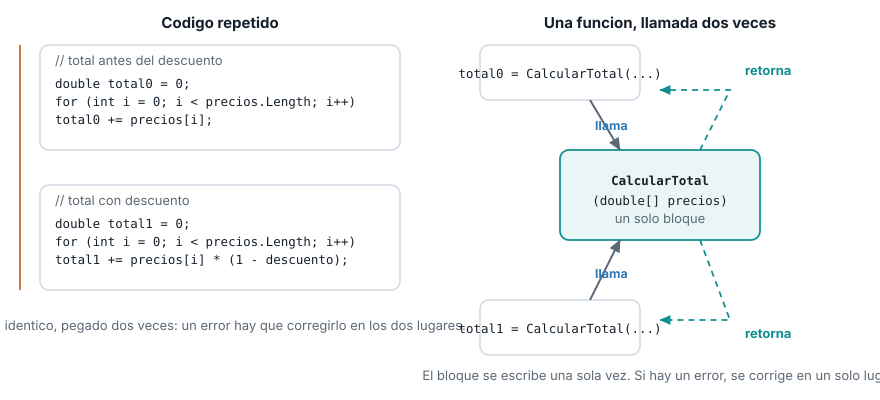
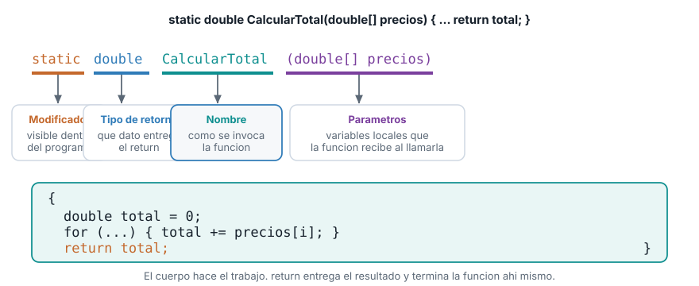
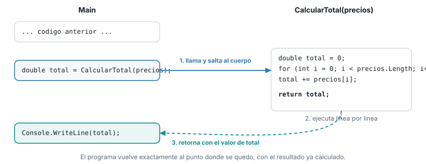

::: {.ficha}
|            |                                                          |
|------------|----------------------------------------------------------|
| Asignatura | Herramientas de Programación I (ET0047)                  |
| Programa   | Tecnología en Desarrollo de Software                     |
| Unidad     | Unidad 2. Creando aplicaciones informáticas utilizando arreglos y funciones |
| Saber      | Funciones: parámetros de entrada y valor de retorno      |
:::

Esta guía se probó con el SDK de .NET **10.0.302**.

## El problema que resuelve una función

En el tema anterior calculaste el total de un vector de precios con un `for` que suma sobre
`precios.Length`. Ese cálculo no aparece una sola vez en un sistema de gestión real: aparece cada
vez que hace falta un total. Por ejemplo, una vez para mostrar el total antes de aplicar un
descuento, y otra vez para mostrar el total después:

```csharp
double[] precios = { 4599.90, 12999.00, 8500.50, 2300.00, 15750.75 };

double totalOriginal = 0;
for (int i = 0; i < precios.Length; i++)
{
    totalOriginal += precios[i];
}
Console.WriteLine($"Total antes del descuento: {totalOriginal}");

double descuento = 0.10;
double totalConDescuento = 0;
for (int i = 0; i < precios.Length; i++)
{
    totalConDescuento += precios[i] * (1 - descuento);
}
Console.WriteLine($"Total con descuento: {totalConDescuento:F2}");
```

```text
Total antes del descuento: 44150,15
Total con descuento: 39735,14
```

Mira el segundo `for`: es casi idéntico al primero, solo cambia una línea. Copiarlo y pegarlo
funciona hoy, pero deja dos copias del mismo cálculo sueltas en el programa. Si mañana encuentras
un error en la forma de sumar, o cambias el tipo de dato, tienes que acordarte de corregirlo en los
dos lugares. Y esto no se queda en dos copias: cada vez que el sistema de gestión necesite un total
en otro punto (un reporte, una validación, un resumen), aparece una tercera, una cuarta copia del
mismo bloque.

::: {.diagrama}
{fig-alt="Comparacion entre repetir el mismo bloque de codigo en dos lugares del programa, y escribirlo una sola vez en una funcion llamada desde dos lugares"}
:::

Lo que falta es una forma de escribir un bloque de código **una sola vez**, ponerle un nombre, y
poder **invocarlo** cuantas veces haga falta desde cualquier parte del programa. Eso es una
**función**.

## Qué es una función en C#

Una función (en C# también se le llama **método**) es un bloque de código con nombre que se puede
invocar las veces que haga falta, desde distintos lugares del programa, opcionalmente recibiendo
datos de entrada y opcionalmente devolviendo un resultado.

Dos acciones quedan separadas, y conviene no confundirlas:

- **Declarar (o definir) la función.** Escribir su código una sola vez, con su nombre, en algún
  lugar del programa. Esto no ejecuta nada todavía: solo deja el bloque disponible.
- **Llamar (o invocar) la función.** Escribir el nombre de la función seguido de paréntesis en el
  punto del programa donde quieres que se ejecute. Cada llamada ejecuta el mismo código declarado
  una sola vez, tantas veces como lo llames.

Es la misma relación que ya conoces entre un vector y sus posiciones: declaras `precios` una vez,
y accedes a `precios[2]` tantas veces como necesites. Con una función, declaras `CalcularTotal` una
vez, y la llamas tantas veces como necesites un total.

## Anatomía de una función

Toda función en C# se escribe con la misma forma: una **firma** (la línea que la declara) seguida
de un **cuerpo** entre llaves. La firma tiene cuatro partes fijas, en este orden:

::: {.diagrama}
{fig-alt="Anatomia de la firma de una funcion en C#: modificador static, tipo de retorno double, nombre CalcularTotal, lista de parametros double vector precios, y cuerpo con return"}
:::

- **Modificador de acceso.** En este curso vas a escribir siempre `static`. Significa que la
  función no pertenece a un objeto particular (todavía no viste programación orientada a objetos,
  eso llega en la Unidad 3): es una función suelta, disponible en todo el programa.
- **Tipo de retorno.** El tipo de dato que la función va a entregar como resultado. Puede ser
  cualquier tipo que ya conoces (`double`, `int`, `string`, `bool`, un vector) o `void`, que
  significa "esta función no entrega ningún resultado".
- **Nombre.** Cómo se va a invocar la función. En C# se escribe en `PascalCase` (cada palabra con
  mayúscula inicial), a diferencia de las variables, que van en `camelCase`.
- **Parámetros.** La lista de datos que la función necesita recibir para hacer su trabajo, entre
  paréntesis, cada uno con su tipo. Puede estar vacía.

Con esa anatomía, el cálculo del total del principio de la guía se convierte en una función:

```csharp
static double CalcularTotal(double[] precios)
{
    double total = 0;
    for (int i = 0; i < precios.Length; i++)
    {
        total += precios[i];
    }
    return total;
}
```

`static double CalcularTotal(double[] precios)` es la firma: una función llamada `CalcularTotal`,
sin pertenecer a un objeto (`static`), que recibe un vector de `double` llamado `precios` y
devuelve un `double`. El cuerpo es exactamente el mismo `for` que ya conocías, ahora encerrado en
un solo lugar.

## Parámetros de entrada

Un **parámetro** es una variable local que la función recibe con un valor en el momento en que es
llamada. Se declara en la firma, con su tipo y su nombre, igual que cualquier variable. En
`CalcularTotal(double[] precios)`, `precios` es el único parámetro: un vector de `double`.

Cuando llamas la función, el valor real que le pasas se llama **argumento**. La distinción importa
para hablar con precisión: `precios` en la firma es el parámetro; el vector que efectivamente le
pasas al llamarla es el argumento.

```csharp
double[] precios = { 4599.90, 12999.00, 8500.50, 2300.00, 15750.75 };
double total = CalcularTotal(precios);
Console.WriteLine($"Total del vector: {total}");
```

```text
Total del vector: 44150,15
```

Aquí `precios` (la variable del programa) es el argumento que se pasa; dentro de `CalcularTotal`,
ese mismo valor se recibe con el nombre del parámetro, también `precios` (el nombre puede coincidir
o no, C# no exige que sean iguales).

Una función puede tener **cero, uno o varios parámetros**, separados por comas en la firma. Por
ejemplo, una versión que además reciba el porcentaje de descuento a aplicar:

```csharp
static double CalcularTotalConDescuento(double[] precios, double porcentajeDescuento)
{
    double total = CalcularTotal(precios);
    return total * (1 - porcentajeDescuento);
}
```

Esta función recibe **dos** parámetros: el vector `precios` y el `double porcentajeDescuento`. Por
dentro, reutiliza `CalcularTotal` en vez de repetir el `for`: una función puede llamar a otra
función, igual que cualquier otro código puede hacerlo.

```csharp
double totalConDescuento = CalcularTotalConDescuento(precios, 0.10);
Console.WriteLine($"Total con 10% de descuento: {totalConDescuento:F2}");
```

```text
Total con 10% de descuento: 39735,14
```

Los argumentos se pasan **en el mismo orden** en que están declarados los parámetros: el primer
argumento (`precios`) llena el primer parámetro, el segundo argumento (`0.10`) llena el segundo
parámetro (`porcentajeDescuento`). Invertir el orden al llamar la función, cuando los tipos no
coinciden, es un error que el compilador detecta antes de ejecutar el programa.

## Valor de retorno

`return` es la palabra clave que entrega el resultado de la función y **termina su ejecución en ese
punto exacto**, aunque queden líneas de código después. El tipo del valor que sigue a `return` debe
coincidir con el tipo de retorno declarado en la firma: `CalcularTotal` declara `double`, así que
`return total;` solo es válido porque `total` es `double`.

No toda función necesita devolver algo. Cuando el tipo de retorno es `void`, la función no entrega
ningún resultado: hace su trabajo (por ejemplo, imprimir algo en pantalla) y termina sola, sin
`return`, o con un `return;` sin valor si necesitas cortarla antes de tiempo.

```csharp
static void MostrarVector(double[] vector, string etiqueta)
{
    Console.WriteLine(etiqueta);
    foreach (double valor in vector)
    {
        Console.WriteLine($"  {valor}");
    }
}
```

```csharp
MostrarVector(precios, "Precios del inventario:");
```

```text
Precios del inventario:
  4599,9
  12999
  8500,5
  2300
  15750,75
```

`MostrarVector` no tiene `return`: imprime y termina. Compárala con `CalcularTotal`: una calcula y
**entrega** un valor para que quien la llamó lo use; la otra **hace algo** (imprimir) y no entrega
nada de vuelta.

`return` también sirve para cortar una función antes de llegar al final, típicamente dentro de un
`if`. Una función que revisa si todos los precios de un vector son válidos (ninguno negativo) puede
salir apenas encuentra uno que no lo es, sin revisar el resto:

```csharp
static bool TienePreciosValidos(double[] precios)
{
    foreach (double precio in precios)
    {
        if (precio < 0)
        {
            return false;
        }
    }
    return true;
}
```

```csharp
double[] preciosValidos = { 4599.90, 12999.00, 8500.50 };
double[] preciosConError = { 4599.90, -50.0, 8500.50 };
Console.WriteLine($"preciosValidos: {TienePreciosValidos(preciosValidos)}");
Console.WriteLine($"preciosConError: {TienePreciosValidos(preciosConError)}");
```

```text
preciosValidos: True
preciosConError: False
```

El `return false;` de adentro del `if` corta la función de inmediato, apenas encuentra el primer
precio negativo: no sigue revisando el resto del vector. Si el `foreach` termina sin encontrar
ninguno negativo, se llega al `return true;` final. Una función puede tener más de un `return`, pero
solo se ejecuta uno por cada llamada: el primero que se alcanza.

## Llamar una función desde `Main`

Invocar una función con retorno y una función `void` se ve distinto en el punto de llamada. Con
retorno, normalmente asignas el resultado a una variable (`double total = CalcularTotal(precios);`)
o lo usas directo dentro de otra expresión. Una función `void` se llama como una sentencia suelta,
sin asignarla a nada, porque no hay ningún valor que recibir.

Lo que pasa por dentro, en cualquiera de los dos casos, sigue siempre el mismo flujo:

::: {.diagrama}
{fig-alt="Flujo de ejecucion al llamar una funcion: el programa llega a la linea de la llamada, salta al cuerpo de la funcion, la ejecuta, y regresa al punto exacto donde se quedo con el valor de retorno"}
:::

El programa nunca ejecuta las dos cosas a la vez: se detiene en la línea de la llamada, salta al
cuerpo de la función, ejecuta ese cuerpo de principio a fin (o hasta el primer `return` que
encuentre), y regresa exactamente a la línea siguiente a la llamada, llevando el valor de retorno si
lo hay. El resto del programa continúa como si el cuerpo de la función se hubiera escrito ahí
mismo, sin la repetición.

## Lo que sigue: paso de parámetros por valor y por referencia

Todos los parámetros de esta guía fueron datos que la función **lee**: calcula un total, revisa si
son válidos, los imprime. Pero `MostrarVector` recibe el vector completo como parámetro. Eso abre
una pregunta que todavía no respondiste: **¿qué pasa si una función modifica el vector que recibió
como parámetro? ¿El cambio se queda solo adentro de la función, o se nota también afuera, en el
`Main` que la llamó?** Esa es la pregunta que abre el siguiente tema.

## Lista de verificación

::: {.checklist}
- [ ] Explicas por qué repetir el mismo bloque de código en varios lugares es un problema, y cómo
  una función lo resuelve.
- [ ] Distingues declarar una función de llamarla.
- [ ] Nombras las cuatro partes de la firma de una función: modificador, tipo de retorno, nombre y
  parámetros.
- [ ] Distingues un parámetro (en la definición) de un argumento (en la llamada).
- [ ] Escribes una función con más de un parámetro, respetando el orden al llamarla.
- [ ] Explicas la diferencia entre una función que devuelve un valor y una función `void`.
- [ ] Sabes que `return` corta la ejecución de la función en el punto exacto donde aparece.
- [ ] Describes el flujo de llamada y retorno: salto al cuerpo, ejecución, regreso al punto de
  llamada.
:::

## Recursos

- Métodos en C#: [learn.microsoft.com/dotnet/csharp/methods](https://learn.microsoft.com/es-es/dotnet/csharp/methods)
- Parámetros de método: [learn.microsoft.com/dotnet/csharp/programming-guide/classes-and-structs/method-parameters](https://learn.microsoft.com/es-es/dotnet/csharp/programming-guide/classes-and-structs/method-parameters)
- Sentencia `return`: [learn.microsoft.com/dotnet/csharp/language-reference/statements/jump-statements](https://learn.microsoft.com/es-es/dotnet/csharp/language-reference/statements/jump-statements#the-return-statement)

::: {.pie-doc}
Herramientas de Programación I (ET0047). Institución Universitaria Pascual Bravo.
Facultad de Ingeniería. Semestre 2026-02.

**Transparencia.** La redacción de esta guía contó con el apoyo de inteligencia artificial,
usando el modelo Claude Sonnet 5 de Anthropic. Todo el contenido fue revisado y validado. Las
salidas de terminal son reales, obtenidas ejecutando el código exacto de esta guía contra el SDK
de .NET 10.0.302.
:::
