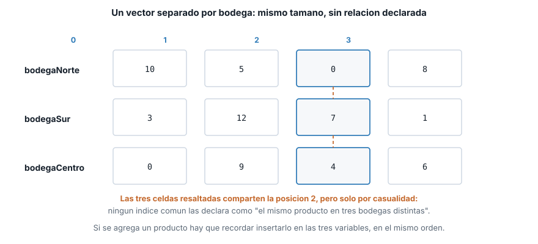
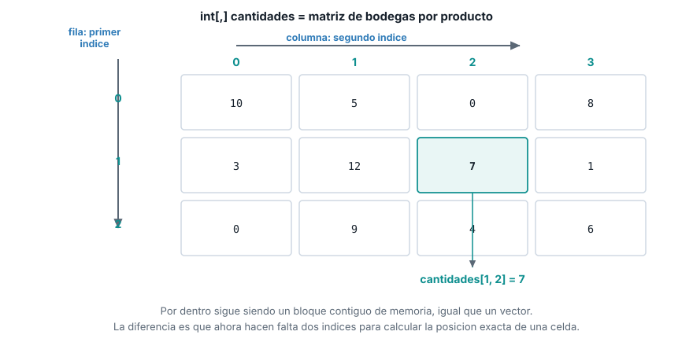
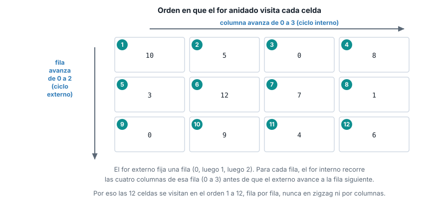

::: {.ficha}
|            |                                                          |
|------------|----------------------------------------------------------|
| Asignatura | Herramientas de Programación I (ET0047)                  |
| Programa   | Tecnología en Desarrollo de Software                     |
| Unidad     | Unidad 2. Creando aplicaciones informáticas utilizando arreglos y funciones |
| Saber      | Estructura de datos tipo vectores y matrices             |
:::

Esta guía se probó con el SDK de .NET **10.0.302**.

## El problema que resuelve una matriz

El tema anterior dejó al vector `precios` guardando los precios de varios productos, todos en la
misma bodega. El proyecto del semestre ahora necesita algo más: el sistema de gestión debe llevar
la **cantidad** de cada producto, pero repartida en **varias bodegas**. Con 4 productos y 3
bodegas, eso son 12 números que registrar, y cada uno tiene que quedar ligado a dos cosas a la vez:
a qué producto pertenece y en qué bodega está.

Con lo que ya sabes de vectores, la primera idea es declarar un vector por bodega:

```csharp
int[] bodegaNorte = { 10, 5, 0, 8 };
int[] bodegaSur = { 3, 12, 7, 1 };
int[] bodegaCentro = { 0, 9, 4, 6 };

Console.WriteLine($"Cantidad del producto 2 en Bodega Sur: {bodegaSur[2]}");
```

```text
Cantidad del producto 2 en Bodega Sur: 7
```

El programa funciona: `bodegaSur[2]` sí devuelve la cantidad del producto correcto. El problema no
es un error de ejecución, es un error de diseño que se paga después. Cada bodega vive en su propio
vector, del mismo tamaño por pura disciplina del programador, no porque el lenguaje lo exija.
Ningún vínculo declarado le dice a C# "la posición 2 de estos tres vectores es el mismo producto":
si mañana llega un cuarto producto, hay que recordar agregarlo en las **tres** variables, en el
mismo orden, y nada avisa si te olvidas de una. Tres vectores paralelos son tres oportunidades de
desincronizarlos.

::: {.diagrama}
{fig-alt="Tres vectores bodegaNorte, bodegaSur y bodegaCentro, cada uno con 4 posiciones, con la posicion 2 resaltada en los tres para mostrar que coinciden por casualidad y no por una relacion declarada en el codigo"}
:::

Lo que hace falta es una sola estructura que agrupe las 12 cantidades bajo un nombre, donde cada
valor se identifique con dos coordenadas a la vez: la bodega y el producto. Esa estructura es la
**matriz**.

## Qué es una matriz

Una matriz (`array` de dos dimensiones en C#) es una estructura de datos que guarda una colección
de elementos del mismo tipo organizados en **filas** y **columnas**, donde cada elemento se
identifica con **dos** índices: `matriz[fila, columna]`.

Todo lo que ya sabes de un vector se mantiene igual, solo que ahora con dos coordenadas en vez de
una:

- **Mismo tipo.** Una matriz de `int` solo guarda `int`, igual que un vector.
- **Bloque contiguo.** Por dentro, C# sigue guardando la matriz en un único bloque continuo de
  memoria. El tamaño se fija al crearla, igual que con un vector.
- **Acceso por índice, ahora doble.** El primer índice ubica la **fila** (en el proyecto, la
  bodega). El segundo ubica la **columna** (el producto). Los dos juntos, separados por una coma
  dentro de los mismos corchetes, ubican una celda exacta.

::: {.diagrama}
{fig-alt="Matriz de 3 filas por 4 columnas con los indices de fila 0 a 2 a la izquierda y los indices de columna 0 a 3 arriba, la celda fila 1 columna 2 resaltada con el valor 7 y la notacion cantidades entre corchetes 1 coma 2"}
:::

Este es el mismo bloque de memoria contiguo que viste con los vectores. La diferencia está en
cómo se calcula la posición: con un índice, C# calcula un desplazamiento; con dos, calcula el
desplazamiento combinando fila y columna. Esa cuenta la hace el lenguaje por ti; lo único que
necesitas manejar es la notación `[fila, columna]`.

::: {.callout-note}
Esta guía usa **matrices rectangulares** (`int[,]`), donde todas las filas tienen el mismo número
de columnas, como una cuadrícula real. C# también tiene arreglos "irregulares" (`int[][]`, un
vector de vectores donde cada fila puede tener un tamaño distinto), pero eso no forma parte del
saber de esta unidad y no lo vas a necesitar en el proyecto del semestre.
:::

## Declaración, creación e inicialización

La sintaxis de una matriz rectangular se distingue de la de un vector por una sola coma dentro de
los corchetes: `int[,]` en vez de `int[]`. Esa coma es la que le dice al compilador "esto tiene dos
dimensiones".

### Tamaño fijo, valores por defecto

```csharp
int[,] vacia = new int[3, 4];
Console.WriteLine($"Filas: {vacia.GetLength(0)}, columnas: {vacia.GetLength(1)}");
Console.WriteLine($"Valor por defecto en [0,0]: {vacia[0, 0]}");
```

```text
Filas: 3, columnas: 4
Valor por defecto en [0,0]: 0
```

`new int[3, 4]` reserva una cuadrícula de 3 filas por 4 columnas (12 celdas en total) y las llena
con el valor por defecto del tipo, igual que hacía `new int[5]` con un vector. Úsala cuando conoces
las dimensiones pero vas a llenar los valores después, por ejemplo leyéndolos por consola dentro de
un `for` anidado.

### Valores literales, fila por fila

```csharp
int[,] cantidades = {
    { 10, 5, 0, 8 },
    { 3, 12, 7, 1 },
    { 0, 9, 4, 6 }
};
Console.WriteLine($"Filas (bodegas): {cantidades.GetLength(0)}");
Console.WriteLine($"Columnas (productos): {cantidades.GetLength(1)}");
```

```text
Filas (bodegas): 3
Columnas (productos): 4
```

Cada par de llaves internas es una fila. El compilador exige que todas las filas traigan la misma
cantidad de valores: si una fila trae 3 números y otra trae 4, no compila, porque una matriz
rectangular no admite filas de tamaño distinto. Esta es la forma que vas a usar más seguido cuando
ya conoces los datos al escribir el programa, por la misma razón que el inicializador corto de
vectores: es la más legible y el tamaño se deduce solo.

### `GetLength` contra `Length`: el error que hay que anticipar

```csharp
Console.WriteLine($"cantidades.Length (total de celdas): {cantidades.Length}");
```

```text
cantidades.Length (total de celdas): 12
```

Esta es la trampa más común al pasar de vectores a matrices. En un vector, `.Length` es exactamente
lo que necesitas para recorrerlo: el número de posiciones. En una matriz, `.Length` no distingue
filas de columnas: devuelve el **total de celdas** (3 por 4 = 12), un número que no sirve para
controlar un `for` de filas ni uno de columnas por separado. Para eso existen `GetLength(0)` (número
de filas) y `GetLength(1)` (número de columnas), que ya usaste arriba. Si escribes
`for (int i = 0; i < cantidades.Length; i++)` esperando recorrer las filas, el ciclo va a dar 12
vueltas en vez de 3, y `cantidades[i, 0]` va a lanzar `IndexOutOfRangeException` en cuanto `i` pase
de 2.

## Recorrer una matriz

Recorrer una matriz completa exige dos ciclos `for` anidados: uno para las filas, otro para las
columnas dentro de cada fila. El ciclo **externo** controla la fila; el ciclo **interno**, anidado
dentro del externo, recorre todas las columnas de esa fila antes de que el externo avance a la
siguiente.

```csharp
for (int fila = 0; fila < cantidades.GetLength(0); fila++)
{
    for (int columna = 0; columna < cantidades.GetLength(1); columna++)
    {
        Console.Write($"{cantidades[fila, columna],4}");
    }
    Console.WriteLine();
}
```

```text
  10   5   0   8
   3  12   7   1
   0   9   4   6
```

::: {.diagrama}
{fig-alt="La misma matriz de 3 por 4, con cada celda numerada del 1 al 12 en el orden en que la visita un for anidado: las cuatro columnas de la fila 0, luego las cuatro de la fila 1, luego las cuatro de la fila 2"}
:::

`{cantidades[fila, columna],4}` es un formato de alineación de `string` interpolado: reserva 4
espacios para el número, para que la cuadrícula quede alineada en la consola sin importar si el
valor tiene uno o dos dígitos. `Console.WriteLine()` sin argumentos, al cerrar el ciclo interno,
solo imprime el salto de línea que separa una fila de la siguiente.

### Sumar una columna: el total de un producto en todas las bodegas

Cuando necesitas solo una columna, fijas ese índice y dejas que el `for` recorra únicamente las
filas:

```csharp
int columnaProducto = 2;
int totalProducto = 0;
for (int fila = 0; fila < cantidades.GetLength(0); fila++)
{
    totalProducto += cantidades[fila, columnaProducto];
}
Console.WriteLine($"Total del producto {columnaProducto} en todas las bodegas: {totalProducto}");
```

```text
Total del producto 2 en todas las bodegas: 11
```

Aquí `columnaProducto` queda fijo en 2 durante todo el ciclo: lo único que cambia es `fila`. Es la
misma idea de "una columna vertical de la cuadrícula", leída de arriba hacia abajo.

### Sumar el total general

Para sumar las 12 celdas hace falta volver a los dos ciclos anidados, acumulando en cada vuelta del
ciclo interno:

```csharp
int totalGeneral = 0;
for (int fila = 0; fila < cantidades.GetLength(0); fila++)
{
    for (int columna = 0; columna < cantidades.GetLength(1); columna++)
    {
        totalGeneral += cantidades[fila, columna];
    }
}
Console.WriteLine($"Total general del inventario: {totalGeneral}");
```

```text
Total general del inventario: 65
```

## Acceder y modificar una celda

Leer o escribir una celda concreta usa la misma notación de dos índices, a la izquierda o a la
derecha de un `=`, igual que ya viste con un solo índice en un vector:

```csharp
Console.WriteLine($"Cantidad original en [1,2]: {cantidades[1, 2]}");
cantidades[1, 2] = 20;
Console.WriteLine($"Cantidad actualizada en [1,2]: {cantidades[1, 2]}");
```

```text
Cantidad original en [1,2]: 7
Cantidad actualizada en [1,2]: 20
```

`cantidades[1, 2] = 20` reemplaza, no suma: la celda queda en 20, no en 7 + 20. Es el mismo
comportamiento que `precios[2] = 7990.00` en el tema anterior, con un índice más.

## Lo que sigue: funciones

El código de esta guía ya se repitió varias veces: el `for` anidado para recorrer la matriz
completa aparece igual en la sección de recorrido y en la del total general, y volvería a
aparecer si el proyecto necesitara imprimir el inventario en otro punto del programa. El siguiente
tema enseña a empacar ese bloque de código en una **función**, para escribirlo una sola vez y
llamarlo cada vez que haga falta, con los datos de entrada y el resultado que necesite cada
llamada.

## Lista de verificación

::: {.checklist}
- [ ] Explicas por qué varios vectores paralelos no garantizan que la misma posición represente el
  mismo producto en todos.
- [ ] Defines una matriz como una colección del mismo tipo organizada en filas y columnas, con
  acceso por dos índices.
- [ ] Declaras una matriz con tamaño fijo y con valores literales por filas.
- [ ] Distingues `GetLength(0)` y `GetLength(1)` de `.Length`, y sabes qué devuelve cada uno.
- [ ] Recorres una matriz completa con dos `for` anidados, entendiendo cuál ciclo es la fila y
  cuál la columna.
- [ ] Lees y modificas una celda por sus dos índices sin confundir fila con columna.
:::

## Recursos

- Arreglos multidimensionales: [learn.microsoft.com/dotnet/csharp/programming-guide/arrays/multidimensional-arrays](https://learn.microsoft.com/es-es/dotnet/csharp/programming-guide/arrays/multidimensional-arrays)
- `Array.GetLength`: [learn.microsoft.com/dotnet/api/system.array.getlength](https://learn.microsoft.com/es-es/dotnet/api/system.array.getlength)
- Formato de alineación en cadenas interpoladas: [learn.microsoft.com/dotnet/csharp/language-reference/tokens/interpolated](https://learn.microsoft.com/es-es/dotnet/csharp/language-reference/tokens/interpolated#alignment-component)

::: {.pie-doc}
Herramientas de Programación I (ET0047). Institución Universitaria Pascual Bravo.
Facultad de Ingeniería. Semestre 2026-02.

**Transparencia.** La redacción de esta guía contó con el apoyo de inteligencia artificial,
usando el modelo Claude Sonnet 5 de Anthropic. Todo el contenido fue revisado y validado. Las
salidas de terminal son reales, obtenidas ejecutando el código exacto de esta guía contra el SDK
de .NET 10.0.302.
:::
