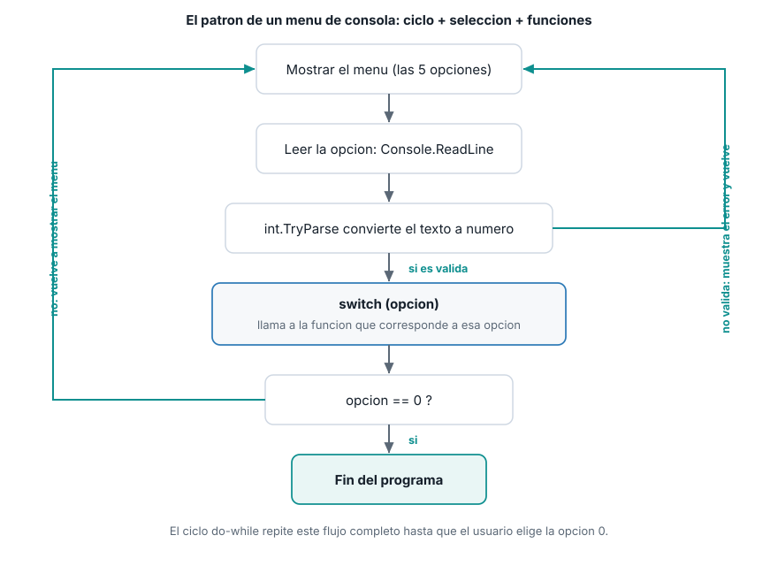
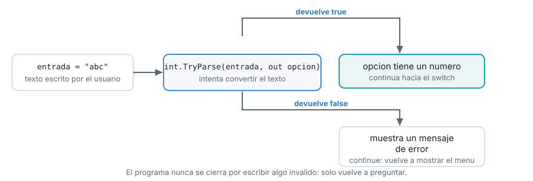
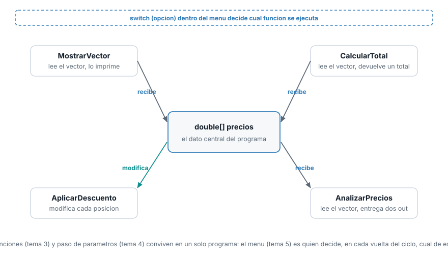

::: {.ficha}
|            |                                                          |
|------------|----------------------------------------------------------|
| Asignatura | Herramientas de Programación I (ET0047)                  |
| Programa   | Tecnología en Desarrollo de Software                     |
| Unidad     | Unidad 2. Creando aplicaciones informáticas utilizando arreglos y funciones |
| Saber      | Creación de menús con aplicación de funciones            |
:::

Esta guía se probó con el SDK de .NET **10.0.302**. Es el último tema de la unidad: reúne
vectores, funciones y paso de parámetros en un solo programa.

## El problema que resuelve un menú

Cada programa de las guías anteriores hace **una** cosa y termina: calcula un total, aplica un
descuento, analiza un vector. Corres el programa, ves el resultado, y se cierra. El sistema de
gestión real no funciona así: el usuario necesita mostrar los precios, calcular el total, aplicar
un descuento y analizar los datos, todo en la misma ejecución, eligiendo qué hacer cada vez, hasta
que decide terminar.

Un programa lineal, de arriba a abajo, no alcanza para eso. Si escribes las cuatro operaciones una
después de otra, las cuatro se ejecutan siempre, en ese orden fijo, una sola vez. Lo que hace falta
es una estructura que **pregunte, repita y elija**: un menú.

## El patrón: ciclo + selección + funciones

Un menú de consola combina tres cosas que ya conoces, cada una haciendo su parte:

- Un **ciclo** que se repite mientras el usuario no elija salir.
- Una **selección** (`switch`) que decide qué hacer según la opción elegida.
- **Funciones**, cada una encargada de una operación concreta, que el `switch` invoca.

::: {.diagrama}
{fig-alt="Diagrama de flujo del patron de menu: mostrar menu, leer opcion, TryParse, switch que llama a una funcion, verificar si la opcion es 0, y volver al inicio si no lo es"}
:::

**¿Por qué `do-while` y no `while`?** Un menú tiene que mostrarse **al menos una vez** antes de que
tenga sentido preguntar si el usuario quiere seguir. Con `while`, la condición se revisa **antes**
del primer paso por el ciclo, así que necesitarías mostrar el menú una vez afuera del ciclo y otra
vez adentro, duplicando código. Con `do-while`, el cuerpo del ciclo se ejecuta primero y la
condición se revisa al final, exactamente lo que un menú necesita: muéstralo, atiende una opción, y
solo entonces pregunta si hay que repetir.

## Construyendo el menú paso a paso

### 1. El vector y las funciones que ya tienes

El programa parte del mismo vector de precios de todo el semestre, y de las funciones que ya
construiste en los temas 3 y 4: `MostrarVector`, `CalcularTotal`, `AplicarDescuento` y
`AnalizarPrecios`. Ninguna cambia aquí; el menú solo las llama.

```csharp
double[] precios = { 4599.90, 12999.00, 8500.50, 2300.00, 15750.75 };
```

### 2. El esqueleto del ciclo

El cuerpo del `do-while` muestra las opciones y lee lo que el usuario escribió. Hasta aquí, todavía
no hace nada con la opción: solo la pide.

```csharp
bool continuarMenu = true;
do
{
    Console.WriteLine();
    Console.WriteLine("=== Sistema de gestion: menu ===");
    Console.WriteLine("1. Mostrar precios");
    Console.WriteLine("2. Calcular total");
    Console.WriteLine("3. Aplicar descuento general");
    Console.WriteLine("4. Analizar precios (total y maximo)");
    Console.WriteLine("0. Salir");
    Console.Write("Elige una opcion: ");
    string? entrada = Console.ReadLine();

    // aqui falta leer "entrada" como numero y decidir que hacer

} while (continuarMenu);
```

`continuarMenu` es la variable que controla el ciclo. Empieza en `true`, y solo la opción de salir
la va a cambiar a `false` más adelante: por eso el ciclo se repite indefinidamente hasta que el
usuario elige esa opción, y por eso la variable no puede llamarse igual que la opción numérica que
el usuario escribe (eso sería mezclar "qué escribió" con "si hay que seguir", dos preguntas
distintas).

### 3. Validar la opción con `TryParse`

`Console.ReadLine` siempre devuelve texto (Semana 2), y el usuario puede escribir cualquier cosa,
no solo un número. `int.TryParse` convierte el texto y devuelve `true` o `false` según si lo logró,
sin lanzar una excepción si falla.

::: {.diagrama}
{fig-alt="Diagrama de la validacion con TryParse: el texto entrada pasa por TryParse, si devuelve false se muestra un mensaje de error y se continua el ciclo, si devuelve true la opcion sigue hacia el switch"}
:::

```csharp
if (!int.TryParse(entrada, out int opcion))
{
    Console.WriteLine("Esa no es una opcion valida. Escribe un numero del menu.");
    continue;
}
```

`continue` salta directo a la condición del `do-while` sin ejecutar el resto del cuerpo: el
programa vuelve a mostrar el menú, sin cerrarse por una entrada inválida.

**Una trampa real que vale la pena señalar.** La primera versión de este programa comparaba
`opcion != 0` en la condición del `do-while`, en vez de usar una variable `continuarMenu` aparte.
Con eso, escribir cualquier texto inválido (donde `TryParse` deja `opcion` en `0` por defecto)
cerraba el menú de inmediato, como si el usuario hubiera elegido salir, sin haber elegido nada.
Por eso esta guía usa una variable booleana independiente para controlar el ciclo: la decisión de
seguir o parar no puede depender del mismo valor que ya se usa para saber si el texto era válido.

### 4. El `switch` que llama a las funciones

Con la opción ya convertida a número, el `switch` decide cuál función ejecutar. Cada `case` es una
operación del sistema de gestión, ya construida en temas anteriores:

```csharp
switch (opcion)
{
    case 1:
        MostrarVector(precios, "Precios actuales:");
        break;
    case 2:
        {
            double total = CalcularTotal(precios);
            Console.WriteLine($"Total: {total:F2}");
            break;
        }
    case 3:
        {
            Console.Write("Porcentaje de descuento, como numero entero (por ejemplo 10 para 10%): ");
            if (!int.TryParse(Console.ReadLine(), out int porcentajeEntero))
            {
                Console.WriteLine("Ese no es un numero valido. Vuelve a intentar desde el menu.");
                break;
            }
            double porcentaje = porcentajeEntero / 100.0;
            AplicarDescuento(precios, porcentaje);
            Console.WriteLine("Descuento aplicado.");
            break;
        }
    case 4:
        {
            AnalizarPrecios(precios, out double totalAnalizado, out double maximo);
            Console.WriteLine($"Total: {totalAnalizado:F2}");
            Console.WriteLine($"Maximo: {maximo:F2}");
            break;
        }
    case 0:
        Console.WriteLine("Hasta pronto.");
        continuarMenu = false;
        break;
    default:
        Console.WriteLine("Esa opcion no existe. Elige una del menu.");
        break;
}
```

Fíjate en el `case 3`: pide un segundo dato (el porcentaje) **dentro** del mismo `case`, con su
propia validación. Nada impide que un `case` lea más datos si la operación los necesita; lo único
que cambia es que ese `case` hace más de un paso antes de su `break`.

**Por qué el porcentaje se pide como número entero.** Al verificar este ejemplo apareció un error
real: pedirlo como `double` (por ejemplo escribiendo `0.10`) y convertirlo con `double.Parse` dio
un resultado absurdo, porque la configuración regional de la consola interpreta el punto decimal
de forma distinta a como lo escribimos en el código fuente. Pedirlo como entero (`10` en vez de
`0.10`) y dividirlo entre `100.0` dentro del programa evita el problema por completo, y de paso
reutiliza `int.TryParse`, que ya conoces.

Los bloques `{ }` alrededor de los `case` que declaran una variable nueva (`total`,
`porcentajeEntero`, `totalAnalizado`) no son decorativos: delimitan en qué parte del `switch` esa
variable existe, para que dos `case` distintos puedan declarar variables con nombres parecidos sin
chocar entre sí.

## Cómo conviven las piezas de toda la unidad

::: {.diagrama}
{fig-alt="Diagrama de integracion: el vector precios en el centro, con flechas hacia y desde MostrarVector, CalcularTotal, AplicarDescuento y AnalizarPrecios, todo dentro de un recuadro punteado que representa el switch del menu"}
:::

El vector es el único dato que vive fuera del ciclo del menú: se declara una vez, antes del
`do-while`, y cada función lo recibe como parámetro cuando el `switch` la llama. `MostrarVector`,
`CalcularTotal` y `AnalizarPrecios` solo lo **leen**. `AplicarDescuento` lo **modifica**: por eso,
después de elegir la opción 3, si vuelves a elegir la opción 1 o la 2, vas a ver los precios ya
descontados, no los originales. El vector conserva sus cambios entre una vuelta del ciclo y la
siguiente, porque sigue siendo la misma variable durante toda la ejecución del programa.

## El programa completo

Con las cuatro piezas ya explicadas, así queda el programa entero:

```csharp
double[] precios = { 4599.90, 12999.00, 8500.50, 2300.00, 15750.75 };

bool continuarMenu = true;
do
{
    Console.WriteLine();
    Console.WriteLine("=== Sistema de gestion: menu ===");
    Console.WriteLine("1. Mostrar precios");
    Console.WriteLine("2. Calcular total");
    Console.WriteLine("3. Aplicar descuento general");
    Console.WriteLine("4. Analizar precios (total y maximo)");
    Console.WriteLine("0. Salir");
    Console.Write("Elige una opcion: ");
    string? entrada = Console.ReadLine();

    if (!int.TryParse(entrada, out int opcion))
    {
        Console.WriteLine("Esa no es una opcion valida. Escribe un numero del menu.");
        continue;
    }

    switch (opcion)
    {
        case 1:
            MostrarVector(precios, "Precios actuales:");
            break;
        case 2:
            {
                double total = CalcularTotal(precios);
                Console.WriteLine($"Total: {total:F2}");
                break;
            }
        case 3:
            {
                Console.Write("Porcentaje de descuento, como numero entero (por ejemplo 10 para 10%): ");
                if (!int.TryParse(Console.ReadLine(), out int porcentajeEntero))
                {
                    Console.WriteLine("Ese no es un numero valido. Vuelve a intentar desde el menu.");
                    break;
                }
                double porcentaje = porcentajeEntero / 100.0;
                AplicarDescuento(precios, porcentaje);
                Console.WriteLine("Descuento aplicado.");
                break;
            }
        case 4:
            {
                AnalizarPrecios(precios, out double totalAnalizado, out double maximo);
                Console.WriteLine($"Total: {totalAnalizado:F2}");
                Console.WriteLine($"Maximo: {maximo:F2}");
                break;
            }
        case 0:
            Console.WriteLine("Hasta pronto.");
            continuarMenu = false;
            break;
        default:
            Console.WriteLine("Esa opcion no existe. Elige una del menu.");
            break;
    }
} while (continuarMenu);

static void MostrarVector(double[] vector, string etiqueta)
{
    Console.WriteLine(etiqueta);
    foreach (double valor in vector)
    {
        Console.WriteLine($"  {valor}");
    }
}

static double CalcularTotal(double[] precios)
{
    double total = 0;
    for (int i = 0; i < precios.Length; i++)
    {
        total += precios[i];
    }
    return total;
}

static void AplicarDescuento(double[] precios, double porcentaje)
{
    for (int i = 0; i < precios.Length; i++)
    {
        precios[i] = precios[i] * (1 - porcentaje);
    }
}

static void AnalizarPrecios(double[] precios, out double total, out double maximo)
{
    total = 0;
    maximo = precios[0];
    for (int i = 0; i < precios.Length; i++)
    {
        total += precios[i];
        if (precios[i] > maximo)
        {
            maximo = precios[i];
        }
    }
}
```

Una sesión real, eligiendo primero una opción inválida, luego las cuatro operaciones en orden, y
por último saliendo:

```text
=== Sistema de gestion: menu ===
1. Mostrar precios
2. Calcular total
3. Aplicar descuento general
4. Analizar precios (total y maximo)
0. Salir
Elige una opcion: abc
Esa no es una opcion valida. Escribe un numero del menu.

=== Sistema de gestion: menu ===
1. Mostrar precios
2. Calcular total
3. Aplicar descuento general
4. Analizar precios (total y maximo)
0. Salir
Elige una opcion: 1
Precios actuales:
  4599,9
  12999
  8500,5
  2300
  15750,75

=== Sistema de gestion: menu ===
1. Mostrar precios
2. Calcular total
3. Aplicar descuento general
4. Analizar precios (total y maximo)
0. Salir
Elige una opcion: 2
Total: 44150,15

=== Sistema de gestion: menu ===
1. Mostrar precios
2. Calcular total
3. Aplicar descuento general
4. Analizar precios (total y maximo)
0. Salir
Elige una opcion: 3
Porcentaje de descuento, como numero entero (por ejemplo 10 para 10%): 10
Descuento aplicado.

=== Sistema de gestion: menu ===
1. Mostrar precios
2. Calcular total
3. Aplicar descuento general
4. Analizar precios (total y maximo)
0. Salir
Elige una opcion: 4
Total: 39735,14
Maximo: 14175,68

=== Sistema de gestion: menu ===
1. Mostrar precios
2. Calcular total
3. Aplicar descuento general
4. Analizar precios (total y maximo)
0. Salir
Elige una opcion: 0
Hasta pronto.
```

El total de la opción 2 (`44150,15`) coincide con el que calculaste en el tema de funciones antes
de cualquier descuento. Después de aplicar el 10% en la opción 3, el total de la opción 4
(`39735,14`) coincide con el `CalcularTotalConDescuento` del mismo tema: son la misma operación,
llegando al mismo resultado por dos caminos distintos, lo que confirma que el programa quedó bien
armado.

## Lo que deja lista esta unidad

Con los cinco temas de esta unidad, el sistema de gestión pasó de manejar un solo registro con
variables sueltas (Semana 2) a guardar varios datos organizados en un vector, calcular sobre ellos
con matrices cuando hace falta cruzar dos dimensiones, repartir la lógica en funciones con entrada
y salida propias, entender con precisión cuándo esas funciones pueden modificar lo que reciben, y
ofrecerle al usuario todo eso a través de un menú que se repite hasta que decide salir. La Unidad 3
retoma este mismo programa y lo reorganiza alrededor de clases y objetos, en vez de un vector y un
grupo de funciones sueltas.

## Lista de verificación

::: {.checklist}
- [ ] Explicas por qué un programa lineal no alcanza para ofrecer varias operaciones repetibles.
- [ ] Justificas por qué `do-while` encaja mejor que `while` para mostrar un menú.
- [ ] Usas `int.TryParse` para validar la opción leída, sin cerrar el programa ante una entrada
  inválida.
- [ ] Escribes un `switch` que llama a una función distinta según la opción elegida.
- [ ] Explicas por qué una opción puede leer datos adicionales dentro de su propio `case`.
- [ ] Describes cómo el vector conserva sus cambios entre una vuelta del ciclo y la siguiente.
:::

## Recursos

- Sentencia `switch`: [learn.microsoft.com/dotnet/csharp/language-reference/statements/selection-statements](https://learn.microsoft.com/es-es/dotnet/csharp/language-reference/statements/selection-statements#the-switch-statement)
- Sentencia `do`: [learn.microsoft.com/dotnet/csharp/language-reference/statements/iteration-statements](https://learn.microsoft.com/es-es/dotnet/csharp/language-reference/statements/iteration-statements#the-do-statement)
- `int.TryParse`: [learn.microsoft.com/dotnet/api/system.int32.tryparse](https://learn.microsoft.com/es-es/dotnet/api/system.int32.tryparse)

::: {.pie-doc}
Herramientas de Programación I (ET0047). Institución Universitaria Pascual Bravo.
Facultad de Ingeniería. Semestre 2026-02.

**Transparencia.** La redacción de esta guía contó con el apoyo de inteligencia artificial,
usando el modelo Claude Sonnet 5 de Anthropic. Todo el contenido fue revisado y validado. Las
salidas de terminal son reales, obtenidas ejecutando el código exacto de esta guía contra el SDK
de .NET 10.0.302, con la entrada del usuario simulada por redireccion de consola.
:::
