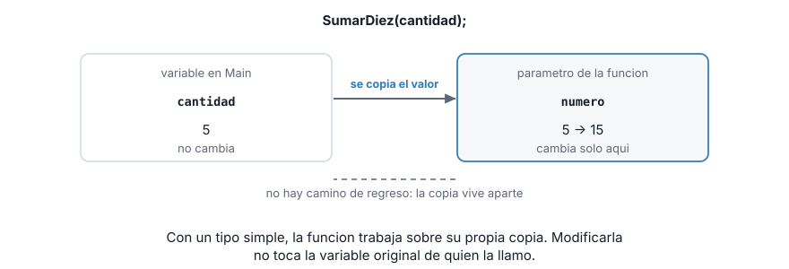
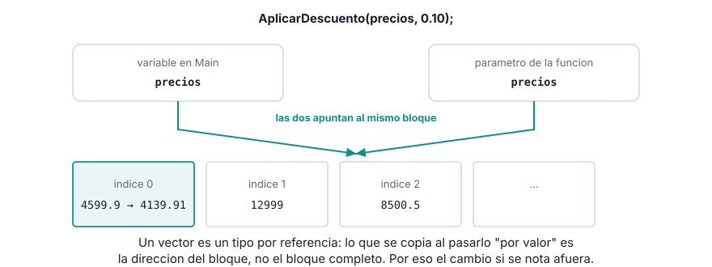
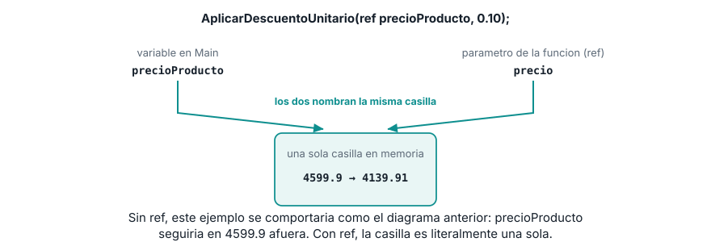
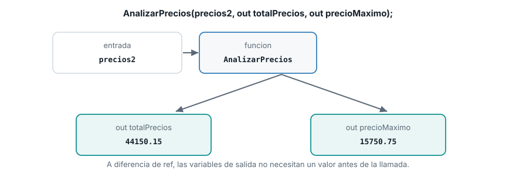

::: {.ficha}
|            |                                                          |
|------------|----------------------------------------------------------|
| Asignatura | Herramientas de Programación I (ET0047)                  |
| Programa   | Tecnología en Desarrollo de Software                     |
| Unidad     | Unidad 2. Creando aplicaciones informáticas utilizando arreglos y funciones |
| Saber      | Paso de parámetros a funciones por valor y por referencia |
:::

Esta guía se probó con el SDK de .NET **10.0.302**.

## La pregunta que dejó abierta el tema anterior

El tema de funciones cerró con una pregunta sin responder: si una función recibe un vector como
parámetro y lo modifica adentro, ¿el cambio se queda encerrado ahí, o se nota también afuera, en el
`Main` que la llamó? La respuesta no es la misma para un tipo simple que para un vector, y esa
diferencia es justo lo que enseña este tema.

Empecemos por el caso más simple: un `int`.

```csharp
static void SumarDiez(int numero)
{
    numero += 10;
    Console.WriteLine($"  Adentro de la funcion: {numero}");
}
```

```csharp
int cantidad = 5;
Console.WriteLine($"Antes de llamar: {cantidad}");
SumarDiez(cantidad);
Console.WriteLine($"Despues de llamar: {cantidad}");
```

```text
Antes de llamar: 5
  Adentro de la funcion: 15
Despues de llamar: 5
```

`cantidad` sigue en 5 después de llamar la función, aunque `numero` haya llegado a 15 adentro. La
función nunca tocó `cantidad`: trabajó sobre otra cosa.

## Por valor con un tipo simple: la función recibe una copia

Con un tipo simple (`int`, `double`, `bool`, `char`...), pasar un argumento "por valor" significa
que C# copia el valor y se lo entrega al parámetro. El parámetro es una variable nueva, propia de
la función, que empieza con el mismo valor que el argumento pero no tiene ninguna conexión con él
después de esa copia inicial.

::: {.diagrama}
{fig-alt="Diagrama de dos casillas de memoria separadas: cantidad en Main con valor 5 que no cambia, y numero en la funcion que pasa de 5 a 15, sin conexion de regreso entre las dos"}
:::

Esto es consistente con todo lo que ya sabes de variables desde la Semana 2: asignar un valor
nuevo a `numero` es una asignación normal, como cualquier otra, y una asignación nunca "viaja hacia
atrás" para modificar de dónde vino el valor original.

## La trampa con arreglos

Ahora el mismo experimento, pero con un vector. Antes de leer la salida, para y piensa: ¿un vector
también se pasa "por valor"? La respuesta técnica es sí. Pero mira lo que pasa:

```csharp
static void AplicarDescuento(double[] precios, double porcentaje)
{
    for (int i = 0; i < precios.Length; i++)
    {
        precios[i] = precios[i] * (1 - porcentaje);
    }
}
```

```csharp
double[] precios = { 4599.90, 12999.00, 8500.50, 2300.00, 15750.75 };
Console.WriteLine($"Antes: {precios[0]}");
AplicarDescuento(precios, 0.10);
Console.WriteLine($"Despues: {precios[0]}");
```

```text
Antes: 4599,9
Despues: 4139,91
```

`precios[0]` cambió afuera de la función, aunque el vector también se pasó "por valor" como
`numero` en el ejemplo anterior. No es una excepción a la regla: es la misma regla, aplicada a un
tipo distinto.

Un vector es un **tipo por referencia**. La variable `precios` nunca guarda el vector completo: guarda
la dirección de memoria donde vive el bloque de casillas (la misma idea de la anatomía de un vector
que ya conoces, del tema 1). Cuando pasas `precios` "por valor", lo que se copia es esa dirección,
no el bloque completo. El parámetro de la función recibe su propia copia de la dirección, pero las
dos direcciones apuntan al mismo bloque de memoria. Escribir en una posición desde adentro de la
función escribe en el único bloque que existe.

::: {.diagrama}
{fig-alt="Diagrama donde la variable precios en Main y el parametro precios en la funcion apuntan con flechas al mismo bloque de memoria del vector, cuya posicion 0 cambia de 4599.9 a 4139.91 y el cambio es visible desde ambas flechas"}
:::

Compara los dos diagramas: en el primero, `cantidad` y `numero` son dos casillas separadas sin
ninguna conexión. En este, `precios` (en Main) y `precios` (en la función) son dos nombres para el
mismo bloque. La regla "se pasa una copia" nunca cambió; lo que cambió es **qué** se copia: un
`int` copia su valor completo, un vector copia solo la dirección de un bloque que ambos comparten.

## La modificadora `ref`

¿Y si sí necesitas que una función modifique una variable de tipo simple, y que el cambio se note
afuera, igual que pasó con el vector? Para eso existe `ref`. Se escribe en dos lugares: en el
parámetro de la función **y** en el argumento al llamarla. Olvidar uno de los dos lados es un error
de compilación, no un error silencioso.

```csharp
static void AplicarDescuentoUnitario(ref double precio, double porcentaje)
{
    precio = precio * (1 - porcentaje);
}
```

```csharp
double precioProducto = 4599.90;
Console.WriteLine($"Antes: {precioProducto}");
AplicarDescuentoUnitario(ref precioProducto, 0.10);
Console.WriteLine($"Despues: {precioProducto}");
```

```text
Antes: 4599,9
Despues: 4139,91
```

Esta vez `precioProducto` sí cambió afuera, aunque es un `double`, el mismo tipo simple del primer
ejemplo de esta guía. La diferencia no es el tipo de dato: es la palabra `ref`.

::: {.diagrama}
{fig-alt="Diagrama de una sola casilla de memoria etiquetada como precioProducto en Main y precio en la funcion al mismo tiempo, con el valor cambiando de 4599.9 a 4139.91"}
:::

`ref` elimina la copia: en vez de crear una casilla nueva para el parámetro, hace que el parámetro
sea otro nombre para la misma casilla del argumento. Por eso el primer ejemplo de esta guía
(`SumarDiez`, sin `ref`) no modificó `cantidad`, y este sí modifica `precioProducto`: la diferencia
entera está en esa palabra.

## La modificadora `out`

`ref` sirve cuando la función necesita **leer y modificar** un valor que ya existe. `out` sirve
para el caso distinto en el que la función necesita **entregar un resultado nuevo**, y ese
resultado no tenía ningún valor antes de la llamada. La diferencia clave: con `ref`, el argumento
debe tener un valor asignado antes de llamar la función (la función puede leerlo). Con `out`, no
hace falta: la función tiene la obligación de asignarle uno antes de terminar.

`out` resuelve además un problema que `return` no puede: una función solo devuelve **un** valor con
`return`, pero puede tener varios parámetros `out` para entregar varios resultados en una sola
llamada.

```csharp
static void AnalizarPrecios(double[] precios, out double total, out double maximo)
{
    total = 0;
    maximo = precios[0];
    for (int i = 0; i < precios.Length; i++)
    {
        total += precios[i];
        if (precios[i] > maximo)
        {
            maximo = precios[i];
        }
    }
}
```

```csharp
double[] precios2 = { 4599.90, 12999.00, 8500.50, 2300.00, 15750.75 };
AnalizarPrecios(precios2, out double totalPrecios, out double precioMaximo);
Console.WriteLine($"Total: {totalPrecios:F2}");
Console.WriteLine($"Maximo: {precioMaximo}");
```

```text
Total: 44150,15
Maximo: 15750,75
```

`totalPrecios` y `precioMaximo` se declaran directamente dentro de la llamada (`out double
totalPrecios`), sin necesidad de una línea aparte antes: no tenían valor todavía, y no lo
necesitaban, porque `AnalizarPrecios` se los asigna a los dos antes de terminar.

::: {.diagrama}
{fig-alt="Diagrama de la funcion AnalizarPrecios recibiendo precios2 como entrada y produciendo dos salidas marcadas como out: totalPrecios con valor 44150.15 y precioMaximo con valor 15750.75"}
:::

## Resumen: cuándo el cambio se nota afuera

| Caso | ¿El cambio adentro de la función se nota afuera? |
|---|---|
| Tipo simple, sin modificador | No. La función recibe una copia del valor. |
| Tipo simple, con `ref` | Sí. La función recibe el mismo dato, no una copia. |
| Tipo simple, con `out` | Sí, pero la variable no necesita valor antes de llamar la función. |
| Vector (u otro arreglo), sin modificador | Sí. Un arreglo es un tipo por referencia: se copia la dirección, no el bloque. |
| Vector, con `ref` | Sí, y además la función puede reasignar el vector completo a uno nuevo, algo que sin `ref` no puede hacer. |

La fila que más se presta a confusión es la cuarta: parece "por valor" (no lleva `ref` ni `out`) y
sin embargo el cambio sí se nota afuera. No es una excepción: es que lo que viaja por valor en un
arreglo es su dirección, no su contenido.

## Lo que sigue: menús con funciones

Ya tienes las tres piezas del proyecto del semestre: vectores y matrices para guardar los datos,
funciones para organizar la lógica, y ahora sabes exactamente cuándo una función puede modificar lo
que recibe y cuándo no. El siguiente tema arma todo esto dentro de un menú de consola: el
estudiante elige una opción, el programa llama a la función correspondiente, y el ciclo vuelve a
mostrar el menú hasta que decida salir.

## Lista de verificación

::: {.checklist}
- [ ] Explicas por qué modificar un parámetro de tipo simple, sin `ref`, no cambia la variable
  original.
- [ ] Explicas por qué modificar una posición de un vector recibido como parámetro sí se nota
  afuera, aunque no lleve `ref`.
- [ ] Distingues qué se copia en cada caso: el valor completo en un tipo simple, la dirección del
  bloque en un vector.
- [ ] Usas `ref` en el parámetro y en el argumento, en los dos lados, para modificar un tipo simple
  desde una función.
- [ ] Usas `out` para que una función entregue más de un resultado en una sola llamada.
- [ ] Sabes cuándo usar `ref` (la variable ya tiene un valor que la función va a leer y modificar) y
  cuándo usar `out` (la variable es un resultado nuevo que la función va a producir).
:::

## Recursos

- Paso de parámetros: [learn.microsoft.com/dotnet/csharp/language-reference/keywords/method-parameters](https://learn.microsoft.com/es-es/dotnet/csharp/language-reference/keywords/method-parameters)
- Palabra clave `ref`: [learn.microsoft.com/dotnet/csharp/language-reference/keywords/ref](https://learn.microsoft.com/es-es/dotnet/csharp/language-reference/keywords/ref)
- Palabra clave `out`: [learn.microsoft.com/dotnet/csharp/language-reference/keywords/out-parameter-modifier](https://learn.microsoft.com/es-es/dotnet/csharp/language-reference/keywords/out-parameter-modifier)

::: {.pie-doc}
Herramientas de Programación I (ET0047). Institución Universitaria Pascual Bravo.
Facultad de Ingeniería. Semestre 2026-02.

**Transparencia.** La redacción de esta guía contó con el apoyo de inteligencia artificial,
usando el modelo Claude Sonnet 5 de Anthropic. Todo el contenido fue revisado y validado. Las
salidas de terminal son reales, obtenidas ejecutando el código exacto de esta guía contra el SDK
de .NET 10.0.302.
:::
