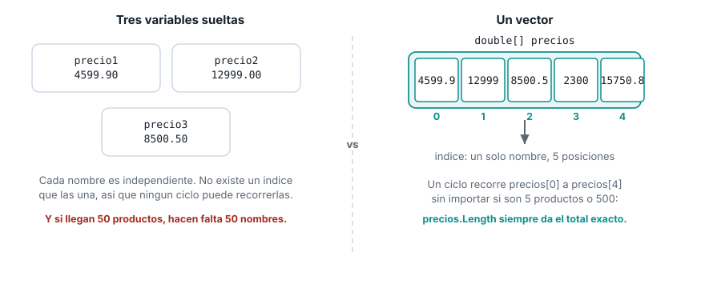
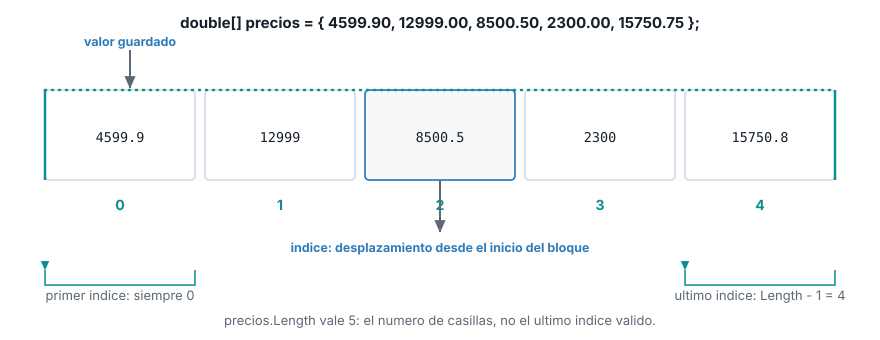

::: {.ficha}
|            |                                                          |
|------------|----------------------------------------------------------|
| Asignatura | Herramientas de Programación I (ET0047)                  |
| Programa   | Tecnología en Desarrollo de Software                     |
| Unidad     | Unidad 2. Creando aplicaciones informáticas utilizando arreglos y funciones |
| Saber      | Estructura de datos tipo vectores y matrices             |
:::

Esta guía se probó con el SDK de .NET **10.0.302**.

## El problema que resuelve un arreglo

### Las notas de un grupo de estudiantes

Te piden un programa que guarde las notas de un grupo de **5 estudiantes**, calcule el promedio
del grupo y muestre cuáles estudiantes quedaron por encima de ese promedio.

Antes de seguir leyendo, resuélvelo con lo que ya sabes: variables, tipos de datos, entrada y
salida por consola, condicionales y ciclos (Semanas 2 a 5). ¿Cómo lo harías?

La respuesta más probable, con lo visto hasta ahora, es declarar una variable por estudiante:

```csharp
double nota1 = 4.2;
double nota2 = 3.8;
double nota3 = 4.7;
double nota4 = 2.9;
double nota5 = 3.5;

double promedio = (nota1 + nota2 + nota3 + nota4 + nota5) / 5;
Console.WriteLine($"Promedio del grupo: {promedio:F2}");

if (nota1 > promedio) Console.WriteLine("Estudiante 1 esta por encima del promedio");
if (nota2 > promedio) Console.WriteLine("Estudiante 2 esta por encima del promedio");
if (nota3 > promedio) Console.WriteLine("Estudiante 3 esta por encima del promedio");
if (nota4 > promedio) Console.WriteLine("Estudiante 4 esta por encima del promedio");
if (nota5 > promedio) Console.WriteLine("Estudiante 5 esta por encima del promedio");
```

```text
Promedio del grupo: 3,82
Estudiante 1 esta por encima del promedio
Estudiante 3 esta por encima del promedio
```

Funciona, con 5 estudiantes. Pero míralo con cuidado: la suma del promedio repite cinco nombres de
variable, y la comparación contra el promedio repite la misma línea de `if` cinco veces, cambiando
solo el número. Nada en el programa dice "estas cinco variables son el mismo tipo de dato,
recórrelas juntas": son cinco nombres sueltos, sin ninguna relación entre sí para el compilador.

Ahora la pregunta que rompe esta idea: **¿y si el grupo fuera de 100 estudiantes?** Habría que
escribir 100 variables, 100 sumandos en el promedio y 100 condicionales, uno por uno, a mano.
Ningún `for` puede recorrerlas, porque un ciclo necesita un índice para saber a cuál variable ir a
buscar en cada vuelta, y `nota1`, `nota2`, ..., `nota100` no comparten ningún índice. El programa
crece exactamente al mismo ritmo que el problema, en vez de crecer una sola vez y quedarse fijo.

### El mismo problema en el proyecto del semestre

Esto no es exclusivo de las notas. En la Semana 2 registraste **un** producto: nombre, precio y
cantidad, cada uno en su propia variable. Ese enfoque funciona mientras el sistema de gestión
maneje un producto a la vez. El proyecto del semestre ya no se conforma con eso: necesita guardar
el precio de **varios** productos para poder sumarlos, ordenarlos o buscarlos. La misma idea de
variables sueltas aparece otra vez, y falla por la misma razón:

```csharp
double precio1 = 4599.90;
double precio2 = 12999.00;
double precio3 = 8500.50;

double total = precio1 + precio2 + precio3;
Console.WriteLine($"Total con variables sueltas: {total}");
```

```text
Total con variables sueltas: 26099,4
```

El programa funciona, pero rompe apenas el inventario deja de ser fijo. Si mañana llegan 4
productos en vez de 3, hay que escribir `precio4` y reescribir la suma. Si llegan 50, hacen falta
50 nombres de variable, y ningún `for` puede recorrerlos: un ciclo necesita un índice para saber a
cuál variable ir a buscar en cada vuelta, y `precio1`, `precio2` y `precio3` no comparten ningún
índice entre sí. Son tres nombres sueltos que el compilador trata como si no tuvieran ninguna
relación.

::: {.diagrama}
{fig-alt="Comparacion entre declarar variables precio1, precio2 y precio3 sueltas, y declarar un vector precios que agrupa los mismos valores en un solo bloque recorrible con un indice"}
:::

Lo que falta es una estructura que agrupe varios valores del mismo tipo bajo **un solo nombre**, y
que numere cada valor para poder ir a buscarlo. Esa estructura es el **vector**.

## Qué es un vector

Un vector (`array` de una dimensión en C#) es una estructura de datos que guarda una colección de
elementos del mismo tipo en un bloque contiguo de memoria, donde cada elemento se identifica por
un número entero llamado **índice**.

Tres ideas quedan fijas en esa definición:

- **Mismo tipo.** Un vector de `double` solo guarda `double`. No mezcla tipos como sí puede hacerlo
  una lista genérica que verás más adelante en el programa.
- **Bloque contiguo.** Las posiciones están una junto a la otra en memoria. Por eso el tamaño de un
  vector se fija al crearlo: no hay espacio libre "al lado" reservado para crecer.
- **Acceso por índice.** Cada posición tiene un número. Ir al valor en la posición 3 no exige
  recorrer las posiciones 0, 1 y 2 primero: el índice calcula la dirección exacta de una vez.

## Índices base 0

El índice del primer elemento es **0**, no 1. La razón no es una convención arbitraria: el índice
es un **desplazamiento** desde el inicio del bloque de memoria. La primera casilla está a
desplazamiento cero de sí misma. La segunda está una casilla más allá, desplazamiento 1. Por eso
un vector de 5 elementos tiene índices válidos de 0 a 4, y su último índice válido es siempre
`Length - 1`, no `Length`.

::: {.diagrama}
{fig-alt="Anatomia de un vector en memoria: cinco casillas contiguas con indices de 0 a 4, cada una con su valor, y Length igual a 5"}
:::

Confundir el índice con el conteo de elementos es el error de **desbordamiento por uno**
(*off-by-one*). Pedir la posición que coincide con `Length` no existe, y C# lo detecta en tiempo de
ejecución:

```csharp
double[] precios = { 4599.90, 12999.00, 8500.50, 2300.00, 15750.75 };
Console.WriteLine($"Longitud del vector: {precios.Length}");
Console.WriteLine(precios[5]);
```

```text
Longitud del vector: 5
Unhandled exception. System.IndexOutOfRangeException: Index was outside the bounds of the array.
   at Program.<Main>$(String[] args) in ...\Program.cs:line 3
```

`precios.Length` vale 5 porque hay 5 casillas, pero la última casilla es la 4. Pedir la posición 5
sale del bloque de memoria reservado, y el programa se detiene con `IndexOutOfRangeException` si
nadie lo maneja. No hay `TryParse` para esto: la única defensa es comparar el índice contra
`Length` antes de usarlo, algo que vas a practicar con los ciclos de la próxima sección.

## Declaración, creación e inicialización

Declarar un vector en C# tiene cuatro formas escritas distintas. Las cuatro terminan creando el
mismo tipo de objeto (`double[]`, un `array` de `double`), y la que conviene depende de si ya
conoces los valores en el momento de escribir el código o si los vas a obtener después, por
ejemplo leyéndolos por consola.

### 1. Tamaño fijo, valores por defecto

```csharp
int[] cantidades = new int[5];
Console.WriteLine($"Longitud del vector cantidades: {cantidades.Length}");
Console.WriteLine($"Valor por defecto en la posicion 0: {cantidades[0]}");
```

```text
Longitud del vector cantidades: 5
Valor por defecto en la posicion 0: 0
```

`new int[5]` reserva espacio para 5 enteros y los llena con el valor por defecto del tipo (`0`
para los numéricos, igual que viste con `default` en la Semana 2). Usa esta forma cuando conoces
**cuántos** elementos necesitas pero todavía no sus **valores**: por ejemplo, antes de leerlos uno
por uno por consola dentro de un `for`, como harías con las 5 notas del problema de apertura.

### 2. Inicializador de colección: la forma más común

```csharp
double[] precios = { 4599.90, 12999.00, 8500.50, 2300.00, 15750.75 };
Console.WriteLine($"Longitud del vector precios: {precios.Length}");
```

```text
Longitud del vector precios: 5
```

Cuando ya conoces los valores al momento de escribir el código, esta es la forma que vas a usar
casi siempre: es la más corta, y el tamaño del vector queda fijado por la cantidad de valores entre
llaves, sin que lo escribas aparte. `precios.Length` siempre devuelve el número real de casillas,
lo hayas contado tú o no. C# permite omitir la palabra `new` aquí porque el tipo del vector ya está
declarado a la izquierda (`double[]`): no hay ambigüedad sobre qué se está creando.

### 3. `new` explícito con inicializador

```csharp
double[] precios2 = new double[] { 4599.90, 12999.00, 8500.50, 2300.00, 15750.75 };
Console.WriteLine($"Longitud del vector precios2: {precios2.Length}");
```

```text
Longitud del vector precios2: 5
```

Es la misma idea que la forma 2, escrita completa con `new double[]`. Casi nunca hace falta al
declarar una variable, pero es obligatoria en un lugar concreto: cuando pasas un vector
directamente como argumento a un método, sin declararlo antes en una variable propia. Ahí no hay
un `double[]` a la izquierda del que C# pueda deducir el tipo, así que `new double[]` es
indispensable.

### 4. Tamaño y valores juntos

```csharp
double[] precios3 = new double[5] { 4599.90, 12999.00, 8500.50, 2300.00, 15750.75 };
Console.WriteLine($"Longitud del vector precios3: {precios3.Length}");
```

```text
Longitud del vector precios3: 5
```

Combina el tamaño explícito con los valores. El compilador exige que el número entre corchetes
coincida exactamente con la cantidad de valores entre llaves; si no coincide, no compila. Por esa
redundancia (el tamaño ya se puede contar en los valores) es la forma que menos vas a usar: aparece
sobre todo cuando el tamaño viene de una constante con nombre y quieres dejarlo explícito para que
quien lea el código no tenga que contar los valores.

**En la práctica**, en este curso vas a alternar entre la forma 1 (tamaño fijo, para llenar con un
`for` a partir de datos leídos) y la forma 2 (inicializador corto, para datos que ya conoces al
escribir el programa). Las formas 3 y 4 quedan para los casos puntuales que acabas de leer.

## Recorrer un vector

Recorrer un vector significa visitar cada una de sus posiciones, una vez cada una. C# ofrece dos
formas, y la diferencia entre ellas es si necesitas o no el índice de cada elemento.

### `for` indexado

El ciclo `for` que ya usaste en la Semana 5 controla el índice de forma explícita: arranca en 0,
sigue mientras el índice sea menor que `Length`, y avanza de uno en uno. Esa condición
(`i < precios.Length`, con `<` y no `<=`) es justo lo que evita el desbordamiento por uno de la
sección anterior.

```csharp
for (int i = 0; i < precios.Length; i++)
{
    Console.WriteLine($"  Posicion {i}: {precios[i]}");
}
```

```text
  Posicion 0: 4599,9
  Posicion 1: 12999
  Posicion 2: 8500,5
  Posicion 3: 2300
  Posicion 4: 15750,75
```

Usa `for` cuando necesitas el índice dentro del ciclo: para imprimirlo, para comparar posiciones
vecinas, o para modificar el vector mientras lo recorres.

### `foreach`

`foreach` recorre cada elemento sin exponer el índice. Es más corto cuando solo necesitas el valor
de cada posición, por ejemplo para acumular un total.

```csharp
double total = 0;
foreach (double precio in precios)
{
    Console.WriteLine($"  Precio: {precio}");
    total += precio;
}
Console.WriteLine($"Total del vector: {total}");
```

```text
  Precio: 4599,9
  Precio: 12999
  Precio: 8500,5
  Precio: 2300
  Precio: 15750,75
Total del vector: 44150,15
```

`precio` dentro del `foreach` es una copia de solo lectura de cada valor: no puedes asignarle un
valor nuevo y esperar que cambie el vector. Si necesitas modificar el vector mientras lo recorres,
usa `for`.

## Modificar y leer elementos por índice

Leer o escribir una posición concreta usa la misma notación en ambos casos: el nombre del vector
seguido del índice entre corchetes.

```csharp
Console.WriteLine($"Precio original en la posicion 2: {precios[2]}");
precios[2] = 7990.00;
Console.WriteLine($"Precio actualizado en la posicion 2: {precios[2]}");
```

```text
Precio original en la posicion 2: 8500,5
Precio actualizado en la posicion 2: 7990
```

`precios[2]` a la izquierda de un `=` asigna un valor nuevo a esa posición. `precios[2]` a la
derecha lee el valor que hay ahí. Es la misma sintaxis que ya usas con cualquier variable: la única
diferencia es que aquí el nombre no basta, hace falta también el índice.

## Lo que sigue: matrices

Un vector organiza datos en una sola fila. El próximo tema extiende la misma idea a dos
dimensiones: filas y columnas, útil para representar por ejemplo un tablero o una tabla de
inventario cruzada por bodega y producto. Una matriz sigue siendo, por dentro, la misma noción de
bloque contiguo con acceso por índice, ahora con dos índices en vez de uno.

## Lista de verificación

::: {.checklist}
- [ ] Explicas por qué las variables sueltas no escalan cuando no sabes cuántos datos vas a
  guardar.
- [ ] Defines un vector como una colección de elementos del mismo tipo, en un bloque contiguo de
  memoria, con acceso por índice.
- [ ] Sabes por qué el primer índice es 0 y el último es `Length - 1`, no `Length`.
- [ ] Declaras un vector con tamaño fijo y con valores literales.
- [ ] Recorres un vector con `for` cuando necesitas el índice, y con `foreach` cuando solo
  necesitas el valor.
- [ ] Lees y modificas un elemento por índice sin confundir la posición con el valor.
:::

## Recursos

- Arreglos: [learn.microsoft.com/dotnet/csharp/programming-guide/arrays](https://learn.microsoft.com/es-es/dotnet/csharp/programming-guide/arrays/)
- Sentencia `foreach`: [learn.microsoft.com/dotnet/csharp/language-reference/statements/iteration-statements](https://learn.microsoft.com/es-es/dotnet/csharp/language-reference/statements/iteration-statements#the-foreach-statement)
- `IndexOutOfRangeException`: [learn.microsoft.com/dotnet/api/system.indexoutofrangeexception](https://learn.microsoft.com/es-es/dotnet/api/system.indexoutofrangeexception)

::: {.pie-doc}
Herramientas de Programación I (ET0047). Institución Universitaria Pascual Bravo.
Facultad de Ingeniería. Semestre 2026-02.

**Transparencia.** La redacción de esta guía contó con el apoyo de inteligencia artificial,
usando el modelo Claude Sonnet 5 de Anthropic. Todo el contenido fue revisado y validado. Las
salidas de terminal son reales, obtenidas ejecutando el código exacto de esta guía contra el SDK
de .NET 10.0.302.
:::
